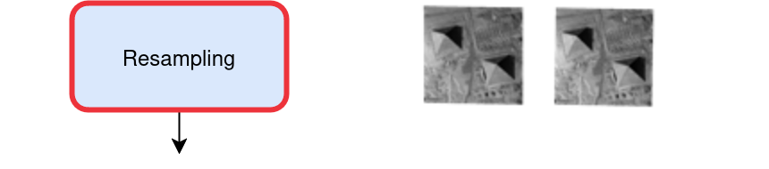
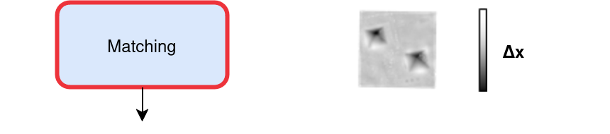
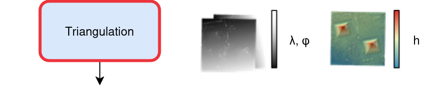
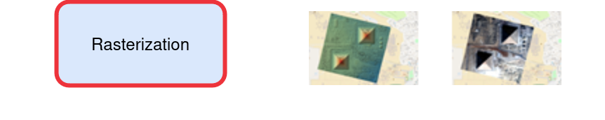
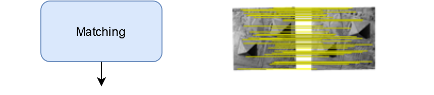
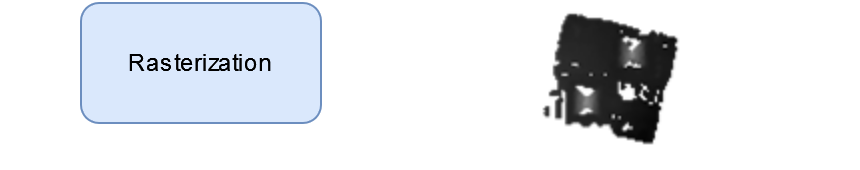
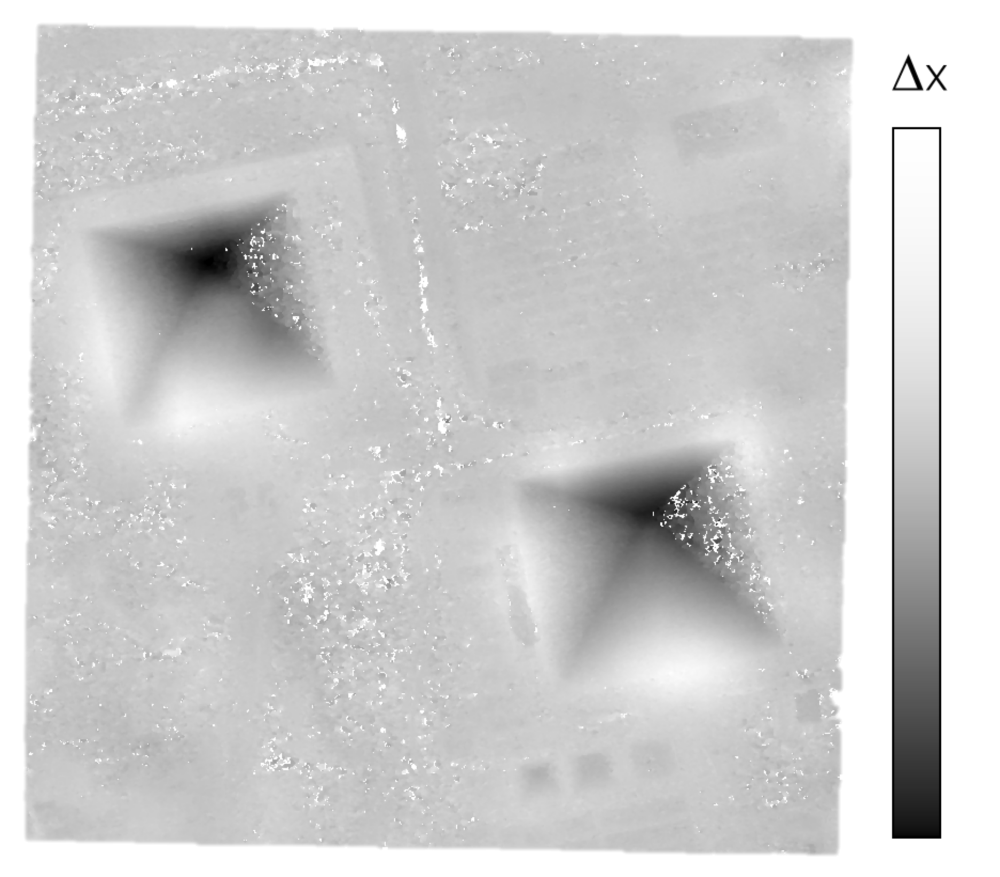

From Satellite Images to Digital Surface Model
==============================================

Generate a DSM step by step
---------------------------

.. |images_models| image:: ../images/dense.images.drawio.png

.. |resampling| image:: ../images/dense.resampling.drawio.png
   :target: index.html#resampling

.. |matching| image:: ../images/dense.matching.drawio.png
   :target: index.html#matching

.. |triangulation| image:: ../images/dense.triangulation.drawio.png
   :target: index.html#triangulation

.. |rasterization| image:: ../images/dense.rasterization.drawio.png
   :target: index.html#rasterization

.. |matching_spa_circled| image:: ../images/sparse.matching.circled.drawio.png

.. |triangulation_spa| image:: ../images/sparse.triangulation.drawio.png
   :target: index.html#triangulationsparse

.. |triangulation_spa_circled| image:: ../images/sparse.triangulation.circled.drawio.png

.. |resampling_image| image:: ../images/crop_image10.gif

.. |matching_spa_image| image:: ../images/sift.png

.. |triangulation_image| image:: ../images/point_cloud_as_image.drawio.png

.. |triangulation_spa_image| image:: ../images/image27.png
    
.. |rasterization_image| image:: ../images/rasters.png
   :width: 50%

.. |rasterization_spa_image| image:: ../images/image29.png

.. |br| raw:: html

      

| Images are first resampled in epipolar geometry: by changing viewpoints, objects pixels move along a line.
| This enables a one-dimensional search (computer performance + error limitation).
| The pixels shifting along other directions are not taken into account : it corresponds to fast moving objects like vehicles.

.. _resampling:

+---------------------------+---------------------------------------------+
| Pipeline                  | Resampling                                  |
+---------------------------+---------------------------------------------+
| |images_models|      |br| | |resampling_image|                          |
| |resampling_circled| |br| |                                             |
| |matching|           |br| |                                             |
| |triangulation|      |br| |                                             |
| |rasterization|      |br| |                                             |
+---------------------------+---------------------------------------------+

| For each point in one image, the software searches the corresponding point in the other image.
| The color of the pixels (grayscale) in the image :ref:`below<matching>` corresponds to the shift value. Pixels with no match are displayed as transparent pixels in the image below. 
| The transparent pixels indicate areas where the matching algorithm couldn't find a reliable correspondence between the two images, highlighting regions of uncertainty in the matching process. These matching errors can occur due to various reasons such as moving objects, shadows, occlusions, or areas with insufficient texture.

.. _matching:

+--------------------------+---------------------------------------------+
| Pipeline                 | Matching                                    |
+--------------------------+---------------------------------------------+
| |images_models|     |br| | |matching_image|                            |
| |resampling|        |br| |                                             |
| |matching_circled|  |br| |                                             |
| |triangulation|     |br| |                                             |
| |rasterization|     |br| |                                             |
+--------------------------+---------------------------------------------+

| The displacements obtained are transformed into positions in both images.
| This allows to deduce lines of sight. The intersection of these lines gives a point in space: longitude, latitude, altitude (see :ref:`below<triangulation>`).
| A line of sight is an imaginary straight line from the camera's perspective through a specific point in the image, extending into 3D space. It represents all possible 3D positions that could have produced that image point.

.. _triangulation:

+------------------------------+---------------------------------------------+
| Pipeline                     | Triangulation                               |
+------------------------------+---------------------------------------------+
| |images_models|         |br| | |triangulation_image|                       |
| |resampling|            |br| |                                             |
| |matching|              |br| |                                             |
| |triangulation_circled| |br| |                                             |
| |rasterization|         |br| |                                             |
+------------------------------+---------------------------------------------+

To obtain a raster image, the final process projects each point into a 2D grid: altitudes and colors (see :ref:`below<rasterization>`).

.. _rasterization:

+------------------------------+---------------------------------------------+
| Pipeline                     | Rasterization                               |
+------------------------------+---------------------------------------------+
| |images_models|         |br| | |rasterization_image|                       |
| |resampling|            |br| |                                             |
| |matching|              |br| |                                             |
| |triangulation|         |br| |                                             |
| |rasterization_circled| |br| |                                             |
+------------------------------+---------------------------------------------+

Altimetric exploration at multiple resolutions
-------------------------------------------------

To reduce the search interval (i.e. altimetric exploration) in the dense matching step and thus save computing time, CARS's pipeline runs the dense matching algorithm and surrounding applications at multiple resolutions, going from a very low resolution to the highest. Each time, based on the previous resolution, the disparity interval searched will be reduced. 

This reduces computation time greatly while providing better results than a bruteforce approach. 

+---------------------+---------------------+---------------------+
| DSM at resolution 4 | DSM at resolution 2 | DSM at resolution 1 |
+---------------------+---------------------+---------------------+
| |multires_res4|     | |multires_res2|     | |multires_res1|     |
+---------------------+---------------------+---------------------+

Geometric inaccuracies
----------------------

To reduce geometric errors present in the sensor images' geometry model, a sparse matching step is performed on the full-resolution images in 2D. These matches are then used to correct geometric errors in the geometry model, ensuring that the epipolar geometry is correct, in turn allowing for better results.

Those matches will also be used to reduce the disparity interval searched in the pipeline's first resolution run.

This sparse matching step is performed with keypoints, like :term:`SIFT` to ensure that the matches found are accurate, as inaccurate ones may result in distortions and bad dense matching results. (`SIFT Article: <https://www.cs.ubc.ca/~lowe/papers/ijcv04.pdf>`_).

.. _matchingsparse:

+-----------------------------+---------------------------------------------+
| Pipeline                    | Matching (sparse)                           |
+-----------------------------+---------------------------------------------+
| |images_models|     |br|    | |matching_spa_image|                        |
| |resampling|        |br|    |                                             |
| |matching_spa_circled| |br| |                                             |
| |triangulation_spa| |br|    |                                             |
| |rasterization_spa| |br|    |                                             |
+-----------------------------+---------------------------------------------+
