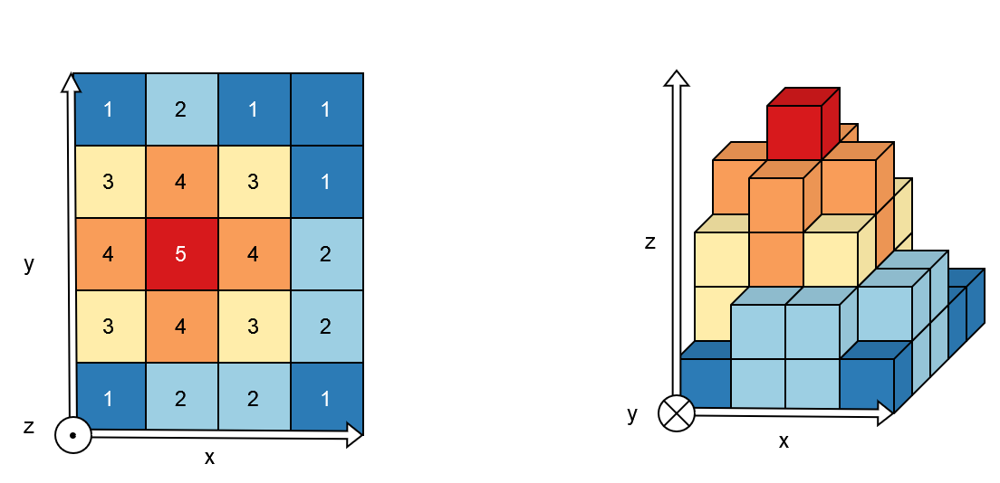
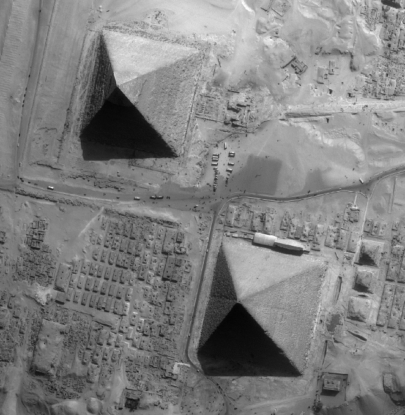
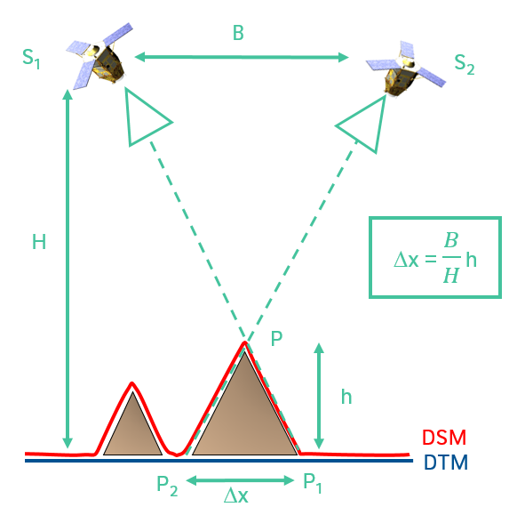

Satellite photogrammetry in a nutshell
======================================

As its name suggests, satellite photogrammetry works using optical satellite acquisitions to generate a Digital Surface Model (:term:`DSM`), the 2.5D representation created from observed surface altitude data. We speak of 2.5D because the digital surface model is an array of pixels (raster, 2D) where each pixel (x,y) corresponds to an altitude (z).

   2.5D representation

   On the left, an example of an array of pixels, and on the right, a volume representation of altitude values.

	   
Like our eyes, altitude (or depth relative to the satellite, to continue the analogy) is determined from the observed pixels displacement. We therefore need at least two images, acquired from two different viewpoints. This difference in viewpoints between two satellites is quantified by the B over H ratio where B is the distance between the two satellites and H is their altitude.
 

+-----------------+----------------+
| B over H ratio  | Two viewpoints |
+-----------------+----------------+
| |b_over_h|      | |nutimages|    |                 
+-----------------+----------------+

Every raster readable by `GDAL`_ can be given as CARS input. In addition to images, the photogrammetric process requires geometric models.  Rational Polynomial Coefficients (:term:`RPC`) provide a compact representation of a ground-to-image geometry giving a relationship between:

    - Image coordinates + altitude and ground coordinates (direct model: image to ground)
    - Ground coordinates + altitude and image coordinates (inverse model: ground to image)

These coefficients are classically contained in the RPC*.XML files.

.. _`GDAL`: https://gdal.org/
