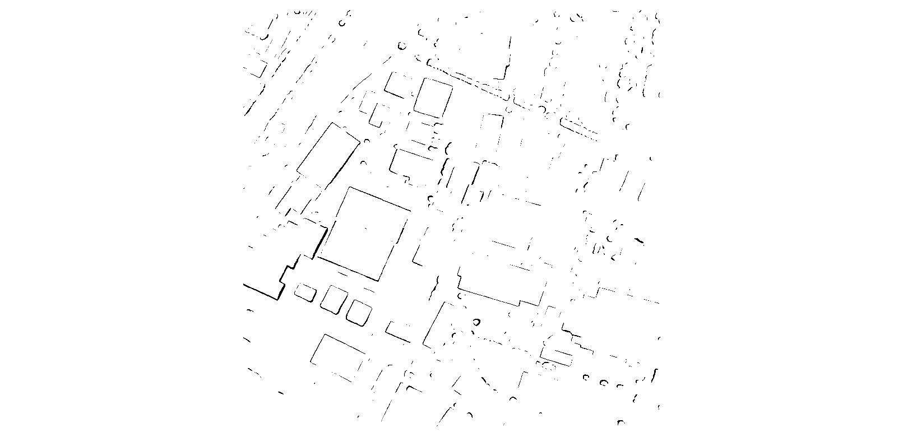

.. _edge_detection_example:

========================
Edge detection with CARS
========================

The main idea of "Edge Detection" is to improve 3D reconstruction on buildings for CARS.
To achieve this, we will use an edge map to enhance the SGM optimization in CARS.

To produce this edge map, we will use `CARS's Edge detection plugin <https://github.com/CNES/cars-edge-detection-plugin>`_.
This plugin relies on the `MoGe2 model <https://github.com/Microsoft/MoGe>`_.
MoGe2 is a deep-learning model dedicated to 3D reconstruction from a single (monocular) image.
The plugin generates a file called ``edges.tif``, which is the edge map that will subsequently be used by CARS.

Below are some instructions on how to use this plugin with CARS:

Step 1: Install the plugin
--------------------------

The plugin can be installed in an existing Python environment using the following command:

.. code-block:: console

    pip install cars-edge-detection-plugin

Or, you can install it with CARS in a single command using the following command:

.. code-block:: console

    pip install cars[edge_detection]

Finally, you can also install it from the source code by cloning the repository and running the following command:

.. code-block:: console

    git clone https://github.com/CNES/cars-edge-detection-plugin.git
    cd cars-edge-detection-plugin
    
    # optionally, create a virtual environment
    python -m venv venv
    source venv/bin/activate
    
    # install the plugin
    pip install .

Step 2: Download the MoGe2 model
--------------------------------

There are multiple ways to download the required MoGe2 model, depending on your environment and preferences.

You can choose one of the following methods:

Method 1: Using the provided executable script
^^^^^^^^^^^^^^^^^^^^^^^^^^^^^^^^^^^^^^^^^^^^^^

    .. code-block:: console

        cars-download-moge2 --model vitl-normal

Method 2: Using wget (suitable for environments with controlled internet access)
^^^^^^^^^^^^^^^^^^^^^^^^^^^^^^^^^^^^^^^^^^^^^^^^^^^^^^^^^^^^^^^^^^^^^^^^^^^^^^^^

    .. code-block:: console

        # Fetch the model
        wget https://huggingface.co/Ruicheng/moge-2-vitl-normal/resolve/main/model.pt

        # Move the model to the correct location.
        # It must be placed under cars_edge_detection_plugin/applications/depth_map_generation/models
        # with the proper name for each model:
        # - moge-2-vitl-normal.pt
        # - moge-2-vitb-normal.pt
        # - moge-2-vits-normal.pt

        mkdir -p [your/plugin/installation/path]/cars_edge_detection_plugin/applications/depth_map_generation/models

        mv ./model.pt [your/plugin/installation/path]/cars_edge_detection_plugin/applications/depth_map_generation/models/moge-2-vitl-normal.pt

Step 3: Run the plugin
----------------------

The plugin can be run either as a standalone pipeline, or integrated into the CARS pipeline.

As a standalone pipeline
^^^^^^^^^^^^^^^^^^^^^^^^

The standalone pipeline is useful for testing the plugin and generating the edge map independently of CARS,
making it possible to review data before doing a full CARS run with it.

For the standalone pipeline, you can use the following command:

.. code-block:: console

    cars ./config_plugin_edge.yaml

where a basic ``config_plugin_edge.yaml`` is a configuration file that follows this format :

.. include-cars-config:: ../example_configs/examples/advanced/edge_example_standalone

The output of this command will be located in the ``output directory`` specified in the configuration file,
and will contain a folder for each left image, itself containing the generated edge map ``edges.tif``.

Below is an example of an edge map generated by the plugin:

To inject the edge map back into CARS, you can then use the following configuration:

.. include-cars-config:: ../example_configs/examples/advanced/edge_example_reinjection

As part of CARS's default pipeline
^^^^^^^^^^^^^^^^^^^^^^^^^^^^^^^^^^

The plugin is also seamlessly integrated into the CARS pipeline, allowing you to run the edge detection and 3D reconstruction in a single command.

CARS will automatically detect the presence of the plugin and run it **if it is installed**.
This means that you can simply run the CARS pipeline as usual, and the plugin will be executed as part of the process.

To check if the plugin is installed, you can use the following command:

.. code-block:: console

    pip show cars-edge-detection-plugin

A normal CARS run can then be executed.

Disabling Edge detection
------------------------

While the plugin is automatically detected and run if installed, there may be cases where you want to disable it.
To do so, manually specifying the ``pipeline`` parameter is required.

Below is an example of a configuration file that disables Edge detection:

.. include-cars-config:: ../example_configs/examples/advanced/edge_example_disable