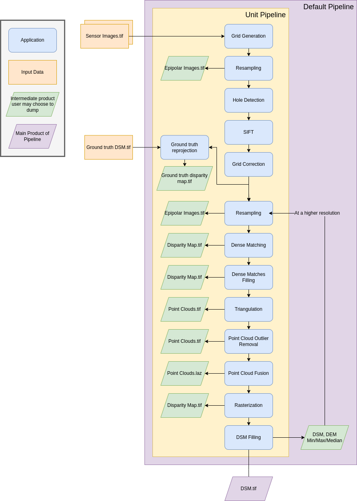

.. _ground_truth_reprojection_app:

Ground truth reprojection
=========================

**Name**: "ground_truth_reprojection"

**Description**

Generates epipolar and sensor ground truth from input dsm using direct localization.

* Sensor ground truth contains altitude in sensor geometry.
* Epipolar ground truth contains disparity map in epipolar geometry.

+---------------------------------+------------------------------------------------------------+------------+------------------------------+---------------+----------+
| Name                            | Description                                                | Type       | Available value              | Default value | Required |
+=================================+============================================================+============+==============================+===============+==========+
| method                          | Method for ground_truth_reprojection                       | string     | "direct_loc"                 |               | Yes      |
+---------------------------------+------------------------------------------------------------+------------+------------------------------+---------------+----------+
| target                          | Type of ground truth                                       | string     | "epipolar", "sensor", "all"  | "epipolar"    | No       |
+---------------------------------+------------------------------------------------------------+------------+------------------------------+---------------+----------+
| tile_size                       | Tile size to use                                           | int        |                              | 2500          | No       |
+---------------------------------+------------------------------------------------------------+------------+------------------------------+---------------+----------+

**Example**

.. include-cars-config:: ../../example_configs/configuration/applications_ground_truth_reprojection

