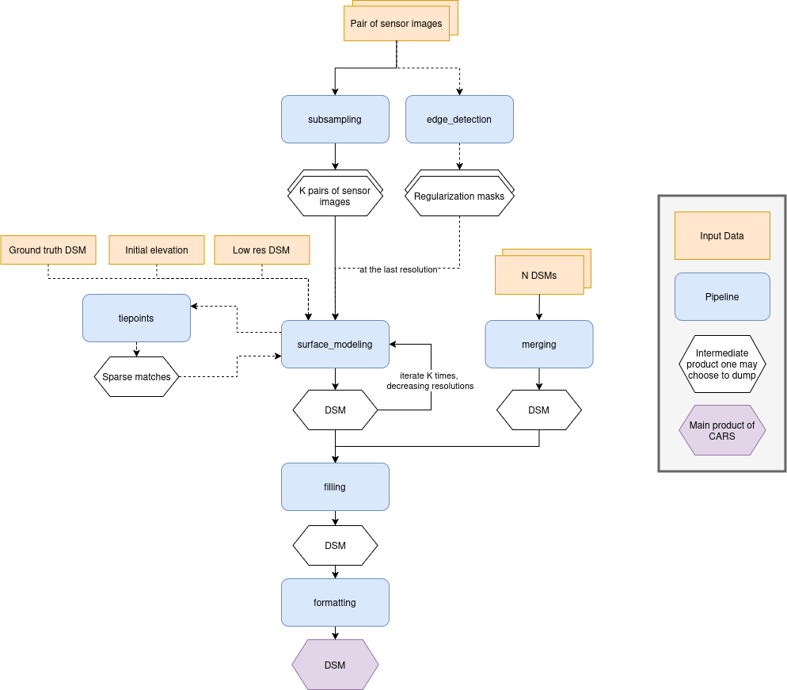

.. _pipeline:

Pipeline
========

The pipeline field allows you to configure which pipeline should be ran, and how.
It makes it possible to choose to run only part of the meta pipeline, or even a single standalone pipeline.
If set to `auto`, a list or a dict, the meta pipeline will be ran.

+----------------+-----------------------+------------------------+---------------+
| Name           | Description           | Type                   | Default value |
+================+=======================+========================+===============+
| *pipeline*     | The pipeline to use   | str, list[str], dict   | "auto"        |
+----------------+-----------------------+------------------------+---------------+

Below is a diagram representing a simplified version of the meta pipeline, 
as well as a short summary of each pipeline's function in the meta pipeline.
Each of them can be called by themselves, provided the right inputs.

.. toctree::
    :maxdepth: 1
    :hidden:

    pipelines/subsampling
    pipelines/edge_detection
    pipelines/surface_modeling
    pipelines/tiepoints
    pipelines/filling
    pipelines/merging
    pipelines/formatting

+---------------------------------------------+----------------+------------------------------------------------------------------------------------------------------------------------------------------+
| Pipeline                                    | Per-resolution | Description                                                                                                                              |
+=============================================+================+==========================================================================================================================================+
| :ref:`subsampling <subsampling>`            | No             | Takes sensor images as input and generates subsampled versions at the resolutions specified in the configuration.                        |
+---------------------------------------------+----------------+------------------------------------------------------------------------------------------------------------------------------------------+
| :ref:`edge_detection <edge_detection>`      | No             | Produces a regularization mask from an input image. This mask is typically used in the surface_modeling step to guide stereo matching.   |
+---------------------------------------------+----------------+------------------------------------------------------------------------------------------------------------------------------------------+
| :ref:`surface_modeling <surface_modeling>`  | Yes            | Computes a DSM by performing pixel-level stereo matching between a left and right image.                                                 |
+---------------------------------------------+----------------+------------------------------------------------------------------------------------------------------------------------------------------+
| :ref:`tiepoints <tiepoints>`                | Yes            | Extracts sparse tie points between two sensor images. These matches are used to improve geometric alignment in surface_modeling.         |
+---------------------------------------------+----------------+------------------------------------------------------------------------------------------------------------------------------------------+
| :ref:`filling <filling>`                    | No             | Fills holes or masked regions in the DSM using configurable interpolation or reconstruction methods.                                     |
+---------------------------------------------+----------------+------------------------------------------------------------------------------------------------------------------------------------------+
| :ref:`merging <merging>`                    | No             | Merges multiple DSMs into a single output without loss of color or classification information when provided.                             |
+---------------------------------------------+----------------+------------------------------------------------------------------------------------------------------------------------------------------+
| :ref:`formatting <formatting>`              | No             | Produces the final formatted output of the CARS pipeline by merging classification layers, selecting color bands, and structuring data.  |
+---------------------------------------------+----------------+------------------------------------------------------------------------------------------------------------------------------------------+

Each pipeline has its own applications and parameters. 
They can be set using a key with the pipeline name at the root of the configuration file, itself containing ``applications`` and ``advanced``, as shown below :

.. include-cars-config:: ../example_configs/pipeline/pipeline_example_config

Meta pipeline
-------------

    The Meta pipeline is the name given to CARS's default pipeline, who itself makes calls to all the other pipelines following the schema provided above.
    By setting a list of pipelines in the ``pipeline`` field, you can control which pipelines will be ran exactly.

    A dict will enable you to specify via true or false which pipelines will be ran, instead of relying on presence in the list. In the ``used_conf.yaml`` file, the dict is used for better clarity.

    For example, with this configuration :

    .. include-cars-config:: ../example_configs/pipeline/meta_pipeline_list_1

    The pipeline will run directly ``surface_modeling``, skipping ``tiepoints`` (meaning there won't be any grid correction using the SIFT) because it's not part of the list, and directly going to formatting, skipping filling :

    .. image:: ../images/meta_pipeline_list_1.png

    Using the configuration below, CARS will use the merging part of the meta pipeline, fill the DSM created as a result, and format it. Because a dict is used, every pipeline is specified.

    .. include-cars-config:: ../example_configs/pipeline/meta_pipeline_list_2

    Using the configuration below, CARS will perform surface modeling over the default resolutions output by subsampling. Edge detection will be used, but no grid correction will be performed using the SIFT. The output will be formatted.

    .. include-cars-config:: ../example_configs/pipeline/meta_pipeline_list_3

.. _geometry_plugin:

**Geometry plugin**

    This section describes configuration of the geometry plugins for CARS, please refer to :ref:`plugins` section for details on plugins installation.
    The geometry plugin may be configured in multiple pipelines.

    +-------------------+-----------------------+----------------+-------------------------+---------------------------------------+----------+
    | Name              | Description           | Type           | Default value           | Available values                      | Required |
    +===================+=======================+================+=========================+=======================================+==========+
    | *geometry_plugin* | The plugin to use     | str or dict    | "SharelocGeometry"      | "SharelocGeometry"                    | False    |
    +-------------------+-----------------------+----------------+-------------------------+---------------------------------------+----------+

    **geometry_plugin** allow user to specify other parameters, through a dictionary:

    +-----------------------------+------------------------------------------------------------------------------------+----------------+-------------------------+---------------------------------------+----------+
    | Name                        | Description                                                                        | Type           | Default value           | Available values                      | Required |
    +=============================+====================================================================================+================+=========================+=======================================+==========+
    | *plugin_name*               | The plugin name to use                                                             | str            | "SharelocGeometry"      | "SharelocGeometry"                    | False    |
    +-----------------------------+------------------------------------------------------------------------------------+----------------+-------------------------+---------------------------------------+----------+
    | *interpolator*              | Interpolator to use                                                                | str            | "cubic"                 | "cubic" , "linear"                    | False    |
    +-----------------------------+------------------------------------------------------------------------------------+----------------+-------------------------+---------------------------------------+----------+
    | *dem_roi_margin*            | Additional margin for DEM : [factor_of_terrain_bounds, constant_margin_in_degrees] | list           | [0.25, 0.02]            |                                       | False    |
    +-----------------------------+------------------------------------------------------------------------------------+----------------+-------------------------+---------------------------------------+----------+

    To use Shareloc geometry library, CARS input configuration should be defined as :

    .. include-cars-config:: ../example_configs/pipeline/meta_pipeline_geometry_plugin_1

    **geometry_plugin** specify the plugin to use, but other configuration parameters can be specified :

    .. include-cars-config:: ../example_configs/pipeline/meta_pipeline_geometry_plugin_2

    The particularities in the configuration file are:

    * **geomodel.model_type**: Depending on the nature of the geometric models indicated above, this field as to be defined as :term:`RPC` or `GRID`. By default, "RPC".
    * **initial_elevation**: Field contains the path to the **file** corresponding the srtm tiles covering the production (and **not** a directory !!)
    * **geometry_plugin**: Parameter configured to "SharelocGeometry" to use Shareloc plugin.

    Parameter can also be defined as a string *path* instead of a dictionary in the configuration. In this case, geomodel parameter will
    be changed to a dictionary before launching the pipeline. The dictionary will be :

    .. include-cars-config:: ../example_configs/pipeline/meta_pipeline_geometry_plugin_3

    .. note::

        Be aware that geometric models must therefore be opened by Shareloc directly in this case, and supported sensors may evolve.

.. _save_intermediate_data:

**Save intermediate data**

    The `save_intermediate_data` flag can be used to activate and deactivate the saving of the possible output of applications.

    It is set in the `advanced` category of any pipeline, and can also be overloaded in each application separately. It defaults to false, meaning that no intermediate product is saved. 
    Intermediate data are saved in the `dump_dir` folder found in CARS output directory, with a subfolder corresponding to each application.

    For example, setting `save_intermediate_data` to `true` in `surface_modeling/advanced` and to `false` in `surface_modeling/applications/point_cloud_rasterization` will activate product saving in all surface modeling applications except `point_cloud_rasterization`.
    Conversely, setting it to `false` in `surface_modeling/advanced` and to `true` in `surface_modeling/applications/point_cloud_rasterization` will only save rasterization outputs.

    Intermediate data refers to all files that are not part of an output product. Files that compose an output product will not be found in the application dump directory.
    For example if `dsm` is requested as output product, the `dsm.tif` files and all activated dsm auxiliary files will not be found in `rasterization` dump directory.
    This directory will still contain the files generated by the `rasterization` application that are not part of the `dsm` product.

    The following example enables `save_intermediate_data` for all applications at all resolutions : 

    .. include-cars-config:: ../example_configs/pipeline/meta_pipeline_save_intermediate_data_1

    This in turn will produce the following folder structure :

    .. code-block::

        cars_output_folder/
            dsm/
            intermediate_data/
                surface_modeling/
                    out_res16/
                        dsm/
                        dump_dir/
                    out_res4/
                        dsm/
                        dump_dir/
                    out_res1/
                        dump_dir/
    
    The following example enables `save_intermediate_data` for all applications at resolution 16, while keeping it disabled for both resolution 4 and resolution 1 :

    .. include-cars-config:: ../example_configs/pipeline/meta_pipeline_save_intermediate_data_2