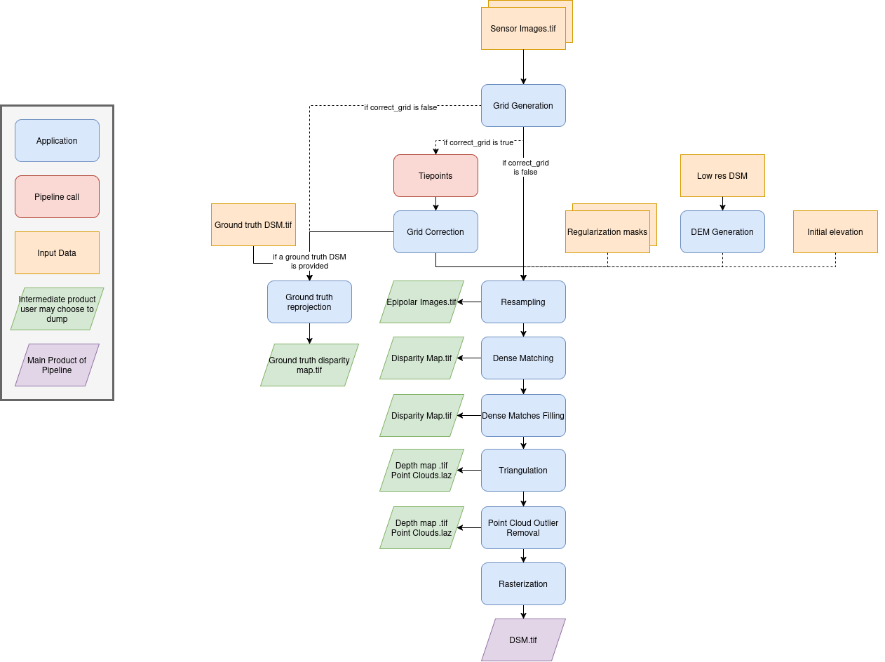

.. _surface_modeling:

Surface Modeling
================

This pipeline computes a DSM by performing pixel-level stereo matching between a left and a right
image. To correct the epipolar projection if needed, this pipeline can call :ref:`tie_points <tie_points>`.

Allowed inputs
--------------

Surface modeling takes `Sensor image pairs` as well as (optionally) an `Initial elevation` as inputs, as explained in the :ref:`input <input>` section. If provided, this pipeline will make use of the `regularization mask` of the sensor images given.

This pipeline has specific inputs **when used directly** : it can take a `Low res DSM`.
It can be specified in the ``input`` field :

.. list-table:: Configuration
    :widths: 19 19 19
    :header-rows: 1

    * - Name
      - Description
      - Type
    * - low_res_dsm
      - The DSM used to reconstruct a disparity range apriori  
      - str

If running the meta pipeline, the Low res DSM is typically set to be the previous resolution's DSM.
It makes it so locally, the disparity range to go through is very small, significantly lowering the computation time and memory used.

.. include-cars-config:: ../../example_configs/pipeline/surface_modeling_low_res_dsm
  
Applications
------------

The surface modeling pipeline uses these applications:

  - :ref:`grid_generation <grid_generation_app>`
  - :ref:`grid_correction <grid_correction_app>`
  - :ref:`resampling <resampling_app>`
  - :ref:`dense_matching <dense_matching_app>`
  - :ref:`dense_match_filling <dense_match_filling_app>`
  - :ref:`triangulation <triangulation_app>`
  - :ref:`point_cloud_outlier_removal <point_cloud_outlier_removal_app>`
  - :ref:`point_cloud_rasterization <point_cloud_rasterization_app>`

Here is a schema summarizing the inner workings of this pipeline : 

Advanced Parameters
-------------------

.. list-table::
    :widths: 19 19 19 19
    :header-rows: 1

    * - Name
      - Description
      - Type
      - Default value
    * - save_intermediate_data
      - Save intermediate data for all applications inside this pipeline.
      - bool
      - False
    * - keep_low_res_dir
      - Save intermediate data for all applications inside this pipeline.
      - bool
      - False
    * - ground_truth_dsm
      - Data to be reprojected from the application ground_truth_reprojection
      - dict
      - None
    * - geometry_plugin
      - Name of the geometry plugin to use and optional parameters (see :ref:`geometry plugin <geometry_plugin>`)
      - str or dict
      - "SharelocGeometry"
    * - land_cover_map
      - A global classification map used to choose the optimal configuration for dense matching
      - str
      - "global_land_cover_map.tif"
    * - classification_to_configuration_mapping
      - A JSON file that maps each class of the global classification map to a corresponding Pandora configuration
      - str
      - "config_mapping.json"

Keep low res dir
^^^^^^^^^^^^^^^^

    The `keep_low_res_dir` parameter flag can be used to specify that you would like the intermediate DSMs to be saved in their respective directory, when using the meta pipeline.

    By default, since `keep_low_res_dir` is true, you will find the intermediate DSMs in `intermediate_res/out_res{resolution_value}/dsm`.
    If `save_intermediate_data` was enabled for an application of an intermediate resolution, those results will be found in `intermediate_res/out_res{resolution_value}/dump_dir`.

    The following example disables the saving of the outputs of all intermediate resolutions:

    .. include-cars-config:: ../../example_configs/pipeline/surface_modeling_keep_low_res_dir

Ground truth DSM
^^^^^^^^^^^^^^^^

    To activate the ground truth reprojection application, it is necessary to specify the required inputs in the advanced settings.
    For this, a dictionary named `ground_truth_dsm` must be added, containing the keys presented in the following table.
    By default, the used dsm is considered on ellipsoid. If not, fill the `geoid` parameter.

    +---------------------------------+------------------------------------------------------------+--------------------+------------------------------+-------------------------------------------------------+----------+
    | Name                            | Description                                                | Type               | Available value              | Default value                                         | Required |
    +=================================+============================================================+====================+==============================+=======================================================+==========+
    | dsm                             | Path to ground truth dsm (Lidar for example)               | string             |                              |                                                       | Yes      |
    +---------------------------------+------------------------------------------------------------+--------------------+------------------------------+-------------------------------------------------------+----------+
    | geoid                           | DSM geoid.                                                 | bool or string     |                              |  False                                                | No       |
    +---------------------------------+------------------------------------------------------------+--------------------+------------------------------+-------------------------------------------------------+----------+
    | auxiliary_data                  | The lidar auxiliaries data                                 | dict               |                              |  None                                                 | No       |
    +---------------------------------+------------------------------------------------------------+--------------------+------------------------------+-------------------------------------------------------+----------+
    | auxiliary_data_interpolation    | The lidar auxiliaries data interpolator                    | dict               |                              |  None (nearest if auxiliary_data is not None)         | No       |
    +---------------------------------+------------------------------------------------------------+--------------------+------------------------------+-------------------------------------------------------+----------+

    .. note::

        The parameter `geoid` refers to the vertical reference of the ground truth DSM. It can be set as a string to provide the path to a geoid file on disk, or as a boolean: if set to True CARS default geoid is used, if set to False no vertical offset is applied (ellipsoid reference).

    Example:

    .. include-cars-config:: ../../example_configs/pipeline/surface_modeling_ground_truth_dsm
