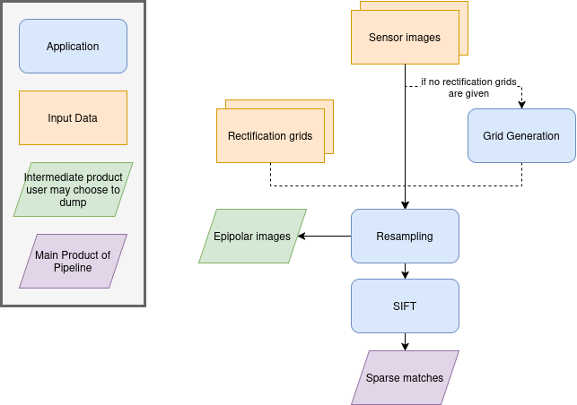

.. _tie_points:

Tie Points
==========

This pipeline extracts sparse tie points between two sensor images. It is used to improve geometric alignment during ``surface_modeling`` in the meta pipeline.

Allowed inputs
--------------

Tie points takes a single pair of sensor images as input, as shown in the :ref:`input <input>` section of the documentation. Optionally, it can also take a `rectification grid` when called alone. The meta pipeline will make use of this optional input in order to not have to compute the rectification grid twice (once in surface_modeling and once in tie_points).

To specify rectification grids when using this pipeline alone, use the ``rectification_grid`` field in ``input``:

.. include-cars-config:: ../../example_configs/pipeline/tie_points_inputs

Applications
------------

The tie points pipeline uses these applications :

  - :ref:`grid_generation <grid_generation_app>`
  - :ref:`resampling <resampling_app>`
  - :ref:`sparse_matching <sparse_matching_app>`

Below is a schema summarizing how the Tie points pipeline works.

Advanced Parameters
-------------------

.. list-table::
    :header-rows: 1

    * - Name
      - Description
      - Type
      - Default value
    * - save_intermediate_data
      - Save intermediate data for all applications inside this pipeline.
      - bool
      - False
    * - geometry_plugin
      - Name of the geometry plugin to use and optional parameters (see :ref:`geometry plugin <geometry_plugin>`)
      - str or dict
      - "SharelocGeometry"
    * - resampling_tile_width
      - Width of the tiles used for resampling and SIFT computation, in pixels
      - int
      - 5000
    * - resampling_tile_height
      - Height of the tiles used for resampling and SIFT computation, in pixels
      - int
      - 60

Below is an example configuration for this pipeline :

.. include-cars-config:: ../../example_configs/pipeline/tie_points_pipeline