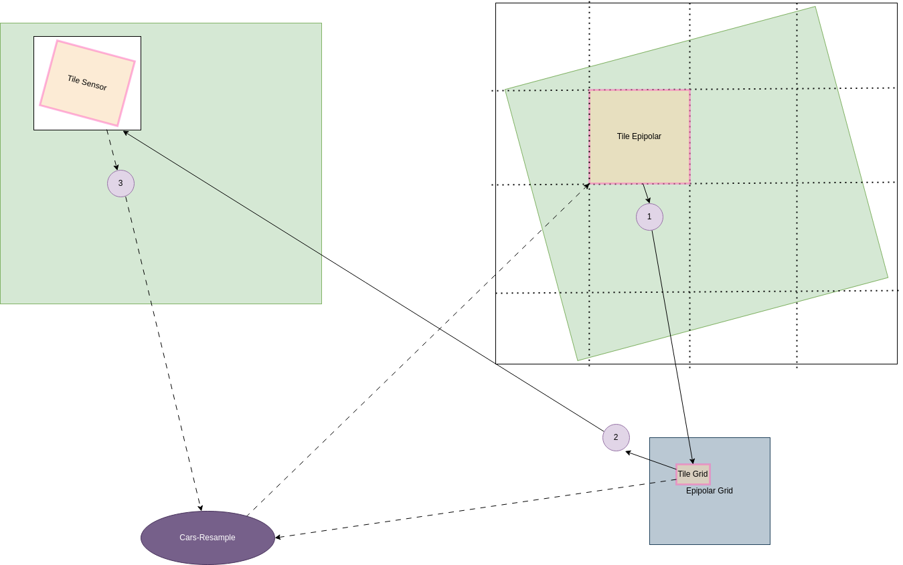

==========
Resampling
==========

The resampling application is used to resample Sensor Image into an Epipolar Image

:raw-html:`<h1>Method</h1>`

In the Resampling application, we are given:

  * A Sensor Image associated to a Sensor Model
  * An Epipolar Geometry associated to an Epipolar Grid

The application generates a CarsDataset containing all the tiles of the Epipolar Image.

For each tile, the following steps are performed:

  1.  From the Epipolar ROI of the tile, we compute the corresponding ROI in the epipolar grid.
  2.  From the Epipolar Grid ROI, we compute the corresponding ROI in the Sensor Image using the Sensor Model and the Epipolar Geometry.
  3.  With the Epipolar tile shape, Epipolar Grid Crop (shifted to match the epipolar tile crop and sensor crop), and Sensor Crop, we resample the Sensor Image into the Epipolar tile, using CARS-Resample. 3 Methods are available: Nearest Neighbor, Bilinear, and Bicubic.

:raw-html:`<h1>Limits of the method</h1>`

For a given Region of Interest of the tile, a corresponding ROI in the Sensor Image is not always what is loaded in memory: it depends on the loaded Block from the Sensor Image, defined by the Block Size.
This is the reason why tile can be split, resampled, and then reassembled.

:raw-html:`<h1>Implementation</h1>`

The Resampling application is implemented in the file ``cars/applications/resampling/bicubic_resampling_app.py``. The applications generated a CarsDataset of type "array", containing all the tiles of the Epipolar Image.
Every tile is computed in parallel, using the Orchestrator framework. The wrapper function used for each tile, generates a xarray Dataset containing the resampled Epipolar tile.

The resampling method will be as follows:
  *  Bicubic for texture image.
  *  Nearest Neighbor for classification image, and masks.

