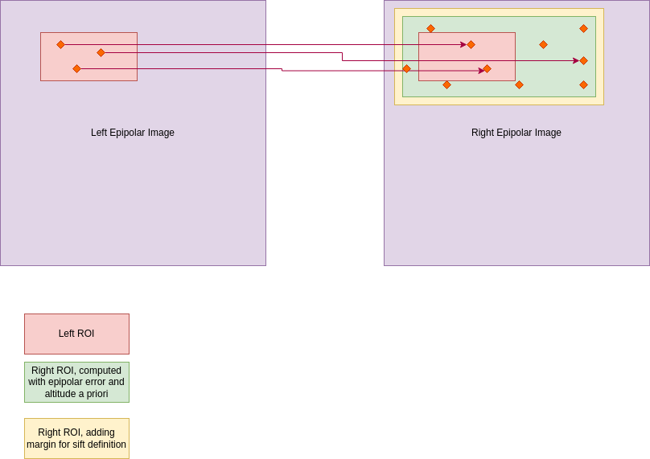

===============
Sparse Matching
===============

:raw-html:`<h1>Method</h1>`

In the Sparse Matching Application, we can given a pair of left and right epipolar images.
By construction from resampling, these images are stored in tiles inside a CarsDataset. Each tile contains:
* the tile region of interest: area where Matches will be found
* the overlap area with neighboring tiles: area used to find Matches close to tile borders.

We have an epipolar geometry. However it can be not perfect, with epipolar errors. In order to correct these errors, we want to compute matches not only on the epipolar line, but in a margin around it.

Two types of margin are used:

* Research margin: we use

  - the a priori of the maximum epipolar error (or maximum line disparity) to
    define a research margin on the right image. This a priori is given in
    configuration, as it depends on the level of geometry refinement already
    performed.
  - the a priori of the maximum column disparity. It is computed with direct
    localization on dem min and max.

* Method Margin: depending on the matching method used, a margin is added to
  ensure that matches close to the border of the tile region of interest are
  correctly computed.

The default matching method is SIFT (Scale Invariant Feature Transform), which is robust to scale and rotation changes.

----------------
SIFT Algorithm
----------------

SIFT (Scale-Invariant Feature Transform) identifies anchor points in an image that stay the same even if you zoom, rotate, or change the lighting.

1. Find Points: Uses Difference of Gaussians to find blobs at multiple scales (zoom levels).
2. Clean Up: Rejects weak points and edges to keep only high-contrast, stable corners.
3. Set Angle: Assigns an orientation to each point so it can be recognized even if tilted.
4. Create ID: Generates a 128-bit numerical fingerprint (descriptor) for matching.
5. Match Points: Compares descriptors between images to find corresponding points.

:raw-html:`<h1>Limits of the method</h1>`

One of the limits is that we need to have good a priori of the disparity ranges to use:
    * maximum epipolar error : cannot be computed automatically yet. It is set in configuration.
    * maximum column disparity: At the first resolution, it is computed with almost all the line: with no a priori, the search range is large : [-1000, +9000 m]. This is one of the reason why we perform multiple resolution levels.

These margins can cost a lot of computation time. It is important to estimate them well.

:raw-html:`<h1>Implementation</h1>`

The Sparse Matching application is implemented in the file ``cars/applications/sparse_matching/sift_app.py``. The applications generated a CarsDataset of type "points", containing all the tiles of the Sparse matches.
Every tile is computed in parallel, using the Orchestrator framework. The wrapper function used for each tile, generates a Pandas Dataframe containing the computed matches.

The CarsDataset of matches is computed as a to-be-replaced dataset: all the matches will be placed in the main process memory. It could be memory consuming, depending on the images.