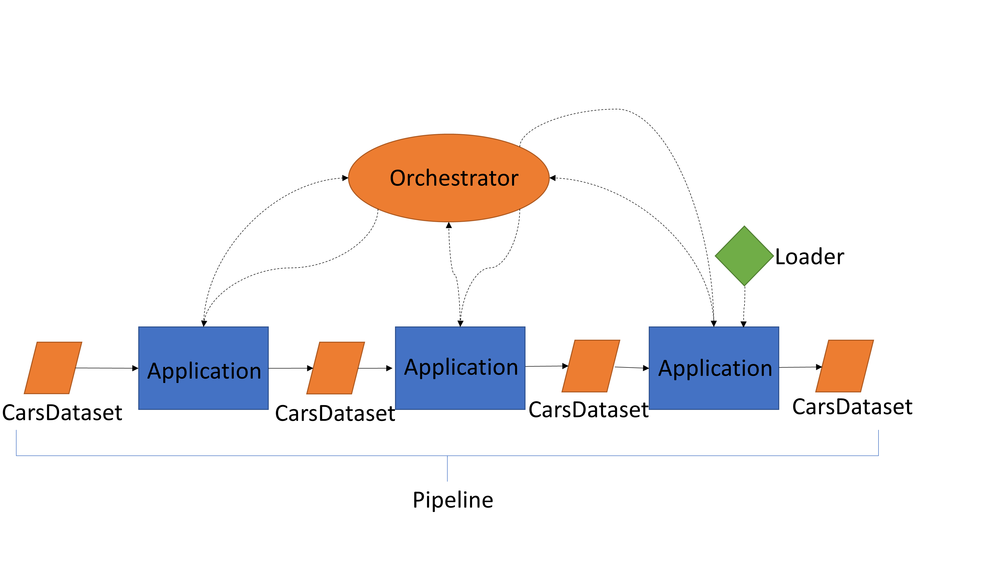

.. _software_conception:

.. role:: raw-html(raw)
   :format: html

CARS software conception
========================

CARS design aims a modular and customizable framework for multiview 3d reconstruction.
This design is organized around key concepts described in this section.

.. warning::

    Under construction with CARS design evolution.

The CARS framework can be introduced by the following diagram:

This section presents one by one the CARS key concepts and their interaction.

    * cars_dataset Input and output object of an application. Contains a calculated and potentially tiled data.
    * application: Algorithmic methods that takes
    * pipeline: sequence of applications to be processed.
    * Orchestrator: It instantiates and interfaces with the cluster to which it provides the tasks to be processed. It is responsible for writing the data calculated by the cluster on the fly.
    * plugin: library or external tools providing specific 3d functions. Under heavy reconstruction !
    * **Pipeline**: A chain of applications ( 3d reconstruction steps) from input to output with intermediate data (CarsDataset) controlled by orchestrator;

.. toctree::
   :caption: Concepts
   :maxdepth: 1

   application
   carsdataset
   pipeline
   orchestrator

:raw-html:`<h1>Interaction between concepts</h1>`

Now that all the concepts have been presented in details, we can draw a more technical diagram:

