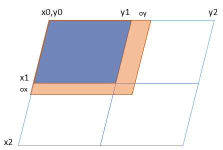

.. _cars_dataset:

CarsDataset
===========

Goals
-----

*CarsDataset* is the CARS internal data structure.
The data used within CARS imposes some restrictions that the structure must manage:

* can contains array (ex: for images) or list of point (ex: for sparse matches).
* can contains georeference, geometry information.
* can be used for parallel/distributed computation, i.e tiled data.
* can contained overlaps between tiled data;

*CarsDataset* aims at defining a data structure that takes into account this constraints.

Details
-------

Here is an example of one dataset with all needed information.

Attributes
^^^^^^^^^^

* *type* : CarsDataset can manage `Xarray.dataset` or `pandas.DataFrame`
* *tiles* : List of list of `Xarray.dataset` or `pandas.DataFrame`. Include overlaps.
   example: blue + orange zone on the previous drawing.
* *tiling_grid* : coordinate position of each tile.
   example: for the first tile on the previous drawing: [x0 ,x1,y0,y1]
* *overlaps* : coordinate position of eachtile + overlaps
   example: for the first tile on the previous drawing: [x0 ,x1+ox,y0,y1+oy]
* *attributes* : all needed extra information

It is important to note that a tile, if even if you'decided to use `Xarray.dataset` or `pandas.DataFrame` could be a `delayed` or `future` related to
`dask` definition. See next sections.

Functions
^^^^^^^^^

*CarsDataset* integrates all functions for manipulating the data throughout the framework:

* for saving a whole dataset : `save_cars_dataset`
* for loading a dataset written on disk: `load_cars_dataset_from_disk`
* for creating a dataset from another one (same tiling_grid and overlaps) `create_empty_copy`
* for saving dataset tile by tile  with futur results, `run_save`, see next sections.