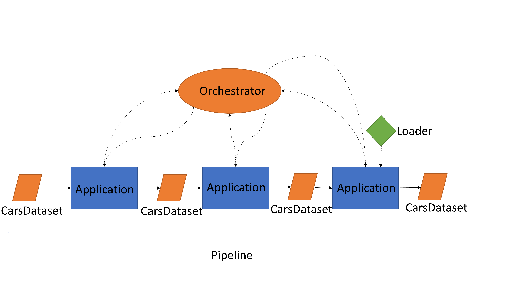

.. _design_overview:

===============
Design Overview
===============

The proposed design aims to make CARS a modular and customizable framework for multiview 3d reconstruction.
What we want is to create this framework with some new key concepts.

Framework & definition of key concepts
======================================

The CARS framework can be introduced by the following diagram:

To describe it more precisely, we have to define some key concepts

    * :ref:`cars_dataset` Input and output object of an application. Contains a calculated and potentially tiled data.
    * :ref:`application`: Algorithmic methods that takes
    * :ref:`Orchestrator`: It instantiates and interfaces with the cluster to which it provides the tasks to be processed. It is responsible for writing the data calculated by the cluster on the fly.
    * :ref:`loader`: library or external tools providing specific 3d functions.
    * *pipeline*: A chain of applications ( 3d reconstruction steps) from input to ouput with intermediate data (CarsDataset) controled by orchestrator;

