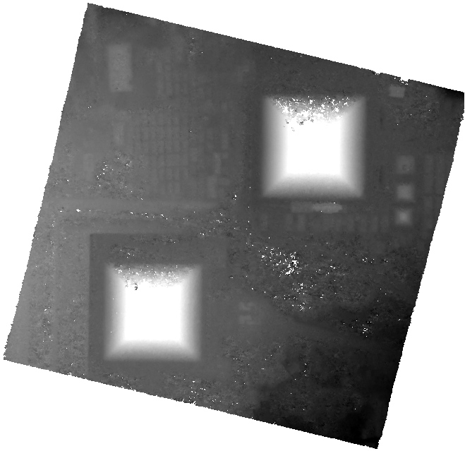
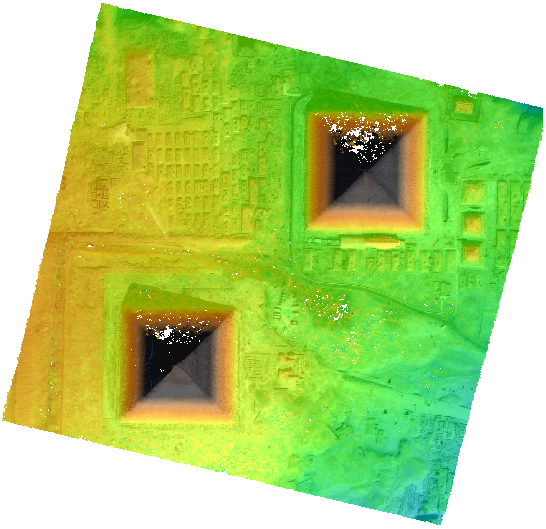
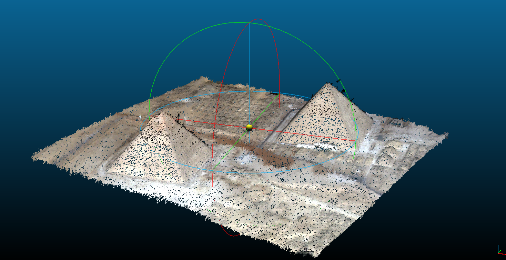

3D products
===========

| CARS produces a geotiff file named ``dsm.tif`` that contains the Digital Surface Model in the required cartographic projection and the ground sampling distance defined by the user.
| If the user provides an additional input image, an ortho-image ``color.tif`` is also produced. The latter is stackable to the DSM (See :ref:`getting_started`).
| If the user saves point clouds as `laz format <https://docs.fileformat.com/fr/gis/laz/>`_, the point clouds are saved in laz compressed format with colors or graylevel image.

These two products can be visualized with `QGIS <https://www.qgis.org/fr/site/>`_ for example.

.. |color| image:: ../images/clr.png
  :width: 100%

+--------------+-------------+-------------+-------------------+
|   dsm.tif    |   color.tif | `QGIS`_ Mix |    cloudcompare   |
+--------------+-------------+-------------+-------------------+
| |dsm|        | |color|     |  |dsmclr|   |        |pc|       |
+--------------+-------------+-------------+-------------------+
