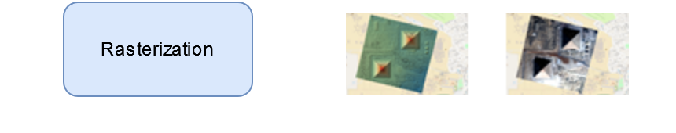
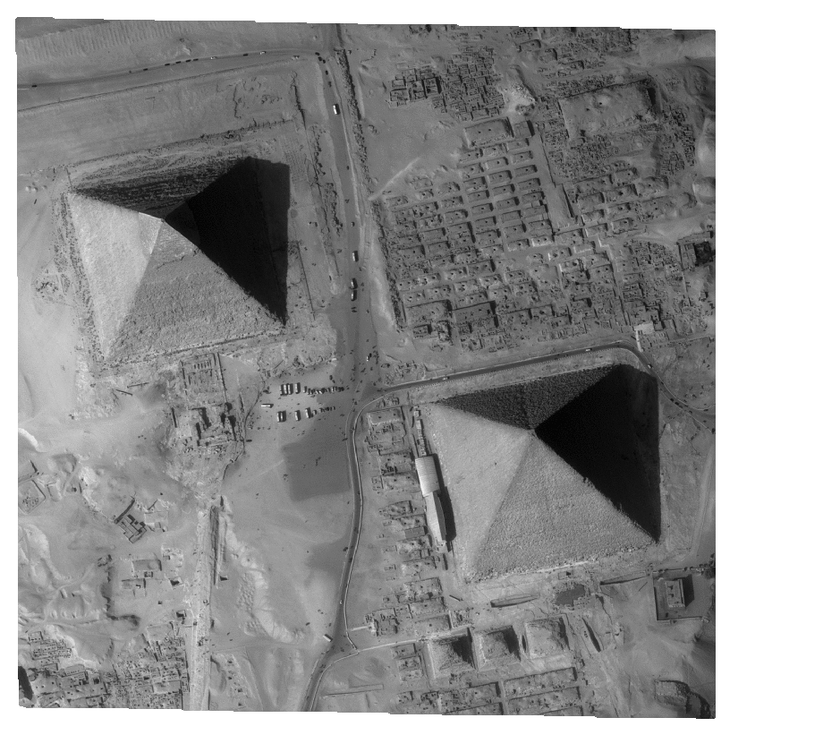
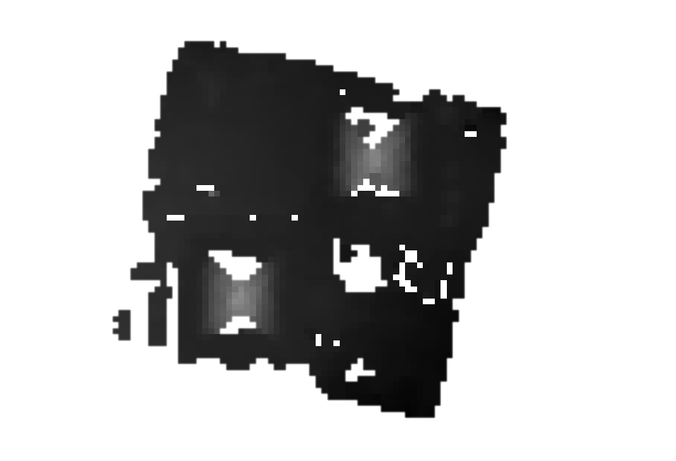

From Satellite Images to Digital Surface Model
==============================================

Generate a DSM step by step
---------------------------

.. |images_models| image:: ../images/dense.images.drawio.png

.. |resampling| image:: ../images/dense.resampling.drawio.png
   :target: index.html#resampling

.. |matching| image:: ../images/dense.matching.drawio.png
   :target: index.html#matching

.. |triangulation| image:: ../images/dense.triangulation.drawio.png
   :target: index.html#triangulation

.. |matching_spa| image:: ../images/sparse.matching.drawio.png
   :target: index.html#matching_sparse

.. |triangulation_spa| image:: ../images/sparse.triangulation.drawio.png
   :target: index.html#triangulation_sparse

.. |rasterization_spa| image:: ../images/sparse.rasterization.drawio.png
   :target: index.html#rasterization_sparse
	    

.. |matching_spa_image| image:: ../images/sift.png

.. |triangulation_spa_image| image:: ../images/image27.png
    
.. |rasterization_image| image:: ../images/rasters.png
   :width: 50%

.. |br| raw:: html

      

| Images are first resampled in epipolar geometry: by changing viewpoints, objects pixels move along a line.
| This enables a one-dimensional search (computer performance + error limitation).
| The pixels shifting along others directions doesn't taking account and it corresponds to fast moving objets (for instance like vehicle moving from bottom to top, see :ref:`below<resampling>`)

.. _resampling:

+--------------------------+---------------------------------------------+
| Pipeline                 | Resampling                                  |
+--------------------------+---------------------------------------------+
| |images_models|     |br| | |resampling_image|                          |
| |resampling|        |br| |                                             |
| |matching|          |br| |                                             |
| |triangulation|     |br| |                                             |
| |rasterization|     |br| |                                             |
+--------------------------+---------------------------------------------+

| For each point in one image, the software searches the corresponding point in the other image.
| The color of the pixels (grayscale) in the image :ref:`below<matching>` corresponds to the shift value. Some pixels do not have a match, which are represented as transparent pixels in the image. These matching errors can occur due to various reasons such as moving objects, shadows, occlusions, or areas with insufficient texture.
| The transparent pixels indicate areas where the matching algorithm couldn't find a reliable correspondence between the two images, highlighting regions of uncertainty in the matching process.

.. _matching:

+--------------------------+---------------------------------------------+
| Pipeline                 | Matching                                    |
+--------------------------+---------------------------------------------+
| |images_models|     |br| | |matching_image|                            |
| |resampling|        |br| |                                             |
| |matching|          |br| |                                             |
| |triangulation|     |br| |                                             |
| |rasterization|     |br| |                                             |
+--------------------------+---------------------------------------------+

| The displacements obtained are transformed into positions in both images.
| This allows to deduce lines of sight. The intersection of these lines gives a point in space: longitude, latitude, altitude (see :ref:`below<triangulation>`).
| A line of sight is an imaginary straight line from the camera's perspective through a specific point in the image, extending into 3D space. It represents all possible 3D positions that could have produced that image point.

.. _triangulation:

+--------------------------+---------------------------------------------+
| Pipeline                 | Triangulation                               |
+--------------------------+---------------------------------------------+
| |images_models|     |br| | |triangulation_image|                       |
| |resampling|        |br| |                                             |
| |matching|          |br| |                                             |
| |triangulation|     |br| |                                             |
| |rasterization|     |br| |                                             |
+--------------------------+---------------------------------------------+

To obtain a raster image, the final process projects each point into a 2D grid: altitudes and colors (see :ref:`below<rasterization>`).

.. _rasterization:

+--------------------------+---------------------------------------------+
| Pipeline                 | Rasterization                               |
+--------------------------+---------------------------------------------+
| |images_models|     |br| | |rasterization_image|                       |
| |resampling|        |br| |                                             |
| |matching|          |br| |                                             |
| |triangulation|     |br| |                                             |
| |rasterization|     |br| |                                             |
+--------------------------+---------------------------------------------+

Initial Input Digital Elevation Model
^^^^^^^^^^^^^^^^^^^^^^^^^^^^^^^^^^^^^

For now, CARS uses an initial input Digital Elevation Model (:term:`DEM`) which is integrated in the stereo-rectification to minimize the disparity intervals to explore.
Any geotiff file can be used.

For example, the `SRTM <https://www2.jpl.nasa.gov/srtm/>`_ data corresponding to the processed zone can be used through `otbcli_DownloadSRTMTiles <https://www.orfeo-toolbox.org/CookBook-7.4/Applications/app_DownloadSRTMTiles.html>`_.

The parameter is ``initial_elevation`` as seen in :ref:`configuration`.

Altimetric exploration and geometric inaccuracies
-------------------------------------------------

To reduce the search interval (i.e. altimetric exploration) in the matching step and thus save computing time, a faster sparse matching step is typically used. This matching step also enables geometric errors to be corrected, thus ensuring that the epipolar geometry (based on these models) is correct.

Matching can be performed with keypoints like `SIFT <https://www.cs.ubc.ca/~lowe/papers/ijcv04.pdf>`_.

.. _matching_sparse:

+--------------------------+---------------------------------------------+
| Pipeline                 | Matching (sparse)                           |
+--------------------------+---------------------------------------------+
| |images_models|     |br| | |matching_spa_image|                        |
| |resampling|        |br| |                                             |
| |matching_spa|      |br| |                                             |
| |triangulation_spa| |br| |                                             |
| |rasterization_spa| |br| |                                             |
+--------------------------+---------------------------------------------+

The result is a sparse point cloud...

.. _triangulation_sparse:

+--------------------------+---------------------------------------------+
| Pipeline                 | Triangulation (sparse)                      |
+--------------------------+---------------------------------------------+
| |images_models|     |br| | |triangulation_spa_image|                   |
| |resampling|        |br| |                                             |
| |matching_spa|      |br| |                                             |
| |triangulation_spa| |br| |                                             |
| |rasterization_spa| |br| |                                             |
+--------------------------+---------------------------------------------+

and a sparse digital surface model.

.. _rasterization_sparse:

+--------------------------+---------------------------------------------+
| Pipeline                 | Rasterization (sparse)                      |
+--------------------------+---------------------------------------------+
| |images_models|     |br| | |rasterization_spa_image|                   |
| |resampling|        |br| |                                             |
| |matching_spa|      |br| |                                             |
| |triangulation_spa| |br| |                                             |
| |rasterization_spa| |br| |                                             |
+--------------------------+---------------------------------------------+
