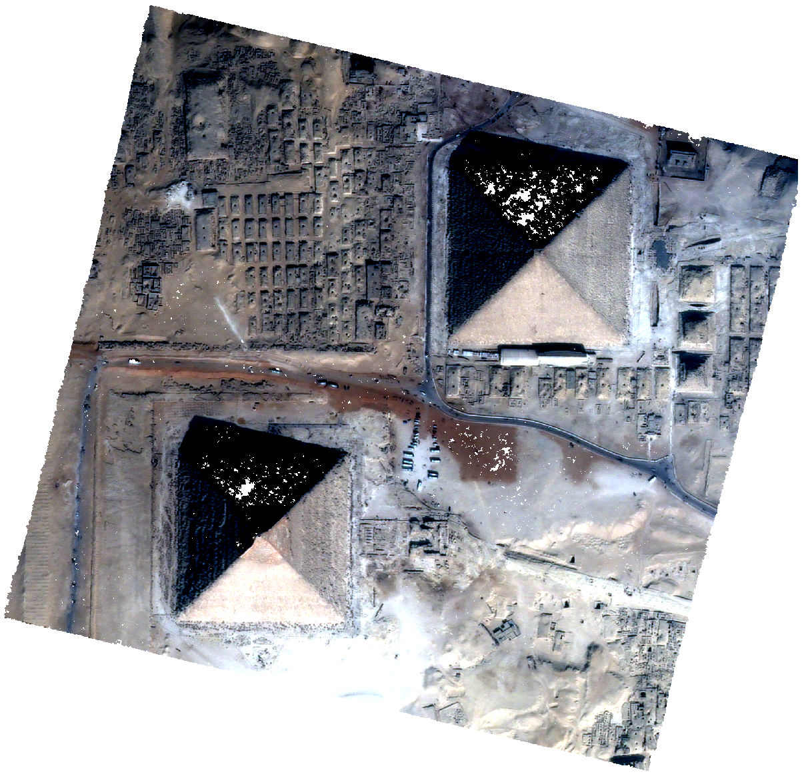

Product Range
=============

CARS produces a geotiff file named ``dsm.tif`` that contains the Digital Surface Model in the required cartographic projection and the ground sampling distance defined by the user.

If the user provides an additional input image, an ortho-image ``clr.tif`` is also produced. The latter is stackable to the DSM (See :ref:`getting_started`).

If the user saves points clouds as laz format (point_cloud_fusion, point_cloud_outliers_removing, point_cloud_rasterization), the points clouds are saved in laz compressed format with colors or graylevel image.

These two products can be visualized with `QGIS <https://www.qgis.org/fr/site/>`_ for example.

.. |dsm| image:: ../images/dsm.png
  :width: 100%

.. |dsmclr| image:: ../images/dsm_clr.png
  :width: 100%
.. |pc| image:: ../images/pc.png
  :width: 100%

+--------------+-------------+-------------+-------------------+
|   dsm.tif    |   clr.tif   | `QGIS`_ Mix |    cloudcompare   |
+--------------+-------------+-------------+-------------------+
| |dsm|        | |clr|       |  |dsmclr|   |        |pc|       |
+--------------+-------------+-------------+-------------------+
