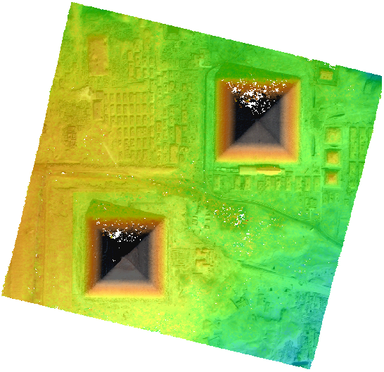

.. _getting_started:

===============
Getting Started
===============

.. note::

  Data samples from this tutorial can be used under `open licence <https://www.etalab.gouv.fr/licence-ouverte-open-licence>`_.

Quick Start
===========
* Install `Docker <https://docs.docker.com/get-docker/>`_
* Download `CARS Quick Start  <https://raw.githubusercontent.com/CNES/cars/master/docs/source/demo/quick_start.sh>`_

.. code-block:: console

    $ wget https://raw.githubusercontent.com/CNES/cars/master/docs/source/demo/quick_start.sh

* Run this quick_start.sh script

.. code-block:: console

    $ ./quick_start.sh

Go to the ``data_samples/outcompute/`` output directory to get a :term:`DSM` and color image associated.

Open the ``dsm.tif`` DSM and ``clr.tif`` color image in `QGIS`_ software.

.. |dsm| image:: images/dsm.png
  :width: 100%
.. |clr| image:: images/clr.png
  :width: 100%

+--------------+-------------+-------------+
|   dsm.tif    |   clr.tif   | `QGIS`_ Mix |
+--------------+-------------+-------------+
| |dsm|        | |clr|       |  |dsmclr|   |
+--------------+-------------+-------------+

Steps by steps
==============

* Check Docker install

.. code-block:: console

    $ docker -v

* Get CARS dockerfile image

.. code-block:: console

    $ docker pull cnes/cars

* Get and extract data samples from CARS repository:

.. code-block:: console

    $ wget https://raw.githubusercontent.com/CNES/cars/master/docs/source/demo/data_samples.tar.bz2
    $ wget https://raw.githubusercontent.com/CNES/cars/master/docs/source/demo/data_samples.tar.bz2.md5sum
    $ md5sum --status -c data_samples.tar.bz2.md5sum
    $ tar xvfj data_samples.tar.bz2

* Run CARS :ref:`prepare_pipeline` for first pair (img1 and img2)

.. code-block:: console

    $ docker run -v "$(pwd)"/data_samples:/data cnes/cars prepare -i /data/input12.json -o /data/outprepare12

* Run CARS :ref:`prepare_pipeline` pipeline for second pair (img1 and img3)

.. code-block:: console

    $ docker run -v "$(pwd)"/data_samples:/data cnes/cars prepare -i /data/input13.json -o /data/outprepare13

* Run CARS :ref:`compute_dsm_pipeline`

.. code-block:: console

    $ docker run -v "$(pwd)"/data_samples:/data cnes/cars compute_dsm -i /data/outprepare12/content.json /data/outprepare13/content.json  -o /data/outcompute/

* Clean Unix rights on Docker generated data.

.. code-block:: console

    $ docker run -it -v "$(pwd)"/data_samples:/data --entrypoint /bin/bash cnes/cars -c "chown -R '$(id -u):$(id -g)' /data/"

* Show resulting output directory

.. code-block:: console

    $ ls -l data_samples/outcompute/

.. warning::

	This first tutorial uses Docker to avoid CARS installation. To go further, follow :ref:`install` and :ref:`user_manual`.

Advanced Quick Start
====================

1. :ref:`install` CARS on your system.

2. Follow now `CARS Advanced Quick Start script  <https://raw.githubusercontent.com/CNES/cars/master/docs/source/demo/quick_start_advanced.sh>`_ with the same steps than previous quick start.

You need to get command line options files with the script:

- `CARS prepare img1-img2 configuration file  <https://raw.githubusercontent.com/CNES/cars/master/docs/source/demo/args_prepare12.txt>`_
- `CARS prepare img1-img3 configuration file  <https://raw.githubusercontent.com/CNES/cars/master/docs/source/demo/args_prepare13.txt>`_
- `CARS compute_dsm configuration file  <https://raw.githubusercontent.com/CNES/cars/master/docs/source/demo/args_compute.txt>`_

.. _`QGIS`: https://www.qgis.org/
