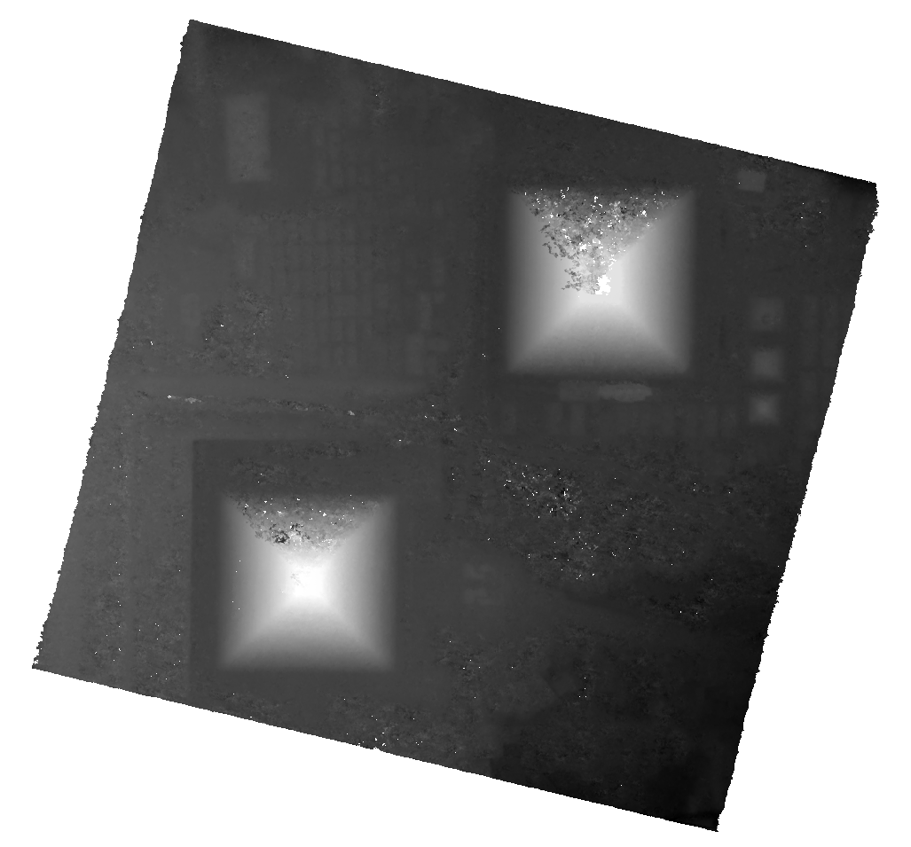

.. _getting_started:

===============
Getting Started
===============

Installation
------------

* CARS is available on Pypi and can be installed by:

.. code-block:: console

    pip install cars

* Alternatively, you can use the provided Dockerfile to build a Docker image for CARS:

.. code-block:: console

    # Clone the CARS repository
    git clone https://github.com/CNES/cars.git
    cd cars

    # Build the Docker image
    docker build -t cars:latest .

Download data
-------------

* Get and extract data samples from CARS repository:

.. note::

  Data samples from this tutorial can be used under `open licence <https://www.etalab.gouv.fr/licence-ouverte-open-licence>`_.

.. code-block:: console

    wget https://raw.githubusercontent.com/CNES/cars/master/tutorials/data_gizeh.tar.bz2
    wget https://raw.githubusercontent.com/CNES/cars/master/tutorials/data_gizeh.tar.bz2.md5sum
    md5sum --status -c data_gizeh.tar.bz2.md5sum
    tar xvfj data_gizeh.tar.bz2

Run CARS
--------

* Launch CARS for img1+img2 and img1+img3 pairs:

.. code-block:: console

    cars data_gizeh/configfile.yaml

* Configuration example (configfile.yaml or configfile.json) for data_gizeh:

.. include-cars-config:: example_configs/getting_started/gizeh_configfile

Open the results 
----------------

* Go to the ``data_gizeh/outresults/dsm`` output directory to get a :term:`DSM` (dsm.tif) and image associated (image.tif).

Open the ``dsm.tif`` DSM and ``image.tif`` image in `QGIS`_ software.

.. |color| image:: images/clr.png
  :width: 100%
.. |dsmcolor| image:: images/dsm_clr.png
  :width: 100%

+--------------+---------------+-------------+
|   dsm.tif    |   image.tif   | `QGIS`_ Mix |
+--------------+---------------+-------------+
| |dsm|        | |color|       |  |dsmcolor| |
+--------------+---------------+-------------+

.. _`QGIS`: https://www.qgis.org/
