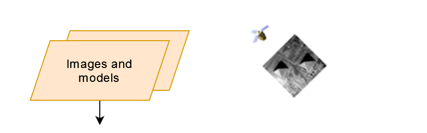
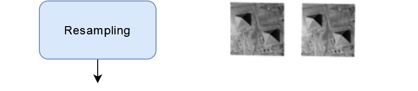
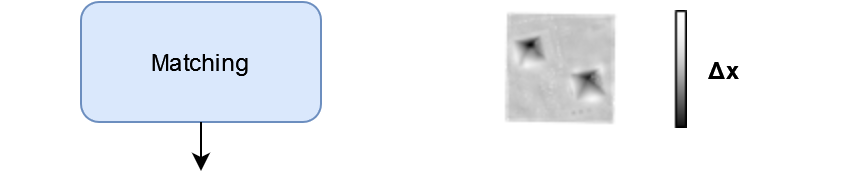
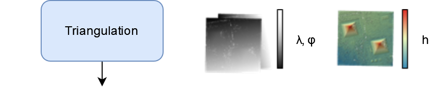
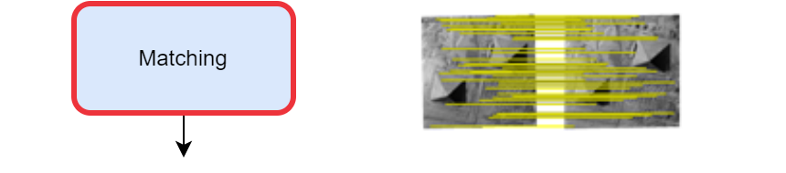
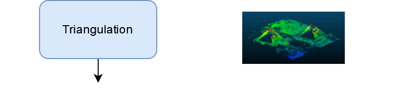
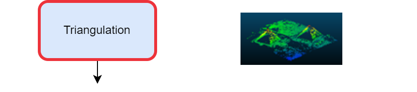
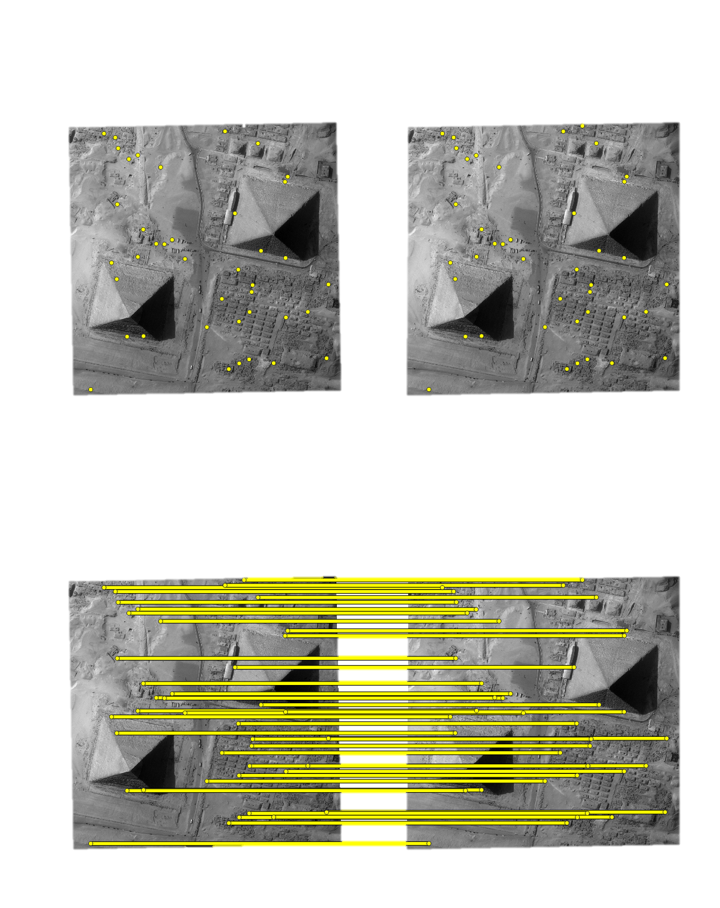
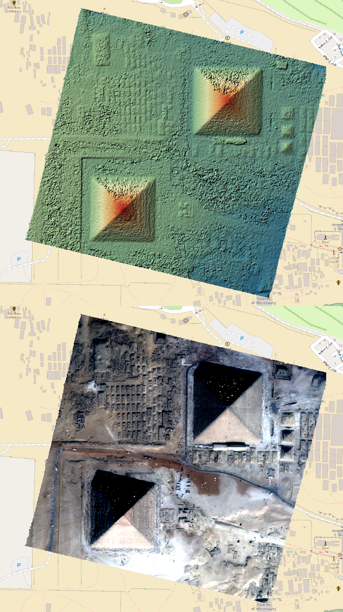

From Satellite Images to Digital Surface Model
==============================================

Generate a DSM step by step
---------------------------

.. |resampling_circled| image:: ../images/dense.resampling.circled.drawio.png

.. |matching_circled| image:: ../images/dense.matching.circled.drawio.png

.. |triangulation_circled| image:: ../images/dense.triangulation.circled.drawio.png

.. |rasterization| image:: ../images/dense.rasterization.drawio.png
   :target: index.html#rasterization

.. |rasterization_circled| image:: ../images/dense.rasterization.circled.drawio.png

.. |matching_spa| image:: ../images/sparse.matching.drawio.png
   :target: index.html#matchingsparse

.. |rasterization_spa| image:: ../images/sparse.rasterization.drawio.png
   :target: index.html#rasterizationsparse

.. |rasterization_spa_circled| image:: ../images/sparse.rasterization.circled.drawio.png

.. |resampling_image| image:: ../images/crop_image10.gif

.. |matching_image| image:: ../images/crop_image13.drawio.png

.. |triangulation_image| image:: ../images/point_cloud_as_image.drawio.png

.. |triangulation_spa_image| image:: ../images/image27.png
    

.. |rasterization_spa_image| image:: ../images/image29.png

.. |br| raw:: html

      

| Images are first resampled in epipolar geometry: by changing viewpoints, objects pixels move along a line.
| This enables a one-dimensional search (computer performance + error limitation).
| The pixels shifting along other directions are not taken into account : it corresponds to fast moving objects like vehicles.

.. _resampling:

+---------------------------+---------------------------------------------+
| Pipeline                  | Resampling                                  |
+---------------------------+---------------------------------------------+
| |images_models|      |br| | |resampling_image|                          |
| |resampling_circled| |br| |                                             |
| |matching|           |br| |                                             |
| |triangulation|      |br| |                                             |
| |rasterization|      |br| |                                             |
+---------------------------+---------------------------------------------+

| For each point in one image, the software searches the corresponding point in the other image.
| The color of the pixels (grayscale) in the image :ref:`below<matching>` corresponds to the shift value. Pixels with no match are displayed as transparent pixels in the image below. 
| The transparent pixels indicate areas where the matching algorithm couldn't find a reliable correspondence between the two images, highlighting regions of uncertainty in the matching process. These matching errors can occur due to various reasons such as moving objects, shadows, occlusions, or areas with insufficient texture.

.. _matching:

+--------------------------+---------------------------------------------+
| Pipeline                 | Matching                                    |
+--------------------------+---------------------------------------------+
| |images_models|     |br| | |matching_image|                            |
| |resampling|        |br| |                                             |
| |matching_circled|  |br| |                                             |
| |triangulation|     |br| |                                             |
| |rasterization|     |br| |                                             |
+--------------------------+---------------------------------------------+

| The displacements obtained are transformed into positions in both images.
| This allows to deduce lines of sight. The intersection of these lines gives a point in space: longitude, latitude, altitude (see :ref:`below<triangulation>`).
| A line of sight is an imaginary straight line from the camera's perspective through a specific point in the image, extending into 3D space. It represents all possible 3D positions that could have produced that image point.

.. _triangulation:

+------------------------------+---------------------------------------------+
| Pipeline                     | Triangulation                               |
+------------------------------+---------------------------------------------+
| |images_models|         |br| | |triangulation_image|                       |
| |resampling|            |br| |                                             |
| |matching|              |br| |                                             |
| |triangulation_circled| |br| |                                             |
| |rasterization|         |br| |                                             |
+------------------------------+---------------------------------------------+

To obtain a raster image, the final process projects each point into a 2D grid: altitudes and colors (see :ref:`below<rasterization>`).

.. _rasterization:

+------------------------------+---------------------------------------------+
| Pipeline                     | Rasterization                               |
+------------------------------+---------------------------------------------+
| |images_models|         |br| | |rasterization_image|                       |
| |resampling|            |br| |                                             |
| |matching|              |br| |                                             |
| |triangulation|         |br| |                                             |
| |rasterization_circled| |br| |                                             |
+------------------------------+---------------------------------------------+

Initial Input Digital Elevation Model
-------------------------------------

The user can provide as input a low resolution Digital Elevation Model (:term:`DEM`). It helps to minimize the disparity intervals to explore. Any geotiff file can be used.
If the DEM is not specified by the user, an internal DEM is generated with sparse matches.

To download the low resolution DEM corresponding to your area, see section :ref:`download_srtm_tiles`.

The parameter is ``dem`` in ``initial_elevation`` as seen in :ref:`basic configuration`.

Altimetric exploration and geometric inaccuracies
-------------------------------------------------

To reduce the search interval (i.e. altimetric exploration) in the matching step and thus save computing time, a faster sparse matching step is typically used. This matching step also enables geometric errors to be corrected, thus ensuring that the epipolar geometry (based on these models) is correct.

Matching can be performed with keypoints like :term:`SIFT` (`Here is an article <https://www.cs.ubc.ca/~lowe/papers/ijcv04.pdf>`_).

.. _matchingsparse:

+-----------------------------+---------------------------------------------+
| Pipeline                    | Matching (sparse)                           |
+-----------------------------+---------------------------------------------+
| |images_models|     |br|    | |matching_spa_image|                        |
| |resampling|        |br|    |                                             |
| |matching_spa_circled| |br| |                                             |
| |triangulation_spa| |br|    |                                             |
| |rasterization_spa| |br|    |                                             |
+-----------------------------+---------------------------------------------+

The result is a sparse point cloud...

.. _triangulationsparse:

+----------------------------------+---------------------------------------------+
| Pipeline                         | Triangulation (sparse)                      |
+----------------------------------+---------------------------------------------+
| |images_models|     |br|         | |triangulation_spa_image|                   |
| |resampling|        |br|         |                                             |
| |matching_spa|      |br|         |                                             |
| |triangulation_spa_circled| |br| |                                             |
| |rasterization_spa| |br|         |                                             |
+----------------------------------+---------------------------------------------+

and a sparse digital surface model.

.. _rasterizationsparse:

+----------------------------------+---------------------------------------------+
| Pipeline                         | Rasterization (sparse)                      |
+----------------------------------+---------------------------------------------+
| |images_models|     |br|         | |rasterization_spa_image|                   |
| |resampling|        |br|         |                                             |
| |matching_spa|      |br|         |                                             |
| |triangulation_spa| |br|         |                                             |
| |rasterization_spa_circled| |br| |                                             |
+----------------------------------+---------------------------------------------+
