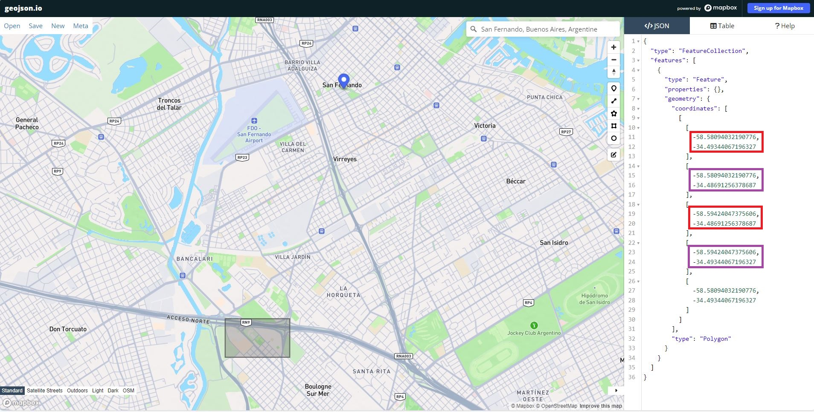

.. _howto:

=========
How to...
=========

.. _get_stereo_products:

Get full stereo products
========================

Pléiades / SPOT 6-7 products (DINAMIS)
--------------------------------------

| `DINAMIS <https://dinamis.data-terra.org/catalogue/>`_ is a platform that acquires and distributes satellite Earth imagery (Pléaides and Spot 6-7) for french and foreign institutional users under `specific subscription conditions <https://dinamis.data-terra.org/en/eligible-users/>`_.

AIRBUS Pleiades NEO example files
---------------------------------
Example files are available here: https://intelligence.airbus.com/imagery/sample-imagery/pleiades-neo-tristereo-marseille/ (A form must be filled out to access the data).

.. _maxar_example_files:

Maxar WorldView example files
-----------------------------

| Example files are available on AWS S3 through the SpaceNet challenge here: `s3://spacenet-dataset/Hosted-Datasets/MVS_dataset/WV3/PAN/`
| You need to install `aws-cli <https://github.com/aws/aws-cli>`_:

.. code-block:: console

   python -m venv venv-aws-cli # create a virtual environment
   source ./venv-aws-cli/bin/activate # activate it
   pip install --upgrade pip # upgrade pip
   pip install awscli

And download a stereo:

.. code-block:: console

   aws s3 cp --no-sign-request s3://spacenet-dataset/Hosted-Datasets/MVS_dataset/WV3/PAN/18DEC15WV031000015DEC18140522-P1BS-500515572020_01_P001_________AAE_0AAAAABPABJ0.NTF .
   aws s3 cp --no-sign-request s3://spacenet-dataset/Hosted-Datasets/MVS_dataset/WV3/PAN/18DEC15WV031000015DEC18140554-P1BS-500515572030_01_P001_________AAE_0AAAAABPABJ0.NTF  .

Prepare input images
====================

.. _make_input_roi_images:

Make input ROI images
---------------------

``cars-extractroi`` script allows to extract region of interest from your image product.

.. code-block:: console

   usage: cars-extractroi [-h] -il [IL [IL ...]] -out OUT -bbx x1 y1 x2 y2

   Helper to extract roi from bounding box

   optional arguments:
     -h, --help         show this help message and exit
     -il [IL [IL ...]]  Image products
     -out OUT           Extracts directory
     -bbx x1 y1 x2 y2   Bounding box from two points (x1, y1) and (x2, y2)

		
        
How to find the coordinates of the bounding box ?
.................................................

For example, if you have downloaded the maxar example data :ref:`maxar_example_files`, you are working in an area near to San Fernando in Argentina. Go to the website `geojson.io <https://geojson.io/>`_ in order to select your ROI:

|roisanfernando|

You can either select the upper left corner with the lower right corner (in red in the previous image): 

.. code-block:: console

   cars-extractroi -il *.NTF -out ext_dir -bbx -58.5809 -34.4934 -58.5942 -34.4869
   cars-starter -il ext_dir/*.tif -out out_dir > config.json
   cars config.json

or the lower left corner with the upper right corner (in purple in the previous image):

.. code-block:: console

   cars-extractroi -il *.NTF -out ext_dir -bbx -58.5809 -34.4869 -58.5942 -34.4934
   cars-starter -il ext_dir/*.tif -out out_dir > config.json
   cars config.json

N.B.: Instead of using ``cars-extractroi``, you can directly give the GeoJson dictionnary in the configuration file (Please, see :ref:`basic configuration` for details). In this case, the sparse steps (geometric corrections) are processed on the entire image and not only on the ROI.

Monitor tiles progression
-------------------------

``cars-dashboard`` script allows to monitor the progression of tiles computation on a web browser.

.. code-block:: console

    usage: cars-dashboard [-h] -out OUT

    Helper to monitor tiles progress

    optional arguments:
    -h, --help  show this help message and exit
    -out OUT    CARS output folder to monitor

For example, if you want to monitor the computation of a CARS run:

.. code-block:: console

    cars-dashboard -out output_cars

.. _make_a_simple_pan_sharpening:

Make a simple pan sharpening
----------------------------

In the case of Pleiades sensors, the XS color isn't superimposable to the Panchromatic image.

It can be recommended to apply a P+XS pansharpening with `OTB`_.

.. code-block:: console

    otbcli_BundleToPerfectSensor -inp image.tif -inxs color.tif -out color_pxs.tif

.. code-block:: console

    docker run -w /data -v "$(pwd)"/data:/data --entrypoint=/bin/bash  cnes/cars otbcli_BundleToPerfectSensor -inp /data/image.tif -inxs /data/color.tif -out /data/color_pxs.tif

.. _`OTB`: https://www.orfeo-toolbox.org/CookBook-8.0/C++/UserGuide.html#image-data-representation

Convert RGB image to panchromatic image
---------------------------------------

CARS only uses panchromatic images for processing.

If you have a multi-spectral image, you'll need to extract a single band to use, or convert it to a panchromatic image before using it with CARS.

The line below use `"Grayscale Using Luminance" <https://en.wikipedia.org/wiki/Grayscale#Luma_coding_in_video_systems>`_ expression with `OTB BandMath <https://www.orfeo-toolbox.org/CookBook/Applications/app_BandMath.html>`_

.. code-block:: console

    otbcli_BandMath -il image.tif -out image_panchromatic.tif -exp "(0.2126 * im1b1 + 0.7152 * im1b2 + 0.0722 * im1b3)"

.. _make_a_water_mask:

Make a water mask
-----------------

To produce a water mask from R,G,B,NIR images, it can be recommended to compute a Normalized Difference Water Index (NDWI) and threshold the output to a low value.

The low NDWI values can be considered as water area.

.. code-block:: console

    gdal_calc.py -G input.tif --G_band=2 -N input.tif --N_band=4 --outfile=mask.tif --calc="((1.0*G-1.0*N)/(1.0*G+1.0*N))>0.3" --NoDataValue=0
    
It is also possible to produce a water mask with `SLURP <https://github.com/CNES/slurp>`_.   

See next section to apply a gdal_translate to convert the mask with 1bit image struture.

.. _convert_image_to_binary_image:

Convert image to binary image
-----------------------------

To translate single image or multiband image with several nbits per band to 1bit per band, it can be recommended to use `gdal_translate <https://gdal.org/en/latest/programs/gdal_translate.html>`_ as follows:

.. code-block:: console

    gdal_translate -ot Byte -co NBITS=1 mask.tif mask_1nbit.tif

.. _add_band_description_in_image:

Add band name / description in TIF files metadata
--------------------------------------------------

To add a band name / description ("water", "cloud", etc.) in TIF files, for classification or color files in order to be used:

.. code-block:: python

    data_in = gdal.Open(infile, gdal.GA_Update)
    band_in = data_in.GetRasterBand(inband)
    band_in.SetDescription(band_description)
    data_in = None

.. _download_srtm_tiles:

Get low resolution DEM
========================

SRTM 90m DEM
---------------

It is possible to download a low resolution DEM (90-m SRTM) corresponding to your area. To get a SRTM tile, you need to run the following python script knowing the latitude and the longitude of your area:

.. code-block:: python

    import numpy as np

    def get_srtm_tif_name(lat, lon):
        """Download srtm tiles"""
        # longitude: [1, 72] == [-180, +180]
        tlon = (1+np.floor((lon+180)/5)) % 72
        tlon = 72 if tlon == 0 else tlon

        # latitude: [1, 24] == [60, -60]
        tlat = 1+np.floor((60-lat)/5)
        tlat = 24 if tlat == 25 else tlat

        srtm = "https://srtm.csi.cgiar.org/wp-content/uploads/files/srtm_5x5/TIFF/srtm_%02d_%02d.zip" % (tlon, tlat)
        return srtm

    if __name__ == "__main__":
        print("Get SRTM tile corresponding to latitude and longitude couple")
        while 1:
            print(">> Latitude? ", end="")
            lat = input()
            print(">> Longitude? ", end="")
            lon = input()
            print(">> SRTM filename:", get_srtm_tif_name(int(lat), int(lon)))
            input()

If your area intersects multiple latitudes and longitudes, get all the SRTM tiles and create a VRT from them:

.. code-block:: console

    gdalbuildvrt srtm.vrt srtm_tile1.tif srtm_tile2.tif

Post process output
===================

.. _merge_laz_files:

Merge Laz files
---------------

CARS generates several `laz files <https://docs.fileformat.com/gis/laz/>`_ corresponding to the tiles processed.

To merge them:

.. code-block:: console

    laszip -i data\*.laz -merged -o merged.laz

.. _`laszip`: https://laszip.org/

Docker
======

A docker is available to use CARS and OTB applications.
CARS is the docker entrypoint. To use otb, entrypoint must be specified.

Use CARS in docker
------------------

.. code-block:: console

    docker run -w /data -v "$(pwd)"/data_gizeh_small:/data cnes/cars /data/configfile.json

Use OTB in docker
-----------------

Any OTB application can be ran in docker

.. code-block:: console

    docker run  --entrypoint=/bin/bash  cnes/cars otbcli_BandMath -help
    
You can either enter docker's interactive mode or execute the program from outside of the docker, as explained right below (example for extract-roi): 

Interactive mode:
-----------------

You can enter in the docker interactive mode by using this command : 

.. code-block:: console

    docker run -it -w /data -v "$(pwd)"/data_gizeh_small:/data  --entrypoint /bin/bash cnes/cars:latest

You are now in an interactive docker mode and you can launch your program as follow:

.. code-block:: console

    cars-extractroi /data/img1.tif -out crop_img1.tif  -bbx 20800 5100 21000 5300

+--------------------------------------+------------------------------------------------------------------------------+
| Option                               | Explication                                                                  |
+======================================+==============================================================================+
| *docker run*                         | Runs a container based on the cnes/cars:latest image.                        |
+--------------------------------------+------------------------------------------------------------------------------+
| *-it*                                | Interactive mode (-i: interactive input, -t: allocates a pseudo-terminal).   |
+--------------------------------------+------------------------------------------------------------------------------+
| *-w /data*                           | Sets /data as the working directory inside the container.                    |
+--------------------------------------+------------------------------------------------------------------------------+
| *-v "$(pwd)"/data_gizeh_small:/data* | Mounts the local data_gizeh_small folder to /data inside the container.      |
+--------------------------------------+------------------------------------------------------------------------------+
| *--entrypoint /bin/bash*             | Overrides the container’s default entrypoint to run /bin/bash instead.       |
+--------------------------------------+------------------------------------------------------------------------------+
| *cnes/cars:latest*                   | Uses the cnes/cars:latest Docker image containing cars-extractroi.           |
+--------------------------------------+------------------------------------------------------------------------------+

From outside
------------

The other option is to directly use this complete command:

.. code-block:: console

    docker run  -w /data -v "$(pwd)"/data_gizeh_small:/data  --entrypoint cars-extractroi cnes/cars:latest -il /data/img1.tif -out crop_img1.tif  -bbx 20800 5100 21000 5300

.. _resample_image:

Resample an image
========================

If you want to upscale or downscale the resolution of you input data, use rasterio:

.. code-block:: python

    import rasterio
    from rasterio.enums import Resampling
    # Get data
    upscale_factor = 0.5
    with rasterio.open("example.tif") as dataset:
        # resample data to target shape
        data = dataset.read(
            out_shape=(
                dataset.count,
                int(dataset.height * upscale_factor),
                int(dataset.width * upscale_factor)
            ),
            resampling=Resampling.bilinear
        )
        # scale image transform
        transform = dataset.transform * dataset.transform.scale(
            (dataset.width / data.shape[-1]),
            (dataset.height / data.shape[-2])
        )
        profile = dataset.profile
        # Save data
        profile.update(
            width=data.shape[-1],
            height=data.shape[-2],
            transform=transform
        )
        with rasterio.open('resampled_example.tif', 'w', **profile) as dst:
            dst.write(data)

