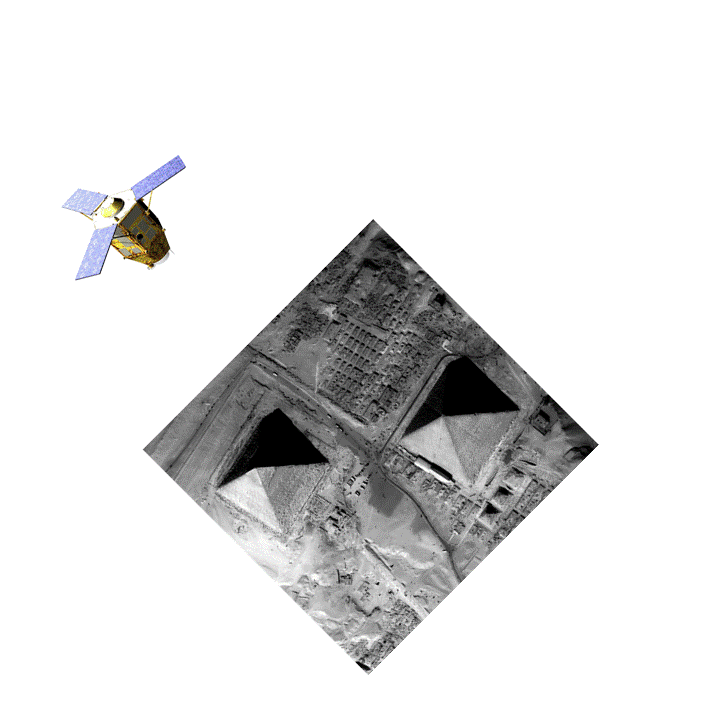

.. CARS documentation master file, created by
   sphinx-quickstart on Wed Sep  9 14:17:17 2020.
   You can adapt this file completely to your liking, but it should at least
   contain the root `toctree` directive.

:Version: |version|

CARS, a satellite multi view stereo pipeline
============================================

**CARS** is a dedicated and open source 3D tool to produce **Digital Surface Models** from satellite imaging by photogrammetry.
This Multiview stereo pipeline is intended for massive :term:`DSM` production with a robust and performant design.

.. |img2| image:: images/overview_dsm_3d.gif
   :width: 80%

+--------------------+---------------------------------------------+
| From stereo images | CARS produces a Digital Surface Model (DSM) |
+--------------------+---------------------------------------------+
| |img1|             | |img2|                                      |
+--------------------+---------------------------------------------+

CARS means CNES Algorithms to Reconstruct Surface (or Chaîne Automatique de Restitution Stéréoscopique in french)

Be aware that the project is new and is evolving to maturity with CNES usage roadmaps and projects such as:

- `CO3D project <https://co3d.cnes.fr/en/co3d-0>`_
- `AI4GEO project <https://www.ai4geo.eu/>`_

It is composed of:

- A **Python 3D API**, based on xarray, enabling to realize all the computation steps leading to a :term:`DSM`.
- An **end-to-end processing** chain based on this API.

The chain can use dask (local or cluster with centralized GPFS files storage) or multiprocessing libraries to distribute the computations.

Table of Contents
=================

.. toctree::
   :maxdepth: 2
   :caption: Contents:

   generalities
   install
   cli_usage
   notebooks
   developer
   core_modules
   glossary
   apidoc/modules

Indices and tables
==================

* :ref:`modindex`
* :ref:`genindex`
* :ref:`search`
