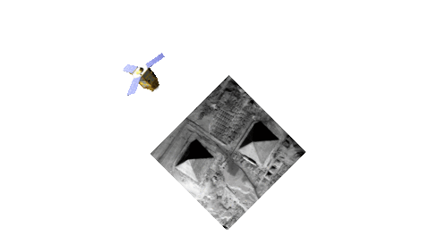

.. CARS documentation master file, created by
   sphinx-quickstart on Wed Sep  9 14:17:17 2020.
   You can adapt this file completely to your liking, but it should at least
   contain the root `toctree` directive.

:Version: |version|

CARS, a satellite multi view stereo pipeline
============================================

:term:`CARS` is a dedicated and open source 3D tool to produce **Digital Surface Models** from satellite imaging by photogrammetry.

.. |img2| image:: images/overview_dsm_3d.gif
   :width: 80%

+--------------------+---------------------------------------------+
| From stereo images | CARS produces a Digital Surface Model (DSM) |
+--------------------+---------------------------------------------+
| |img1|             | |img2|                                      |
+--------------------+---------------------------------------------+

This Multiview stereo pipeline is intended for massive :term:`DSM` production with a robust and performant design.

Be aware that CARS is new and evolving to maturity with CNES roadmaps and `CO3D <https://co3d.cnes.fr/en/co3d-0>`_
and `AI4GEO <https://www.ai4geo.eu/>`_ projects.

**Contact:** cars AT cnes.fr

.. toctree::
   :maxdepth: 2

   getting_started
   install
   userguide
   developer_guide
   api_reference/index.rst
   faq
   glossary
