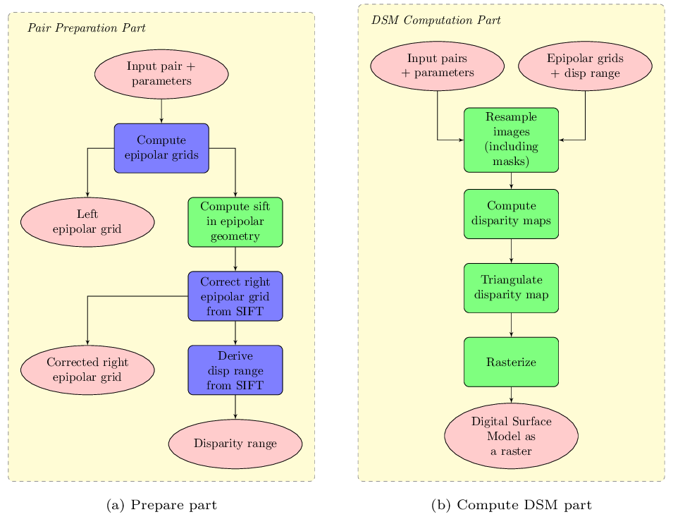

.. _main_principles:

===============
Main principles
===============

**CARS** is a dedicated and open source 3D tool to produce **Digital Surface Models** from satellite imaging by photogrammetry.
This Multiview stereo pipeline is intended for massive :term:`DSM` production with a robust and performant design.

It is composed of:

- A **Python 3D API**, based on xarray, enabling to realize all the computation steps leading to a :term:`DSM`.
- An **end-to-end processing** chain based on this API.

The chain can use dask (local or  distributed cluster) or multiprocessing libraries to distribute the computations.
The distributed cluster require centralized files storage and uses PBS scheduler only for now.

More precisely, CARS is composed of well known steps in Multiview Stereo Pipeline divided in two parts to process images stereo pairs :

1. **Prepare sparse pipeline** : The goal is to compute :term:`DSM` required early data on the whole images to prepare the main computation. It also detects data-induced failures and degraded cases.
2. **Compute_dsm dense pipeline** : This step is composed of the intensive parts of CARS pipeline. It takes as inputs the prepare step's outputs of several pairs and computes a unique DSM from them.

    CARS Workflows

See :ref:`user_manual_main_cli` for CARS main command line interface.

.. _prepare_pipeline:

Prepare pipeline
================

Each stereo images pair is pre-processed independently via prepare pipeline. Each pipeline execution generates refined epipolar resampling grids and an estimation of the disparity range to calibrate the heavy intensive computing part.
This pipeline process uses an approximate geoid (typically SRTM).
As shown in the figure above, the workflow is organized in sequential steps from input pairs (and metadata) to output data, except for the computation of sparse matches (performed tile-wise and distributed among Dask workers).

The prepare part will perform the following steps:

1. Compute the stereo-rectification grids of the input pair's images
2. Compute sift matches between the left and right images in epipolar geometry
3. Derive an optimal disparity range from the matches
4. Derive a bilinear correction model of the right image's stereo-rectification grid in order to minimize the epipolar error
5. Apply the estimated correction to the right grid
6. Export the left and corrected right grids

see :ref:`user_manual_prepare_cli`

.. _compute_dsm_pipeline:

DSM compute pipeline
====================

This dense mode pipeline processes a set of pairs and computes an unique DSM from them. Each pair will be processed independently using the epipolar grids and the disparity range computed in the prepare step. A corresponding set of points clouds will then be generated. Then this set will be merged together during the rasterization step.

After prepare pipeline(s), the ``compute_dsm`` pipeline will be in charge of:

1. **resampling the images pairs in epipolar geometry** (corrected one for the right image) by using SRTM in order to reduce the disparity intervals to explore,
2. **compute disparity for each image pair** in epipolar geometry
3. **triangulating the sights** and get for each point of the reference image a latitude, longitude, altitude point
4. **filtering the 3D points cloud** via two consecutive filters. The first one removes the small groups of 3D points. The second filters the points which have the most scattered neighbors. Those two filters are activated by default.
5. **projecting these altitudes on a regular grid** as well as the associated color

See :ref:`user_manual_compute_cli`

References
==========
For more details, here are the reference papers:

- Youssefi D., Michel, J., Sarrazin, E., Buffe, F., Cournet, M., Delvit, J., L’Helguen, C., Melet, O., Emilien, A., Bosman, J., 2020. **CARS: A photogrammetry pipeline using dask graphs to construct a global 3d model**. IGARSS - IEEE International Geoscience and Remote Sensing Symposium.(`https://ieeexplore.ieee.org/document/9324020 <https://ieeexplore.ieee.org/document/9324020>`_)
- Michel, J., Sarrazin, E., Youssefi, D., Cournet, M., Buffe, F., Delvit, J., Emilien, A., Bosman, J., Melet, O., L’Helguen, C., 2020. **A new satellite imagery stereo pipeline designed for scalability, robustness and performance.** ISPRS - International Archives of the Photogrammetry, Remote Sensing and Spatial Information Sciences.(`https://www.isprs-ann-photogramm-remote-sens-spatial-inf-sci.net/V-2-2020/171/2020/ <https://www.isprs-ann-photogramm-remote-sens-spatial-inf-sci.net/V-2-2020/171/2020/>`_)
