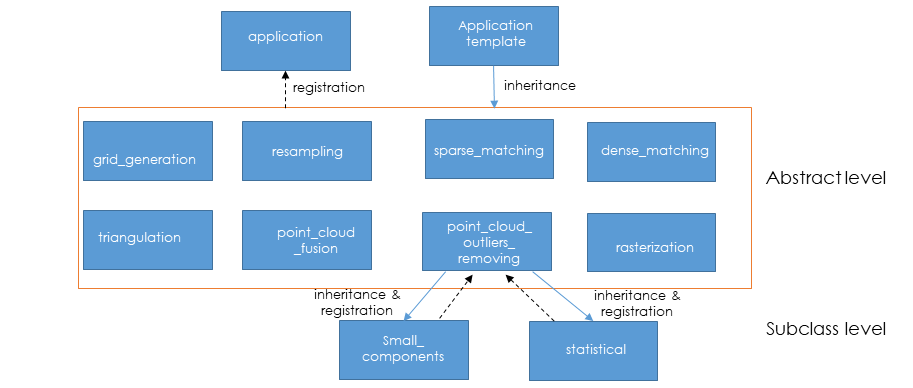

.. _application:

Application
===========

Overview
--------

An *application* is a main step of CARS 3D reconstruction framework.
It contains algorithm methods.
It takes *CarsDatasets* and configuration parameters as input and returns *CarsDatasets*.

It is composed of:
* an application factory concept that register all 3D step application
* an application template
* Some abstract applications (each one defined a main 3d step)
* Some subclass associated to each abstract application, containing specific algorithm

Example
-------

Let's take an example of `dense_matching` application to describe the main steps:

First, we can notice that `dense_matching` derives from `ApplicationTemplate` and is registered with the decorator:

.. sourcecode:: python

    @Application.register("dense_matching")
    class DenseMatching(ApplicationTemplate, metaclass=ABCMeta):

Then,  algorithm is contain in a subclass register, by is `short_name`, of `dense_matching` application.

.. sourcecode:: python

    class CensusMccnnSgm(
        DenseMatching, short_name=["census_sgm"]
    )

1. Init with parameters checking

To instantiate, need the *orchestrator* and a configuration file that contains algorirhm parameters.

.. sourcecode:: python

        def __init__(self, orchestrator, conf_matching):
            """
            Init function of DenseMatching

            :param orchestrator: orchestrator used
            :param conf_matching: configuration for matching
            :return: a application_to_use object
            """

            # orchestrator
            self.orchestrator = orchestrator

            # check conf

            self.corr_config = None
            if "corr_config" in conf_matching:
                self.corr_config = conf_matching["corr_config"]
                # For now, this is a path, transform it to dict
                # later : integrated to input config
                # TODO use loader to check and generate corr_config
                self.corr_config = corr_conf.configure_correlator(self.corr_config)

            self.correlator = None
            if "correlator" in conf_matching:
                self.correlator = conf_matching["correlator"]
            else:
                self.correlator = "pandora"

            # check loader

            # Saving files
            if "save_disparity_map" in conf_matching:
                self.save_disparity_map = conf_matching["save_disparity_map"]
            else:
                self.save_disparity_map = False

            #

2. Run,Take *CarsDataset* as input and return new *CarsDatasets*.

.. sourcecode:: python

        def run(
            self,
            epipolar_images_left,
            epipolar_images_right,
            pair_folder,
        ):

                  """
            Run Matching application.

            Create left and right CarsDataset filled with xarray.Dataset ,
            corresponding to epipolar disparities, on the same geometry
            that epipolar_images_left and epipolar_images_right.

            :param epipolar_images_left: tiled left epipolar
            :type epipolar_images_left: CarsDataset
            :param epipolar_images_right: tiled right epipolar
            :type epipolar_images_right: CarsDataset
            :param pair_folder: folder used for current pair
            :type pair_folder: str

            :return Disparity map
            :rtype: CarsDataset
            """

2.1. Create empty *CarsDatasets*.

.. sourcecode:: python

            if epipolar_images_left.dataset_type == "arrays":
                # Create CarsDataset
                # Epipolar_disparity
                epipolar_disparity_map = cars_dataset.CarsDataset("arrays")
                epipolar_disparity_map.create_empty_copy(epipolar_images_left)

                # Update attributes to get epipolar info
                epipolar_disparity_map.attributes.update(
                    epipolar_images_left.attributes
                )

2.2 Declare to *Orchestrator* which products we want to save.

.. sourcecode:: python

            # Save disparity maps
            if self.save_disparity_map:
                self.orchestrator.add_to_save_lists(
                    os.path.join(pair_folder, "epi_disp.tif"),
                    cst_disp.MAP,
                    epipolar_disparity_map,
                )

                ....

2.3 Ask to the *Orchestrator* ID for each *CarsDataset*

.. sourcecode:: python

                # Get saving infos in order to save tiles when they are computed
                [
                    saving_info
                ] = self.orchestrator.get_saving_infos(
                    [epipolar_disparity_map]
                )

2.4 Tile by tile, algorithm step computation

    1. Use `create_task` function of the cluster throughout the Orchestrator. Algorithm function is called. See juste above
    2. `create_task` returns a `delayed` stored in previous created CarsDataset

.. sourcecode:: python

                # Generate disparity maps
                for col in range(epipolar_disparity_map.shape[1]):
                    for row in range(epipolar_disparity_map.shape[0]):

                        # Compute disparity
                        (
                            epipolar_disparity_map[row, col],
                        ) = self.orchestrator.cluster.create_task(
                            compute_disparity
                        )(
                            epipolar_images[row, col],
                            self.corr_config,
                            saving_info=saving_info,
                        )
            else:
                logging.error(
                    "DenseMatching application doesn't "
                    "support this input data format"
                )

            return epipolar_disparity_map

3. For each tile, the core algorithm function is called.

   1. Takes unique tile in input (not a whole *CarsDataset*) and returns a tile
   2. Add the ID, given by *orchestrator*, to this tile

.. sourcecode:: python

    def compute_disparity(
        image_object: xr.Dataset,
        corr_cfg: dict,
        saving_info=None,
    ) -> Dict[str, xr.Dataset]:
        """
        Compute disparity map from image objects.
        This function will be run as a delayed task.

        User must provide saving infos to save properly created datasets

        :param left_image_object: tiled Left image
          * dataset with :
                - cst.EPI_IMAGE
                - cst.EPI_MSK (if given)
                - cst.EPI_COLOR (for left, if given)
        :type left_image_object: xr.Dataset
          * dataset with :
                - cst.EPI_IMAGE
                - cst.EPI_MSK (if given)
                - cst.EPI_COLOR (for left, if given)
        :param right_image_object: tiled Right image
        :type right_image_object: xr.Dataset
        :param corr_cfg: Correlator configuration
        :type corr_cfg: dict

        :returns: Disparity object

        Returned objects are composed of :
            * dataset with :
                - cst_disp.MAP
                - cst_disp.VALID
                - cst.EPI_COLOR
        """

        # Get disp_min and disp_max
        disp_min = cars_dataset.get_attributes(left_image_object)["disp_min"]
        disp_max = cars_dataset.get_attributes(left_image_object)["disp_max"]

        # Compute disparity
        disp = dense_matching_tools.compute_disparity(
            left_image_object,
            right_image_object,
            corr_cfg,
            disp_min,
            disp_max,
            mask1_ignored_by_corr=mask1_ignored_by_corr,
            mask2_ignored_by_corr=mask2_ignored_by_corr,
        )

        # Fill with attributes
        left_disp_dataset = disp[cst.STEREO_REF]
        cars_dataset.fill_dataset(
            left_disp_dataset,
            saving_info=saving_info_left,
            window=cars_dataset.get_window_dataset(left_image_object),
            profile=cars_dataset.get_profile_rasterio(left_image_object),
            attributes=None,
            overlaps=None,  # overlaps are removed
        )

        return disp_dataset

At the end of the application, we can obtain *CarsDatasets* filled with delayed, one per tile.
