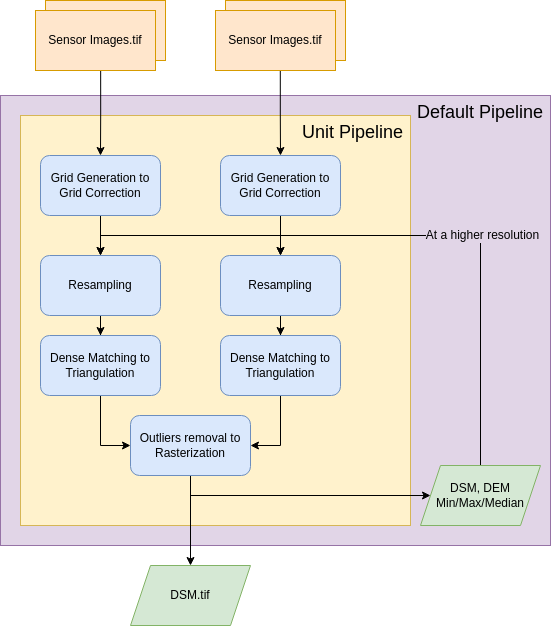

.. _usage:

=====
Usage
=====

Command line
============

``cars`` command line is the entry point for CARS to run 3D pipelines.

.. code-block:: console

    cars -h

    usage: cars [-h] [--loglevel {DEBUG,INFO,PROGRESS,WARNING,ERROR,CRITICAL}] [--version] conf

    CARS: CNES Algorithms to Reconstruct Surface

    positional arguments:
      conf                  Inputs Configuration File

    optional arguments:
      -h, --help            show this help message and exit
      --loglevel {DEBUG,INFO,PROGRESS,WARNING,ERROR,CRITICAL}
                            Logger level (default: PROGRESS. Should be one of (DEBUG, INFO, PROGRESS, WARNING, ERROR, CRITICAL)
      --version, -v         show program's version number and exit

CARS cli takes only one ``.json`` file as command line argument:

.. code-block:: console

    cars configfile.json
    
Note that ``cars-starter`` script can be used to instantiate this configuration file.

.. code-block:: console

    cars-starter  -h
    usage: cars-starter [-h] -il [input.{tif,XML} or pair_dir [input.{tif,XML} or pair_dir ...]] -out out_dir [--full] [--check]

    Helper to create configuration file

    optional arguments:
    -h, --help            show this help message and exit
    -il [input.{tif,XML} or pair_dir [input.{tif,XML} or pair_dir ...]]
                            Inputs list or Pairs directory list
    -out out_dir          Output directory
    --full                Fill all default values
    --check               Check inputs

Finally, an output ``used_conf.json`` file will be created on the output directory. This file contains all the execution used
parameters and can be used as an input configuration file to re-run cars.

.. _configuration:

Configuration
=============

This section describes main CARS configuration structure through a `json <http://www.json.org/json-fr.html>`_ configuration file.

The structure follows this organisation:

.. code-block:: json

    {
        "inputs": {},
        "orchestrator": {},
        "applications": {},
        "output": {},
        "pipeline": "pipeline_to_use",
        "geometry_plugin": "geometry_plugin_to_use"
    }

.. warning::

    Be careful with commas to separate each section. None needed for the last json element.

.. tabs::

   .. tab:: Inputs

    Inputs depends on the pipeline used by CARS. CARS can be entered with Sensor Images or Point Clouds:

    * Sensor Images: used in "sensors_to_dense_dsm", "sensors_to_sparse_dsm", "sensors_to_dense_point_clouds" pipelines.
    * Point Clouds: used in  "dense_point_clouds_to_dense_dsm" pipeline.

    .. tabs::

        .. tab:: Sensors Images inputs

            +-------------------------+---------------------------------------------------------------------+-----------------------+----------------------+----------+
            | Name                    | Description                                                         | Type                  | Default value        | Required |
            +=========================+=====================================================================+=======================+======================+==========+
            | *sensor*                | Stereo sensor images                                                | See next section      | No                   | Yes      |
            +-------------------------+---------------------------------------------------------------------+-----------------------+----------------------+----------+
            | *pairing*               | Association of image to create pairs                                | list of *sensor*      | No                   | Yes      |
            +-------------------------+---------------------------------------------------------------------+-----------------------+----------------------+----------+
            | *epsg*                  | EPSG code                                                           | int, should be > 0    | None                 | No       |
            +-------------------------+---------------------------------------------------------------------+-----------------------+----------------------+----------+
            | *initial_elevation*     | Path to SRTM tiles (see :ref:`plugins` section for details)         | string                | None                 | No       |
            |                         | If not provided, internal dem is generated with sparse matches      |                       |                      |          |
            +-------------------------+---------------------------------------------------------------------+-----------------------+----------------------+----------+
            | *default_alt*           | Default height above ellipsoid when there is no DEM available       | int                   | 0                    | No       |
            |                         | no coverage for some points or pixels with no_data in the DEM tiles |                       |                      |          |
            +-------------------------+---------------------------------------------------------------------+-----------------------+----------------------+----------+
            | *roi*                   | ROI: Vector file path or GeoJson                                    | string, dict          | None                 | No       |
            +-------------------------+---------------------------------------------------------------------+-----------------------+----------------------+----------+
            | *debug_with_roi*        | Use ROI with the tiling of the entire image                         | Boolean               | False                | No       |
            +-------------------------+---------------------------------------------------------------------+-----------------------+----------------------+----------+
            | *check_inputs*          | Check inputs consistency (to be deprecated and changed)             | Boolean               | False                | No       |
            +-------------------------+---------------------------------------------------------------------+-----------------------+----------------------+----------+
            | *geoid*                 | Geoid path                                                          | string                | Cars internal geoid  | No       |
            +-------------------------+---------------------------------------------------------------------+-----------------------+----------------------+----------+
            | *use_epipolar_a_priori* | Active epipolar a priori                                            | bool                  | False                | Yes      |
            +-------------------------+---------------------------------------------------------------------+-----------------------+----------------------+----------+
            | *epipolar_a_priori*     | Provide epipolar a priori information (see section below)           | dict                  |                      | No       |
            +-------------------------+---------------------------------------------------------------------+-----------------------+----------------------+----------+
            | *terrain_a_priori*      | Provide terrain a priori information (see section below)            | dict                  |                      | No       |
            +-------------------------+---------------------------------------------------------------------+-----------------------+----------------------+----------+

            **Sensor**

            For each sensor images, give a particular name (what you want):

            .. code-block:: json

                {
                    "my_name_for_this_image":
                    {
                        "image" : "path_to_image.tif",
                        "color" : "path_to_color.tif",
                        "mask" : "path_to_mask.tif",
                        "classification" : "path_to_classification.tif",
                        "nodata": 0
                    }
                }

            +-------------------+------------------------------------------------------------------------------------------+----------------+---------------+----------+
            | Name              | Description                                                                              | Type           | Default value | Required |
            +===================+==========================================================================================+================+===============+==========+
            | *image*           | Path to the image                                                                        | string         |               | Yes      |
            +-------------------+------------------------------------------------------------------------------------------+----------------+---------------+----------+
            | *color*           | Image stackable to image used to create an ortho-image corresponding to the produced dsm | string         |               | No       |
            +-------------------+------------------------------------------------------------------------------------------+----------------+---------------+----------+
            | *no_data*         | No data value of the image                                                               | int            | 0             | No       |
            +-------------------+------------------------------------------------------------------------------------------+----------------+---------------+----------+
            | *geomodel*        | Path of geomodel and plugin-specific attributes (see :ref:`plugins` section for details) | string, dict   |               | No       |
            +-------------------+------------------------------------------------------------------------------------------+----------------+---------------+----------+
            | *mask*            | Binary mask stackable to image: 0 values are considered valid data                       | string         | None          | No       |
            +-------------------+------------------------------------------------------------------------------------------+----------------+---------------+----------+
            | *classification*  | Multiband classification image (label keys inside metadata): 1 values = valid data       | string         | None          | No       |
            +-------------------+------------------------------------------------------------------------------------------+----------------+---------------+----------+

            .. note::

                - *color*: This image can be composed of XS bands in which case a PAN+XS fusion has been be performed. Please, see the section :ref:`make_a_simple_pan_sharpening` to make a simple pan sharpening with OTB if necessary.
                - If the *classification* configuration file is indicated, all non-zeros values of the classification image will be considered as invalid data.
                - Please, see the section :ref:`convert_image_to_binary_image` to make binary mask image or binary classification with 1 bit per band.
                - The classification of second input is not necessary. In this case, the applications use only the available classification.
                - Please, see the section :ref:`add_band_description_in_image` to add band name / description in order to be used in Applications
                - *geomodel*: If no geomodel is provide, CARS will try to use the rpc loaded with rasterio opening *image*.

            **Pairing**

            The pairing attribute defines the pairs to use, using sensors keys used to define sensor images.

            .. code-block:: json

                {
                "inputs": {
                    "sensors" : {
                        "one": {
                            "image": "img1.tif",
                            "geomodel": "img1.geom"
                        },
                        "two": {
                            "image": "img2.tif",
                            "geomodel": "img2.geom"

                        },
                        "three": {
                            "image": "img3.tif",
                            "geomodel": "img3.geom"
                        }
                    },
                    "pairing": [["one", "two"],["one", "three"]]
                    }
                }

            
            **Epipolar a priori**

            The epipolar is usefull to accelerate the preliminary steps of the grid correction and the disparity range evaluation,
            particularly for the sensor_to_full_resolution_dsm pipeline.
            The epipolar_a_priori data dict is produced during low or full resolution dsm pipeline.
            However, the epipolar_a_priori should be not activated for the sensor_to_low_resolution_dsm.
            So, the sensor_to_low_resolution_dsm pipeline produces a refined_conf_full_res.json in the outdir
            that contains the epipolar_a_priori information for each sensor image pairs.
            The epipolar_a_priori is also saved in the used_conf.json with the sensor_to_full_resolution_dsm pipeline.

            For each sensor images, the epipolar a priori are filled as following:

            +-----------------------+-------------------------------------------------------------+--------+----------------+----------------------------------+
            | Name                  | Description                                                 | Type   | Default value  | Required                         |
            +=======================+=============================================================+========+================+==================================+
            | *grid_correction*     | The grid correction coefficients                            | list   |                | if use_epipolar_a_priori is True |
            +-----------------------+-------------------------------------------------------------+--------+----------------+----------------------------------+
            | *disparity_range*     | The disparity range [disp_min, disp_max]                    | list   |                | if use_epipolar_a_priori is True |
            +-----------------------+-------------------------------------------------------------+--------+----------------+----------------------------------+

            .. note::

                The grid correction coefficients are based on bilinear model with 6 parameters [x1,x2,x3,y1,y2,y3].
                The None value produces no grid correction (equivalent to parameters [0,0,0,0,0,0]).

            **Terrain a priori**

            The terrain a priori is used at the same time that epipolar a priori.
            If use_epipolar_a_priori is activated, epipolar_a_priori and terrain_a_priori must be provided.
            The terrain_a_priori data dict is produced during low or full resolution dsm pipeline.

            The terrain a priori is initially populated with DEM information.

            +----------------+-------------------------------------------------------------+--------+----------------+----------------------------------+
            | Name           | Description                                                 | Type   | Default value  | Required                         |
            +================+=============================================================+========+================+==================================+
            | *dem_median*   | DEM generated with median function                          | str    |                | if use_epipolar_a_priori is True |
            +----------------+-------------------------------------------------------------+--------+----------------+----------------------------------+
            | *dem_min*      | DEM generated with min function                             | str    |                | if use_epipolar_a_priori is True |
            +----------------+-------------------------------------------------------------+--------+----------------+----------------------------------+
            | *dem_max*      | DEM generated with max function                             | str    |                | if use_epipolar_a_priori is True |
            +----------------+-------------------------------------------------------------+--------+----------------+----------------------------------+
            

        .. tab:: Point Clouds inputs

            +-------------------------+---------------------------------------------------------------------+-----------------------+----------------------+----------+
            | Name                    | Description                                                         | Type                  | Default value        | Required |
            +=========================+=====================================================================+=======================+======================+==========+
            | *point_clouds*          | Point Clouds to rasterize                                           | dict                  | No                   | Yes      |
            +-------------------------+---------------------------------------------------------------------+-----------------------+----------------------+----------+
            | *epsg*                  | EPSG code to use for DSM                                            | int, should be > 0    | None                 | No       |
            +-------------------------+---------------------------------------------------------------------+-----------------------+----------------------+----------+
            | *roi*                   | Region Of Interest: Vector file path or GeoJson                     | string, dict          | None                 | No       |
            +-------------------------+---------------------------------------------------------------------+-----------------------+----------------------+----------+

            **Point Clouds**

            For each point cloud, give a particular name (what you want):

            .. code-block:: json

                {
                    "point_clouds": {
                        "my_name_for_this_point_cloud":
                        {
                            "x" : "path_to_x.tif",
                            "y" : "path_to_y.tif",
                            "z" : "path_to_z.tif",
                            "color" : "path_to_color.tif",
                            "mask": "path_to_mask.tif",
                            "classification": "path_to_the_classification.tif",
                            "confidence": {
                                "confidence_name1": "path_to_the_confidence1.tif",
                                "confidence_name2": "path_to_the_confidence2.tif",
                            }
                            "epsg": "point_cloud_epsg"
                        }
                    },
                    "epsg": 32644
                }

            These input files can be generated with the sensors_to_dense_point_clouds pipeline, or sensors_to_dense_dsm pipeline activating the saving of point clouds in `triangulation` application.

            +------------------+-------------------------------------------------------------------+----------------+---------------+----------+
            | Name             | Description                                                       | Type           | Default value | Required |
            +==================+===================================================================+================+===============+==========+
            | *x*              | Path to the x coordinates of point cloud                          | string         |               | Yes      |
            +------------------+-------------------------------------------------------------------+----------------+---------------+----------+
            | *y*              | Path to the y coordinates of point cloud                          | string         |               | Yes      |
            +------------------+-------------------------------------------------------------------+----------------+---------------+----------+
            | *z*              | Path to the z coordinates of point cloud                          | string         |               | Yes      |
            +------------------+-------------------------------------------------------------------+----------------+---------------+----------+
            | *color*          | Color of point cloud                                              | string         |               | Yes      |
            +------------------+-------------------------------------------------------------------+----------------+---------------+----------+
            | *mask*           | Validity mask of point cloud : 0 values are considered valid data | string         |               | No       |
            +------------------+-------------------------------------------------------------------+----------------+---------------+----------+
            | *classification* | Classification of point cloud                                     | string         |               | No       |
            +------------------+-------------------------------------------------------------------+----------------+---------------+----------+
            | *confidence*     | Dict of paths to the confidences of point cloud                   | dict           |               | No       |
            +------------------+-------------------------------------------------------------------+----------------+---------------+----------+
            | *epsg*           | Epsg code of point cloud                                          | int            | 4326          | No       |
            +------------------+-------------------------------------------------------------------+----------------+---------------+----------+

    **Region Of Interest (ROI)**

    A terrain ROI can be provided by user. It can be either a vector file (Shapefile for instance) path,
    or a GeoJson dictionnary. These structures must contain a single Polygon or MultiPolygon. Multi-features are 
    not supported.

    Example of the "roi" parameter with a GeoJson dictionnary containing a Polygon as feature :

    .. code-block:: json

        {
            "inputs":
            {
                "roi" : {
                    "type": "FeatureCollection",
                    "features": [
                        {
                        "type": "Feature",
                        "properties": {},
                        "geometry": {
                            "coordinates": [
                            [
                                [5.194, 44.2064],
                                [5.194, 44.2059],
                                [5.195, 44.2059],
                                [5.195, 44.2064],
                                [5.194, 44.2064]
                            ]
                            ],
                            "type": "Polygon"
                        }
                        }
                    ]
                }
            }
        }

    If the *debug_with_roi* parameter is enabled, the tiling of the entire image is kept but only the tiles intersecting 
    the ROI are computed.

    MultiPolygon feature is only useful if the parameter *debug_with_roi* is activated, otherwise the total footprint of the 
    MultiPolygon will be used as ROI. 

    By default epsg 4326 is used. If the user has defined a polygon in a different reference system, the "crs" field must be specified.

    Example of the *debug_with_roi* mode utilizing an "roi" parameter of type MultiPolygon as a feature and a specific EPSG.

    .. code-block:: json

        {
            "inputs":
            {
                "roi" : {
                    "type": "FeatureCollection",
                    "features": [
                        {
                        "type": "Feature",
                        "properties": {},
                        "geometry": {
                            "coordinates": [
                            [
                                [
                                    [319700, 3317700],
                                    [319800, 3317700],
                                    [319800, 3317800],
                                    [319800, 3317800],
                                    [319700, 3317700]
                                ]
                            ],
                            [
                                [
                                    [319900, 3317900],
                                    [320000, 3317900],
                                    [320000, 3318000],
                                    [319900, 3318000],
                                    [319900, 3317900]
                                ]
                            ]
                            ],
                            "type": "MultiPolygon"
                        }
                        }
                    ],
                    "crs" :
                    {
                        "type": "name",
                        "properties": {
                            "name": "EPSG:32636"
                        }
                    }
                },
                 "debug_with_roi": true,
            }
        }

    Example of the "roi" parameter with a Shapefile

    .. code-block:: json

        {
            "inputs":
            {
                "roi" : "roi_vector_file.shp"
            }
        }

		
   .. tab:: Orchestrator

        CARS can distribute the computations chunks by using either dask (local or distributed cluster) or multiprocessing libraries.
        The distributed cluster require centralized files storage and uses PBS scheduler.

        The ``orchestrator`` key is optional and allows to define orchestrator configuration that controls the distribution:

        +------------------+--------------------------------------------------------------------------------------------------+-----------------------------------------+-----------------+----------+
        | Name             | Description                                                                                      | Type                                    | Default value   | Required |
        +==================+==================================================================================================+=========================================+=================+==========+
        | *mode*           | Parallelization mode "local_dask", "pbs_dask", "slurm_dask", "multiprocessing" or "sequential"   | string                                  | multiprocessing | Yes      |
        +------------------+--------------------------------------------------------------------------------------------------+-----------------------------------------+-----------------+----------+
        | *profiling*      | Configuration for CARS profiling mode                                                            | dict                                    |                 | No       |
        +------------------+--------------------------------------------------------------------------------------------------+-----------------------------------------+-----------------+----------+

        .. note::
            `sequential` orchestrator purposes are mostly for studies, debug and notebooks. If you want to use it with large data, consider using a ROI and Epipolar A Priori. Only tiles needed for the specified ROI will be computed. If Epipolar A priori is not specified, Epipolar Resampling and Sparse Matching will be performed on the whole image, no matter what ROI field is filled with.
    

        Depending on the used orchestrator mode, the following parameters can be added in the configuration:

        **Mode local_dask, pbs_dask:**

        +---------------------+------------------------------------------------------------------+-----------------------------------------+---------------+----------+
        | Name                | Description                                                      | Type                                    | Default value | Required |
        +=====================+==================================================================+=========================================+===============+==========+
        | *nb_workers*        | Number of workers                                                | int, should be > 0                      | 2             | No       |
        +---------------------+------------------------------------------------------------------+-----------------------------------------+---------------+----------+
        | *max_ram_per_worker*| Maximum ram per worker                                           | int or float, should be > 0             | 2000          | No       |
        +---------------------+------------------------------------------------------------------+-----------------------------------------+---------------+----------+
        | *walltime*          | Walltime for one worker                                          | string, Should be formatted as HH:MM:SS | 00:59:00      | No       |
        +---------------------+------------------------------------------------------------------+-----------------------------------------+---------------+----------+
        | *use_memory_logger* | Usage of dask memory logger                                      | bool, True if use memory logger         | False         | No       |
        +---------------------+------------------------------------------------------------------+-----------------------------------------+---------------+----------+
        | *activate_dashboard*| Usage of dask dashboard                                          | bool, True if use dashboard             | False         | No       |
        +---------------------+------------------------------------------------------------------+-----------------------------------------+---------------+----------+
        | *python*            | Python path to binary to use in workers (not used in local dask) | str                                     | Null          | No       |
        +---------------------+------------------------------------------------------------------+-----------------------------------------+---------------+----------+

        **Mode slurm_dask:**

        +---------------------+------------------------------------------------------------------+-----------------------------------------+---------------+----------+
        | Name                | Description                                                      | Type                                    | Default value | Required |
        +=====================+==================================================================+=========================================+===============+==========+
        | *account*           | SLURM account                                                    | str                                     |               | Yes      |
        +---------------------+------------------------------------------------------------------+-----------------------------------------+---------------+----------+
        | *nb_workers*        | Number of workers                                                | int, should be > 0                      | 2             | No       |
        +---------------------+------------------------------------------------------------------+-----------------------------------------+---------------+----------+
        | *max_ram_per_worker*| Maximum ram per worker                                           | int or float, should be > 0             | 2000          | No       |
        +---------------------+------------------------------------------------------------------+-----------------------------------------+---------------+----------+
        | *walltime*          | Walltime for one worker                                          | string, Should be formatted as HH:MM:SS | 00:59:00      | No       |
        +---------------------+------------------------------------------------------------------+-----------------------------------------+---------------+----------+
        | *use_memory_logger* | Usage of dask memory logger                                      | bool, True if use memory logger         | False         | No       |
        +---------------------+------------------------------------------------------------------+-----------------------------------------+---------------+----------+
        | *activate_dashboard*| Usage of dask dashboard                                          | bool, True if use dashboard             | False         | No       |
        +---------------------+------------------------------------------------------------------+-----------------------------------------+---------------+----------+
        | *python*            | Python path to binary to use in workers (not used in local dask) | str                                     | Null          | No       |
        +---------------------+------------------------------------------------------------------+-----------------------------------------+---------------+----------+
        | *qos*               | Quality of Service parameter (qos list separated by comma)       | str                                     | Null          | No       |
        +---------------------+------------------------------------------------------------------+-----------------------------------------+---------------+----------+

        **Mode multiprocessing:**

        +-----------------------+-----------------------------------------------------------+------------------------------------------+---------------+----------+
        | Name                  | Description                                               | Type                                     | Default value | Required |
        +=======================+===========================================================+==========================================+===============+==========+
        | *nb_workers*          | Number of workers                                         | int, should be > 0                       | 2             | No       |
        +-----------------------+-----------------------------------------------------------+------------------------------------------+---------------+----------+
        | *max_ram_per_worker*  | Maximum ram per worker                                    | int or float, should be > 0              | 2000          | No       |
        +-----------------------+-----------------------------------------------------------+------------------------------------------+---------------+----------+
        | *max_tasks_per_worker*| Number of tasks a worker can complete before refresh      | int, should be > 0                       | 10            | No       |
        +-----------------------+-----------------------------------------------------------+------------------------------------------+---------------+----------+
        | *dump_to_disk*        | Dump temporary files to disk                              | bool                                     | True          | No       |
        +-----------------------+-----------------------------------------------------------+------------------------------------------+---------------+----------+
        | *per_job_timeout*     | Timeout used for a job                                    | int or float                             | 600           | No       |
        +-----------------------+-----------------------------------------------------------+------------------------------------------+---------------+----------+
        | *factorize_tasks*     | Tasks sequentially dependent are run in one task          | bool                                     | True          | No       |
        +-----------------------+-----------------------------------------------------------+------------------------------------------+---------------+----------+
    
        .. note::

            **Factorisation**

            Two or more tasks are sequentially dependant if they can be run sequentially, independantly from any other task. 
            If it is the case, those tasks can be factorized, which means they can be run in a single task.
            
            Running several tasks in one task avoids doing useless dumps on disk between sequential tasks. It does not lose time 
            because tasks that are factorized could not be run in parallel, and it permits to save some time from the 
            creation of tasks and data transfer that are avoided.

        **Profiling configuration:**

        The profiling mode is used to analyze time or memory of the executed CARS functions at worker level. By default, the profiling mode is disabled.
        It could be configured for the different orchestrator modes and for different purposes (time, elapsed time, memory allocation, loop testing).

        .. code-block:: json

            {
                "orchestrator":
                {
                    "mode" : "sequential",
                    "profiling" : {},
                }
            }

        +---------------------+-----------------------------------------------------------+-----------------------------------------+----------------+----------+
        | Name                | Description                                               | Type                                    | Default value  | Required |
        +=====================+===========================================================+=========================================+================+==========+
        | *mode*              | type of profiling mode "cars_profiling, cprofile, memray" | string                                  | cars_profiling | No       |
        +---------------------+-----------------------------------------------------------+-----------------------------------------+----------------+----------+
        | *loop_testing*      | enable loop mode to execute each step multiple times      | bool                                    | False          | No       |
        +---------------------+-----------------------------------------------------------+-----------------------------------------+----------------+----------+

        - Please use make command 'profile-memory-report' to generate a memory profiling report from the memray outputs files (after the memray profiling execution).
        - Please disabled profiling to eval memory profiling at master orchestrator level and execute make command instead: 'profile-memory-all'.

        .. note::

            The logging system provides messages for all orchestration modes, both for the main process and the worker processes.
            The logging output file of the main process is located in the output directory.
            In the case of distributed orchestration, the worker's logging output file is located in the workers_log directory (the message format indicates thread ID and process ID).
            A summary of basic profiling is generated in output directory.

   .. tab:: Pipelines

    The ``pipeline`` key is optional and allows to choose the pipeline to use. By default CARS takes sensor images as inputs, and generates a DSM.

    The pipeline is a preconfigured application chain. For now, there are four pipelines. By default CARS launch a Sensor to Dense DSM pipeline.

    .. note::

        The sensor_to_sparse_dsm pipeline can be used to prepare a refined configuration for the sensors_to_dense_dsm pipeline to facilitate and accelerate the sensors_to_dense_dsm pipeline.
        See the `configuration/inputs/epipolar_a_priori` section for more details.

    This section describes the pipeline available in CARS.

    +----------------+-----------------------+--------+------------------------------------+------------------------------------------------------------------------------------------------------------------------------------------------------------------------------------------------------+----------+
    | Name           | Description           | Type   | Default value                      | Available values                                                                                                                                                                                     | Required |
    +================+=======================+========+====================================+======================================================================================================================================================================================================+==========+
    | *pipeline*     | The pipeline to use   | str    | "sensors_to_dense_dsm_no_merging"  | "sensors_to_dense_dsm", "sensors_to_sparse_dsm", "sensors_to_dense_point_clouds", "dense_point_clouds_to_dense_dsm", "sensors_to_dense_dsm_no_merging", "dense_point_clouds_to_dense_dsm_no_merging" | False    |
    +----------------+-----------------------+--------+------------------------------------+------------------------------------------------------------------------------------------------------------------------------------------------------------------------------------------------------+----------+

    .. code-block:: json

        {
            "pipeline": "sensors_to_dense_dsm"
        },

    .. tabs::

        .. tab:: Sensor to Dense DSM

            **Name**: "sensors_to_dense_dsm"

            **Description**

            .. figure:: ./images/cars_pipeline_sensor2dsm.png
                :width: 700px
                :align: center

            - For each stereo pair:

                1. Create stereo-rectification grids for left and right views.
                2. Resample the both images into epipolar geometry.
                3. Compute sift matches between left and right views in epipolar geometry.
                4. Predict an optimal disparity range from the sift matches and create a bilinear correction model of the right image's stereo-rectification grid in order to minimize the epipolar error. Apply the estimated correction to the right grid.
                5. Resample again the stereo pair in epipolar geometry (using corrected grid for the right image) by using input :term:`dem` (such as SRTM) in order to reduce the disparity intervals to explore.
                6. Compute disparity for each image pair in epipolar geometry.
                7. Fill holes in disparity maps for each image pair in epipolar geometry.
                8. Triangule the matches and get for each pixel of the reference image a latitude, longitude and altitude coordinate.

            - Then

                9. Merge points clouds coming from each stereo pairs.
                10. Filter the resulting 3D points cloud via two consecutive filters: the first removes the small groups of 3D points, the second filters the points which have the most scattered neighbors.
                11. Rasterize: Project these altitudes on a regular grid as well as the associated color.

        .. tab:: Sensor to Dense DSM no merging

            **Name**: "sensors_to_dense_dsm_no_merging"

            **Description**

            .. figure:: ./images/cars_pipeline_sensor2dsm_no_merging.png
                :width: 700px
                :align: center

            - For each stereo pair:

                1. Create stereo-rectification grids for left and right views.
                2. Resample the both images into epipolar geometry.
                3. Compute sift matches between left and right views in epipolar geometry.
                4. Predict an optimal disparity range from the sift matches and create a bilinear correction model of the right image's stereo-rectification grid in order to minimize the epipolar error. Apply the estimated correction to the right grid.
                5. Resample again the stereo pair in epipolar geometry (using corrected grid for the right image) by using input :term:`dem` (such as SRTM) in order to reduce the disparity intervals to explore.
                6. Compute disparity for each image pair in epipolar geometry.
                7. Fill holes in disparity maps for each image pair in epipolar geometry.
                8. Triangule the matches and get for each pixel of the reference image a latitude, longitude and altitude coordinate.

            - Then

                9. Rasterize: Project these altitudes on a regular grid as well as the associated color.

        .. tab:: Sensor to Sparse DSM

            **Name**: "sensors_to_sparse_dsm"

            **Description**

            .. figure:: ./images/sensor_to_low_dsm.png
                :width: 700px
                :align: center

            - For each stereo pair:

                1. Create stereo-rectification grids for left and right views.
                2. Resample the both images into epipolar geometry.
                3. Compute sift matches between left and right views in epipolar geometry.
                4. Predict an optimal disparity range from the sift matches and create a bilinear correction model of the right image's stereo-rectification grid in order to minimize the epipolar error. Apply the estimated correction to the right grid.
                5. Triangule the matches and get for each pixel of the reference image a latitude, longitude and altitude coordinate.

            - Then

                6. Merge points clouds coming from each stereo pairs.
                7. Filter the resulting 3D points cloud via two consecutive filters: the first removes the small groups of 3D points, the second filters the points which have the most scattered neighbors.
                8. Rasterize: Project these altitudes on a regular grid as well as the associated color.

        .. tab:: Sensor to Dense Point Clouds

            **Name**: "sensors_to_dense_point_clouds"

            **Description**

            .. figure:: ./images/cars_pipeline_sensor_to_pc.png
                :width: 700px
                :align: center

            - For each stereo pair:

                1. Create stereo-rectification grids for left and right views.
                2. Resample the both images into epipolar geometry.
                3. Compute sift matches between left and right views in epipolar geometry.
                4. Predict an optimal disparity range from the sift matches and create a bilinear correction model of the right image's stereo-rectification grid in order to minimize the epipolar error. Apply the estimated correction to the right grid.
                5. Resample again the stereo pair in epipolar geometry (using corrected grid for the right image) by using input :term:`dem` (such as SRTM) in order to reduce the disparity intervals to explore.
                6. Compute disparity for each image pair in epipolar geometry.
                7. Fill holes in disparity maps for each image pair in epipolar geometry.
                8. Triangule the matches and get for each pixel of the reference image a latitude, longitude and altitude coordinate.

        .. tab:: Dense Point Clouds to Dense DSM

            **Name**: "dense_point_clouds_to_dense_dsm"

            **Description**

            .. figure:: ./images/pc_to_dsm.png
                :width: 700px
                :align: center

            1. Merge points clouds coming from each stereo pairs.
            2. Filter the resulting 3D points cloud via two consecutive filters: the first removes the small groups of 3D points, the second filters the points which have the most scattered neighbors.
            3. Rasterize: Project these altitudes on a regular grid as well as the associated color.

        .. tab:: Dense Point Clouds to Dense DSM no merging

            **Name**: "dense_point_clouds_to_dense_dsm_no_merging"

            **Description**

            .. figure:: ./images/pc_to_dsm_no_merging.png
                :width: 700px
                :align: center

            1. Rasterize: Project these altitudes on a regular grid as well as the associated color.

   .. tab:: Geometry plugin

    This section describes configuration of the geometry plugins for CARS, please refer to :ref:`plugins` section for details on geometry plugins configuration.

    +-------------------+-----------------------+--------+-------------------------+---------------------------------------+----------+
    | Name              | Description           | Type   | Default value           | Available values                      | Required |
    +===================+=======================+========+=========================+=======================================+==========+
    | *geometry_plugin* | The plugin to use     | str    | "OTBGeometry"           | "OTBGeometry", "SharelocGeometry"     | False    |
    +-------------------+-----------------------+--------+-------------------------+---------------------------------------+----------+

    If the parameter "geometry_plugin" is not specified but OTB is not installed or CARS-specific remote modules are unavailable, the value of geometry_plugin switchs to "SharelocGeometry"

    .. code-block:: json

        {
            "geometry_plugin": "OTBGeometry"
        },

   .. tab:: Applications

    This key is optional and allows to redefine parameters for each application used in pipeline.

    This section describes all possible configuration of CARS applications.

    CARS applications are defined and called by their name in applications configuration section:

    .. code-block:: json

      "applications":{
          "application_name": {
              "method": "application_dependent",
              "parameter1": 3,
              "parameter2": 0.3
          }
      },

    Be careful with these parameters: no mechanism ensures consistency between applications for now.
    And some parameters can degrade performance and DSM quality heavily.
    The default parameters have been set as a robust and consistent end to end configuration for the whole pipeline.

    .. tabs::

        .. tab:: Grid Generation

            **Name**: "grid_generation"

            **Description**

            From sensors image, compute the stereo-rectification grids

            **Configuration**

            +-----------------+-----------------------------------------------+---------+-----------------------------------+---------------+----------+
            | Name            | Description                                   | Type    |     Available values              | Default value | Required |
            +=================+===============================================+=========+===================================+===============+==========+
            | method          | Method for grid generation                    | string  | "epipolar"                        | epipolar      | No       |
            +-----------------+-----------------------------------------------+---------+-----------------------------------+---------------+----------+
            | epi_step        | Step of the deformation grid in nb. of pixels | int     | should be > 0                     | 30            | No       |
            +-----------------+-----------------------------------------------+---------+-----------------------------------+---------------+----------+
            | save_grids      | Save the generated grids                      | boolean |                                   | false         | No       |
            +-----------------+-----------------------------------------------+---------+-----------------------------------+---------------+----------+

            **Example**

            .. code-block:: json

                "applications": {
                    "grid_generation": {
                        "method": "epipolar",
                        "epi_step": 35
                    }
                },

        .. tab:: Resampling

            **Name**: "resampling"

            **Description**

            Input images are resampled with grids.

            **Configuration**

            +---------------------+--------------------------------------------------------+---------+-----------------+---------------+----------+
            | Name                | Description                                            | Type    | Available value | Default value | Required |
            +=====================+========================================================+=========+=================+===============+==========+
            | method              | Method for resampling                                  | string  | "bicubic"       | "bicubic"     | No       |
            +---------------------+--------------------------------------------------------+---------+-----------------+---------------+----------+
            | strip_height        | Height of strip (only when tiling is done by strip)    | int     | should be > 0   | 60            | No       |
            +---------------------+--------------------------------------------------------+---------+-----------------+---------------+----------+
            | step                | Horizontal step for resampling inside a strip          | int     | should be > 0   | 500           | No       |
            +---------------------+--------------------------------------------------------+---------+-----------------+---------------+----------+
            | save_epipolar_image | Save the generated images in output folder             | boolean |                 | false         | No       |
            +---------------------+--------------------------------------------------------+---------+-----------------+---------------+----------+
            | save_epipolar_color | Save the generated images (only if color is available) | boolean |                 | false         | No       |
            +---------------------+--------------------------------------------------------+---------+-----------------+---------------+----------+

            **Example**

            .. code-block:: json

                "applications": {
                    "resampling": {
                        "method": "bicubic",
                        "epi_tile_size": 600
                    }
                },

        .. tab:: Sparse matching

            **Name**: "sparse_matching"

            **Description**

            Compute keypoints matches on pair images

            **Configuration**

            +--------------------------------------+------------------------------------------------------------------------------------------------+-------------+------------------------+---------------+----------+
            | Name                                 | Description                                                                                    | Type        | Available value        | Default value | Required |
            +======================================+================================================================================================+=============+========================+===============+==========+
            | method                               | Method for sparse matching                                                                     | string      | "sift"                 | "sift"        | No       |
            +--------------------------------------+------------------------------------------------------------------------------------------------+-------------+------------------------+---------------+----------+
            | disparity_margin                     | Add a margin to min and max disparity as percent of the disparity range.                       | float       |                        | 0.02          | No       |
            +--------------------------------------+------------------------------------------------------------------------------------------------+-------------+------------------------+---------------+----------+
            | elevation_delta_lower_bound          | Expected lower bound for elevation delta with respect to input low resolution dem in meters    | int, float  |                        | -9000         | No       |
            +--------------------------------------+------------------------------------------------------------------------------------------------+-------------+------------------------+---------------+----------+
            | elevation_delta_upper_bound          | Expected upper bound for elevation delta with respect to input low resolution dem in meters    | int, float  |                        | 9000          | No       |
            +--------------------------------------+------------------------------------------------------------------------------------------------+-------------+------------------------+---------------+----------+
            | epipolar_error_upper_bound           | Expected upper bound for epipolar error in pixels                                              | float       | should be > 0          | 10.0          | No       |
            +--------------------------------------+------------------------------------------------------------------------------------------------+-------------+------------------------+---------------+----------+
            | epipolar_error_maximum_bias          | Maximum bias for epipolar error in pixels                                                      | float       | should be >= 0         | 0.0           | No       |
            +--------------------------------------+------------------------------------------------------------------------------------------------+-------------+------------------------+---------------+----------+
            | disparity_outliers_rejection_percent | Percentage of outliers to reject                                                               | float       | between 0 and 1        | 0.1           | No       |
            +--------------------------------------+------------------------------------------------------------------------------------------------+-------------+------------------------+---------------+----------+
            | minimum_nb_matches                   | Minimum number of matches that must be computed to continue pipeline                           | int         | should be > 0          | 100           | No       |
            +--------------------------------------+------------------------------------------------------------------------------------------------+-------------+------------------------+---------------+----------+
            | sift_matching_threshold              | Threshold for the ratio to nearest second match                                                | float       | should be > 0          | 0.6           | No       |
            +--------------------------------------+------------------------------------------------------------------------------------------------+-------------+------------------------+---------------+----------+
            | sift_n_octave                        | The number of octaves of the Difference of Gaussians scale space                               | int         | should be > 0          | 8             | No       |
            +--------------------------------------+------------------------------------------------------------------------------------------------+-------------+------------------------+---------------+----------+
            | sift_n_scale_per_octave              | The numbers of levels per octave of the Difference of Gaussians scale space                    | int         | should be > 0          | 3             | No       |
            +--------------------------------------+------------------------------------------------------------------------------------------------+-------------+------------------------+---------------+----------+
            | sift_peak_threshold                  | Constrast threshold to discard a match (at None it will be set according to image type)        | float       | should be > 0, or None | None          | No       |
            +--------------------------------------+------------------------------------------------------------------------------------------------+-------------+------------------------+---------------+----------+
            | sift_edge_threshold                  | Distance to image edge threshold to discard a match                                            | float       |                        | -5.0          | No       |
            +--------------------------------------+------------------------------------------------------------------------------------------------+-------------+------------------------+---------------+----------+
            | sift_magnification                   | The descriptor magnification factor                                                            | float       | should be > 0          | 2.0           | No       |
            +--------------------------------------+------------------------------------------------------------------------------------------------+-------------+------------------------+---------------+----------+
            | sift_back_matching                   | Also check that right vs. left gives same match                                                | boolean     |                        | true          | No       |
            +--------------------------------------+------------------------------------------------------------------------------------------------+-------------+------------------------+---------------+----------+
            | matches_filter_knn                   | Number of neighbors used to measure isolation of matches and detect isolated matches           | int         | should be > 0          | 25            | No       |
            +--------------------------------------+------------------------------------------------------------------------------------------------+-------------+------------------------+---------------+----------+
            | matches_filter_dev_factor            | Factor of deviation of isolation of matches to compute threshold of outliers                   | int, float  | should be > 0          | 3.0           | No       |
            +--------------------------------------+------------------------------------------------------------------------------------------------+-------------+------------------------+---------------+----------+
            | save_matches                         | Save matches in epipolar geometry (4 first columns) and sensor geometry (4 last columns)       | boolean     |                        | false         | No       |
            +--------------------------------------+------------------------------------------------------------------------------------------------+-------------+------------------------+---------------+----------+
            | strip_margin                         | Margin to use on strip                                                                         | int         | should be > 0          | 10            | No       |
            +--------------------------------------+------------------------------------------------------------------------------------------------+-------------+------------------------+---------------+----------+

	        For more information about these parameters, please refer to the `VLFEAT SIFT documentation <https://www.vlfeat.org/api/sift.html>`_.
            
            .. note::

                By default, the sift_peak_threshold is set to None (auto-mode). In this mode, the sift_peak_threshold is determined at runtime based on the sensor image type:

                * uint8 image type : sift_peak_threshold = 1
                * other image type sift_peak_threshold = 20

                It is also possible to set the value to a fixed value.

            **Example**

            .. code-block:: json

                "applications": {
                    "sparse_matching": {
                        "method": "sift",
                        "disparity_margin": 0.01
                    }
                },

        .. tab:: dem Generation

            **Name**: "dem_generation"

            **Description**

            Generates dem from sparse matches. 

            3 dems are generated, with different methods:
            * median
            * min
            * max

            **Configuration**

            +---------------------------------+------------------------------------------------------------+------------+-----------------+---------------+----------+
            | Name                            | Description                                                | Type       | Available value | Default value | Required |
            +=================================+============================================================+============+=================+===============+==========+
            | method                          | Method for dem_generation                                  | string     | "dichotomic"    | "dichotomic"  | Yes      |
            +---------------------------------+------------------------------------------------------------+------------+-----------------+---------------+----------+
            | resolution                      | Resolution of dem, in meter                                | int, float |  should be > 0  | 200           | No       |
            +---------------------------------+------------------------------------------------------------+------------+-----------------+---------------+----------+
            | margin                          | Margin to use on the border of dem, in meter               | int, float |  should be > 0  | 6000          | No       |
            +---------------------------------+------------------------------------------------------------+------------+-----------------+---------------+----------+
            | percentile                      | Percentile of matches to ignore in min and max functions   | int        | should be > 0   | 3             | No       |
            +---------------------------------+------------------------------------------------------------+------------+-----------------+---------------+----------+
            | min_number_matches              | Minimum number of matches needed to have a valid tile      | int        | should be > 0   | 30            | No       |
            +---------------------------------+------------------------------------------------------------+------------+-----------------+---------------+----------+
            | height_margin                   | Height margin [margin min, margin max], in meter           | int        |                 | 20            | No       |
            +---------------------------------+------------------------------------------------------------+------------+-----------------+---------------+----------+
            | fillnodata_max_search_distance  | Max search distance for rasterio fill nodata               | int        | should be > 0   | 3             | No       |
            +---------------------------------+------------------------------------------------------------+------------+-----------------+---------------+----------+

            **Example**

            .. code-block:: json

                "applications": {
                    "dem_generation": {
                        "method": "dichotomic",
                        "min_number_matches": 20
                    }

        .. tab:: Dense matching

            **Name**: "dense_matching"

            **Description**

            Compute disparity map from stereo-rectified pair images
            
            .. list-table:: Configuration
                :widths: 19 19 19 19 19 19
                :header-rows: 1
                
                * - Name
                  - Description
                  - Type
                  - Available value
                  - Default value
                  - Required
                * - method
                  - Method for dense matching
                  - string
                  - "census_sgm", "mccnn_sgm"
                  - "census_sgm"
                  - No
                * - loader
                  - external library use to compute dense matching
                  - string
                  - "pandora"
                  - "pandora"
                  - No
                * - loader_conf
                  - Configuration associated with loader, dictionary or path to config
                  - dict or str
                  - 
                  - 
                  - No
                * - min_elevation_offset
                  - Override minimum disparity from prepare step with this offset in meters
                  - int
                  - 
                  - None
                  - No
                * - max_elevation_offset
                  - Override maximum disparity from prepare step with this offset in meters
                  - int
                  - should be > min
                  - None
                  - No
                * - disp_min_threshold
                  - Override minimum disparity when less than lower bound
                  - int
                  - 
                  - None
                  - No
                * - disp_max_threshold
                  - Override maximum disparity when greater than upper bound
                  - int
                  - should be > min
                  - None
                  - No
                * - min_epi_tile_size
                  - Lower bound of optimal epipolar tile size for dense matching
                  - int
                  - should be > 0
                  - 300
                  - No
                * - max_epi_tile_size
                  - Upper bound of optimal epipolar tile size for dense matching
                  - int
                  - should be > 0 and > min
                  - 1500
                  - No
                * - epipolar_tile_margin_in_percent
                  - Size of the margin used for dense matching (percent of tile size)
                  - int
                  - 
                  - 60
                  - No
                * - generate_performance_map
                  - Generate a performance map from disparity map
                  - boolean
                  - 
                  - False
                  - No
                * - generate_confidence_intervals
                  - Compute confidence intervals from disparity map. 
                  - boolean
                  - 
                  - False
                  - No
                * - perf_eta_max_ambiguity
                  - Ambiguity confidence eta max used for performance map
                  - float
                  - 
                  - 0.99
                  - No
                * - perf_eta_max_risk
                  - Risk confidence eta max used for performance map
                  - float
                  - 
                  - 0.25
                  - No
                * - perf_eta_step
                  - Risk and Ambiguity confidence eta step used for performance map
                  - float
                  - 
                  - 0.04
                  - No
                * - perf_ambiguity_threshold
                  - Maximal ambiguity considered for performance map
                  - float
                  - 
                  - 0.6
                  - No
                * - save_disparity_map
                  - Save disparity map and disparity confidence
                  - boolean
                  - 
                  - false
                  - No
                * - use_global_disp_range
                  - If true, use global disparity range, otherwise local range estimation
                  - boolean
                  - 
                  - false
                  - No
                * - local_disp_grid_step
                  - Step of disparity min/ max grid used to resample dense disparity range
                  - int
                  - 
                  - 30
                  - No
                * - disp_range_propagation_filter_size
                  - Filter size of local min/max disparity, to propagate local min/max
                  - int
                  - should be > 0
                  - 300
                  - No

            See `Pandora documentation <https://pandora.readthedocs.io/>`_ for more information.

            **Example**

            .. code-block:: json

                "applications": {
                    "dense_matching": {
                        "method": "census_sgm",
                        "loader": "pandora",
                        "loader_conf": "path_to_user_pandora_configuration"
                    }
                },

            .. note::

                * Disparity range can be global (same disparity range used for each tile), or local (disparity range is estimated for each tile with dem min/max).
                * When user activate the generation of performance map, this map transits until being rasterized. Performance map is managed as a confidence map.
                * To save the confidence in the sensors_to_dense_point_clouds pipeline, the save_disparity_map parameter should be activated.

        
        .. tab:: Dense matches filling

            **Name**: "dense_matches_filling"

            **Description**

            Fill holes in dense matches map. This uses the holes detected with the HolesDetection application.
            The holes correspond to the area masked for dense matching.

            **Configuration**

            +-------------------------------------+---------------------------------+---------+-------------------------+--------------------+----------+
            | Name                                | Description                     | Type    | Available value         | Default value      | Required |
            +=====================================+=================================+=========+=========================+====================+==========+
            | method                              | Method for holes detection      | string  | "plane", "zero_padding" | "plane"            | No       |
            +-------------------------------------+---------------------------------+---------+-------------------------+--------------------+----------+
            | save_disparity_map                  | Save disparity map              | boolean |                         | False              | No       |
            +-------------------------------------+---------------------------------+---------+-------------------------+--------------------+----------+

            **Method plane:**

            +-------------------------------------+---------------------------------+-------------+-------------------------+--------------------+----------+
            | Name                                | Description                     | Type        | Available value         | Default value      | Required |
            +=====================================+=================================+=============+=========================+====================+==========+
            | classification                      | Classification band name        | List[str]   |                         | None               | No       |
            +-------------------------------------+---------------------------------+-------------+-------------------------+--------------------+----------+
            | interpolation_type                  | Interpolation type              | string      | "pandora"               | "pandora"          | No       |
            +-------------------------------------+---------------------------------+-------------+-------------------------+--------------------+----------+
            | interpolation_method                | Method for holes interpolation  | string      | "mc_cnn"                | "mc_cnn"           | No       |
            +-------------------------------------+---------------------------------+-------------+-------------------------+--------------------+----------+
            | max_search_distance                 | Maximum search distance         | int         |                         | 100                | No       |
            +-------------------------------------+---------------------------------+-------------+-------------------------+--------------------+----------+
            | smoothing_iterations                | Number of smoothing iterations  | int         |                         | 1                  | No       |
            +-------------------------------------+---------------------------------+-------------+-------------------------+--------------------+----------+
            | ignore_nodata_at_disp_mask_borders  | Ignore nodata at borders        | boolean     |                         | false              | No       |
            +-------------------------------------+---------------------------------+-------------+-------------------------+--------------------+----------+
            | ignore_zero_fill_disp_mask_values   | Ignore zeros                    | boolean     |                         | true               | No       |
            +-------------------------------------+---------------------------------+-------------+-------------------------+--------------------+----------+
            | ignore_extrema_disp_values          | Ignore extrema values           | boolean     |                         | true               | No       |
            +-------------------------------------+---------------------------------+-------------+-------------------------+--------------------+----------+
            | nb_pix                              | Margin used for mask            | int         |                         | 20                 | No       |
            +-------------------------------------+---------------------------------+-------------+-------------------------+--------------------+----------+
            | percent_to_erode                    | Percentage to erode             | float       |                         | 0.2                | No       |
            +-------------------------------------+---------------------------------+-------------+-------------------------+--------------------+----------+

            **Method zero_padding:**

            The zero_padding method fills the disparity with zeros where the selected classification values are non-zero values.

            +-------------------------------------+---------------------------------+-----------+-------------------------+--------------------+----------+
            | Name                                | Description                     | Type      | Available value         | Default value      | Required |
            +=====================================+=================================+===========+=========================+====================+==========+
            | classification                      | Classification band name        | List[str] |                         | None               | No       |
            +-------------------------------------+---------------------------------+-----------+-------------------------+--------------------+----------+

            .. note::
                - The classification of second input is not given. Only the first disparity will be filled with zero value.
                - The filled area will be considered as a valid disparity mask.

            .. warning::

                There is a particular case with the *dense_matches_filling* application because it is called twice.
                The eighth step consists of fill dense matches via two consecutive methods.
                So you can configure the application twice , once for the *plane*, the other for *zero_padding* method.
                Because it is not possible to define twice the *application_name* on your json configuration file, we have decided to configure
                those two applications with :

                 * *dense_matches_filling.1*
                 * *dense_matches_filling.2*

                Each one is associated to a particular *dense_matches_filling* method*

            **Example**

            .. code-block:: json

                    "applications": {
                        "dense_matches_filling.1": {
                            "method": "plane",
                            "classification": ["water"],
                            "save_disparity_map": true
                        },
                        "dense_matches_filling.2": {
                            "method": "zero_padding",
                            "classification": ["cloud", "snow"],
                            "save_disparity_map": true
                        }
                    },

        .. tab:: Triangulation

            **Name**: "triangulation"

            **Description**

            Triangulating the sights and get for each point of the reference image a latitude, longitude, altitude point

            **Configuration**

            +-------------------+--------------------------------------------------------------------------------------------------------------------+---------+--------------------------------------+------------------------------+----------+
            | Name              | Description                                                                                                        | Type    | Available values                      | Default value               | Required |
            +===================+====================================================================================================================+=========+======================================+==============================+==========+
            | method            | Method for triangulation                                                                                           | string  | "line_of_sight_intersection"         | "line_of_sight_intersection" | No       |
            +-------------------+--------------------------------------------------------------------------------------------------------------------+---------+--------------------------------------+------------------------------+----------+
            | use_geoid_alt     | Use geoid grid as altimetric reference.                                                                            | boolean |                                      | false                        | No       |
            +-------------------+--------------------------------------------------------------------------------------------------------------------+---------+--------------------------------------+------------------------------+----------+
            | snap_to_img1      | If all pairs share the same left image, modify lines of sights of secondary images to cross those of the ref image | boolean |                                      | false                        | No       |
            +-------------------+--------------------------------------------------------------------------------------------------------------------+---------+--------------------------------------+------------------------------+----------+
            | save_points_cloud | Save points cloud                                                                                                  | boolean |                                      | false                        | No       |
            +-------------------+--------------------------------------------------------------------------------------------------------------------+---------+--------------------------------------+------------------------------+----------+

            **Example**

            .. code-block:: json

                "applications": {
                    "triangulation": {
                        "method": "line_of_sight_intersection",
                        "use_geoid_alt": true
                    }
                },

        .. tab:: Point Cloud fusion

            **Name**: "point_cloud_fusion"

            **Description**

            Merge points clouds coming from each pair

            Only one method is available for now: "mapping_to_terrain_tiles"

            **Configuration**

            +------------------------------+-----------------------------------------+---------+----------------------------+----------------------------+----------+
            | Name                         | Description                             | Type    | Available value            | Default value              | Required |
            +==============================+=========================================+=========+============================+============================+==========+
            | method                       | Method for fusion                       | string  | "mapping_to_terrain_tiles" | "mapping_to_terrain_tiles" | No       |
            +------------------------------+-----------------------------------------+---------+----------------------------+----------------------------+----------+
            | save_points_cloud_as_laz     | Save points clouds as laz format        | boolean |                            | false                      | No       |
            +------------------------------+-----------------------------------------+---------+----------------------------+----------------------------+----------+
            | save_points_cloud_as_csv     | Save points clouds as csv format        | boolean |                            | false                      | No       |
            +------------------------------+-----------------------------------------+---------+----------------------------+----------------------------+----------+
            | save_points_cloud_by_pair    | Enable points cloud saving by pair      | boolean |                            | false                      | No       |
            +------------------------------+-----------------------------------------+---------+----------------------------+----------------------------+----------+

            **Example**

            .. code-block:: json

                    "applications": {
                        "point_cloud_fusion": {
                            "method": "mapping_to_terrain_tiles",
                            "save_points_cloud_as_laz": true,
                            "save_points_cloud_as_csv": true,
                            "save_points_cloud_by_pair": true,
                        }
                    },

            .. note::
                When `save_points_cloud_as_laz` is activated, multiple Laz files are saved, corresponding to each processed terrain tiles.
                Please, see the section :ref:`merge_laz_files` to merge them into one single file.
                `save_points_cloud_by_pair` parameter enables saving by input pair. The csv/laz name aggregates row, col and corresponding pair key.

        .. tab:: Point Cloud outliers removing

            **Name**: "point_cloud_outliers_removing"

            **Description**

            Point cloud outliers removing

            **Configuration**

            +------------------------------+------------------------------------------+---------+-----------------------------------+---------------+----------+
            | Name                         | Description                              | Type    | Available value                   | Default value | Required |
            +==============================+==========================================+=========+===================================+===============+==========+
            | method                       | Method for point cloud outliers removing | string  | "statistical", "small_components" | "statistical" | No       |
            +------------------------------+------------------------------------------+---------+-----------------------------------+---------------+----------+
            | save_points_cloud_as_laz     | Save points clouds as laz format         | boolean |                                   | false         | No       |
            +------------------------------+------------------------------------------+---------+-----------------------------------+---------------+----------+
            | save_points_cloud_as_csv     | Save points clouds as csv format         | boolean |                                   | false         | No       |
            +------------------------------+------------------------------------------+---------+-----------------------------------+---------------+----------+
            | save_points_cloud_by_pair    | Enable points cloud saving by pair       | boolean |                                   | false         | No       |
            +------------------------------+------------------------------------------+---------+-----------------------------------+---------------+----------+

            If method is *statistical*:

            +----------------+-------------+---------+-----------------+---------------+----------+
            | Name           | Description | Type    | Available value | Default value | Required |
            +================+=============+=========+=================+===============+==========+
            | activated      |             | boolean |                 | false         | No       |
            +----------------+-------------+---------+-----------------+---------------+----------+
            | k              |             | int     | should be > 0   | 50            | No       |
            +----------------+-------------+---------+-----------------+---------------+----------+
            | std_dev_factor |             | float   | should be > 0   | 5.0           | No       |
            +----------------+-------------+---------+-----------------+---------------+----------+

            If method is *small_components*

            +-----------------------------+-------------+---------+-----------------+---------------+----------+
            | Name                        | Description | Type    | Available value | Default value | Required |
            +=============================+=============+=========+=================+===============+==========+
            | activated                   |             | boolean |                 | false         | No       |
            +-----------------------------+-------------+---------+-----------------+---------------+----------+
            | on_ground_margin            |             | int     |                 | 10            | No       |
            +-----------------------------+-------------+---------+-----------------+---------------+----------+
            | connection_distance         |             | float   |                 | 3.0           | No       |
            +-----------------------------+-------------+---------+-----------------+---------------+----------+
            | nb_points_threshold         |             | int     |                 | 50            | No       |
            +-----------------------------+-------------+---------+-----------------+---------------+----------+
            | clusters_distance_threshold |             | float   |                 | None          | No       |
            +-----------------------------+-------------+---------+-----------------+---------------+----------+

            .. warning::

                There is a particular case with the *Point Cloud outliers removing* application because it is called twice.
                The ninth step consists of Filter the 3D points cloud via two consecutive filters.
                So you can configure the application twice , once for the *small component filters*, the other for *statistical* filter.
                Because it is not possible to define twice the *application_name* on your json configuration file, we have decided to configure
                those two applications with :

                 * *point_cloud_outliers_removing.1*
                 * *point_cloud_outliers_removing.2*

                Each one is associated to a particular *point_cloud_outliers_removing* method*

            **Example**

            .. code-block:: json

                    "applications": {
                        "point_cloud_outliers_removing.1": {
                            "method": "small_components",
                            "on_ground_margin": 10,
                            "save_points_cloud_as_laz": true,
                            "save_points_cloud_as_csv": false
                        },
                        "point_cloud_outliers_removing.2": {
                            "method": "statistical",
                            "k": 10,
                            "save_points_cloud_as_laz": true,
                            "save_points_cloud_by_pair": true,
                        }
                    },

        .. tab:: Point Cloud Rasterization

            **Name**: "point_cloud_rasterization"

            **Description**

            Project altitudes on regular grid.

            Only one simple gaussian method is available for now.
            
            .. list-table:: Configuration
                :widths: 19 19 19 19 19 19
                :header-rows: 1
            
                * - Name
                  - Description
                  - Type
                  - Available value
                  - Default value
                  - Required
                * - method
                  - 
                  - string
                  - "simple_gaussian"
                  - simple_gaussian
                  - No
                * - dsm_radius
                  - 
                  - float, int
                  - 
                  - 1.0
                  - No
                * - sigma
                  - 
                  - float
                  - 
                  - None
                  - No
                * - grid_points_division_factor
                  - 
                  - int
                  - 
                  - None
                  - No
                * - resolution
                  - Altitude grid step (dsm)
                  - float
                  - should be > 0
                  - 0.5
                  - No
                * - dsm_no_data
                  - 
                  - int
                  - 
                  - -32768
                  - 
                * - color_no_data
                  - 
                  - int
                  - 
                  - 0
                  - 
                * - color_dtype
                  - | By default, it's retrieved from the input color
                    | Otherwise, specify an image type
                  - string
                  - | "uint8", "uint16"
                    | "float32" ...
                  - None
                  - No
                * - msk_no_data
                  - No data value for mask  and classif
                  - int
                  - 
                  - 255
                  - 
                * - save_color
                  - Save color ortho-image
                  - boolean
                  - 
                  - true
                  - No
                * - save_stats
                  - 
                  - boolean
                  - 
                  - false
                  - No
                * - save_mask
                  - Save mask raster
                  - boolean
                  - 
                  - false
                  - No
                * - save_classif
                  - Save classification mask raster
                  - boolean
                  - 
                  - false
                  - No
                * - save_dsm
                  - Save dsm
                  - boolean
                  - 
                  - true
                  - No
                * - save_confidence
                  - Save all the disparity confidence
                  - boolean
                  - 
                  - false
                  - No
                * - save_intervals
                  - | Save the propagated height confidence intervals
                    | Confidence disparity intervals must have been
                    | computed during the dense matching step.
                  - boolean
                  - 
                  - false
                  - No
                * - save_source_pc
                  - Save mask with data source
                  - boolean
                  - 
                  - false
                  - No
                * - save_filling
                  - Save mask with filling information
                  - boolean
                  - 
                  - false
                  - No
                * - compute_all
                  - | Compute all layers even
                    | if one or more layers
                    | are not saved (color
                    | , dsm, msk..)
                  - boolean
                  - 
                  - false
                  - No

            **Example**

            .. code-block:: json

                    "applications": {
                        "point_cloud_rasterization": {
                            "method": "simple_gaussian",
                            "dsm_radius": 1.5
                        }
                    },

   .. tab:: Outputs

        +----------------+-------------------------------------------------------------+--------+----------------+----------+
        | Name           | Description                                                 | Type   | Default value  | Required |
        +================+=============================================================+========+================+==========+
        | out_dir        | Output folder where results are stored                      | string | No             | No       |
        +----------------+-------------------------------------------------------------+--------+----------------+----------+
        | dsm_basename   | base name for dsm                                           | string | "dsm.tif"      | No       |
        +----------------+-------------------------------------------------------------+--------+----------------+----------+
        | color_basename | base name for  ortho-image                                  | string | "color.tif     | No       |
        +----------------+-------------------------------------------------------------+--------+----------------+----------+
        | info_basename  | base name for file containing information about computation | string | "content.json" | No       |
        +----------------+-------------------------------------------------------------+--------+----------------+----------+

        *Output contents*

        The output directory, defined on the configuration file (see previous section) contains at the end of the computation:

        * the dsm
        * color image (if *color image* has been given)
        * information json file containing: used parameters, information and numerical results related to computation, step by step and pair by pair.
        * subfolder for each defined pair which can contains intermediate data

.. _plugins:

Plugins
=======

This section describes optional plugins possibilities of CARS. 

.. note::
    
    Work in progress !

.. tabs::

    .. tab:: OTB Geometry plugin

        By default, the geometry functions in CARS are run through otb.

        To use OTB geometry library, CARS input configuration should be defined as :

        .. code-block:: json

            {
              "inputs": {
                "sensors": {
                  "one": {
                    "image": "img1.tif",
                    "geomodel": {
                      "path": "img1.geom"
                    },
                  },
                  "two": {
                    "image": "img2.tif",
                    "geomodel": {
                      "path": "img2.geom"
                    },
                  }
                },
                "pairing": [["one", "two"]],
                "initial_elevation": "path/to/srtm_file"
              },
              "geometry_plugin": "OTBGeometry",
              "output": {
                "out_dir": "outresults"
              }
            }

        The standards parts are described in CARS :ref:`configuration`.

        The particularities in the configuration file are:

        * **geomodel.path**: Field contains the paths to the geometric model files related to `img1` and `img2` respectively.
        * **initial_elevation**: Field contains the path to the **folder** in which are located the SRTM tiles covering the production.
        * **geometry_plugin**: Parameter configured to "OTBGeometry" to use OTB library.

        Parameter can also be defined as a string *path* instead of a dictionary in the configuration. In this case, geomodel parameter will
        be changed to a dictionary before launching the pipeline. The dictionary will be :

        .. code-block:: json

            {
              "path": "img1.geom"
            }

    .. tab:: Shareloc Geometry plugin

        Another geometry library called shareloc is installed with CARS and can be configured to be used as another option.

        To use Shareloc library, CARS input configuration should be defined as :

        .. code-block:: json

            {
              "inputs": {
                "sensors": {
                  "one": {
                    "image": "img1.tif",
                    "geomodel": {
                      "path": "img1.geom",
                      "model_type": "RPC"
                    },
                  },
                  "two": {
                    "image": "img2.tif",
                    "geomodel": {
                      "path": "img2.geom",
                      "model_type": "RPC"
                    },
                  }
                },
                "pairing": [["one", "two"]],
                "initial_elevation": "path/to/srtm_file"
              },
              "geometry_plugin": "SharelocGeometry",
              "output": {
                "out_dir": "outresults"
              }
            }

        The particularities in the configuration file are:

        * **geomodel.model_type**: Depending on the nature of the geometric models indicated above, this field as to be defined as `RPC` or `GRID`. By default, "RPC".
        * **initial_elevation**: Field contains the path to the **file** corresponding the srtm tiles covering the production (and **not** a directory as OTB default configuration !!)
        * **geometry_plugin**: Parameter configured to "SharelocGeometry" to use Shareloc plugin.

        Parameter can also be defined as a string *path* instead of a dictionary in the configuration. In this case, geomodel parameter will
        be changed to a dictionary before launching the pipeline. The dictionary will be :

        .. code-block:: json

            {
              "path": "img1.geom",
              "model_type": "RPC"
            }

.. note::

  This library is foreseen to replace otb default in CARS for maintenance and installation ease.
  Be aware that geometric models must therefore be opened by Shareloc directly in this case, and supported sensors may evolve.

.. include:: ./links_substitution.rst
  
Overview
========

To summarize, CARS pipeline is organized in sequential steps from input pairs (and metadata) to output data. Each step is performed tile-wise and distributed among workers.

The pipeline will perform the following steps |cars_isprs| |cars_igarss|:

- For each stereo pair:
    
    1. Create stereo-rectification grids for left and right views.
    2. Resample the both images into epipolar geometry.
    3. Compute sift matches between left and right views in epipolar geometry.
    4. Predict an optimal disparity range from the filtered point cloud resulting from the sift matches triangulation.
    5. Create a bilinear correction model of the right image's stereo-rectification grid in order to minimize the epipolar error. Apply the estimated correction to the right grid.
    6. Resample again the stereo pair in epipolar geometry (using corrected grid for the right image) by using input :term:`DTM` (such as SRTM) in order to reduce the disparity intervals to explore.
    7. Compute disparity for each image pair in epipolar geometry.
    8. Fill holes in disparity maps for each image pair in epipolar geometry.
    9. Triangule the matches and get for each pixel of the reference image a latitude, longitude and altitude coordinate.

- Then

    10. Merge points clouds coming from each stereo pairs.
    11. Filter the resulting 3D points cloud via two consecutive filters: the first removes the small groups of 3D points, the second filters the points which have the most scattered neighbors.
    12. Rasterize: Project these altitudes on a regular grid as well as the associated color.
