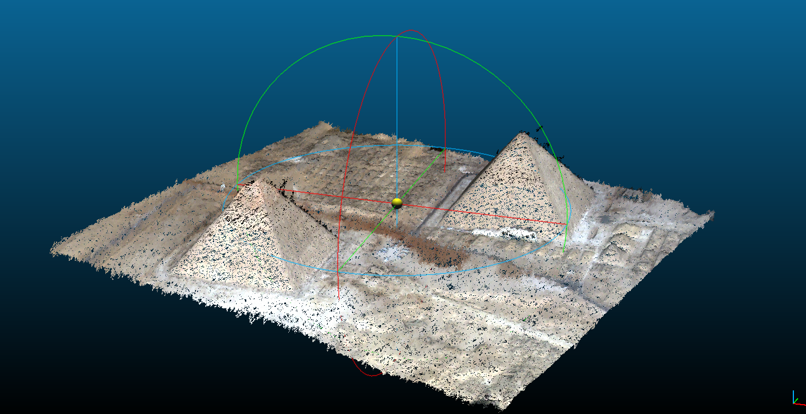

.. include:: ../common.rst

.. _cli:

============
Command line
============

``cars`` command line is the entry point for CARS to run 3D pipelines.

.. code-block:: console

    cars -h

    usage: cars [-h] [--loglevel {DEBUG,INFO,WARNING,ERROR,CRITICAL}] [--version] conf

    CARS: CNES Algorithms to Reconstruct Surface

    positional arguments:
      conf                  Inputs Configuration File

    optional arguments:
      -h, --help            show this help message and exit
      --loglevel {DEBUG,INFO,WARNING,ERROR,CRITICAL}
                            Logger level (default: WARNING. Should be one of (DEBUG, INFO, WARNING, ERROR, CRITICAL)
      --version, -v         show program's version number and exit

CARS cli takes only one ``.json`` file as command line argument:

.. code-block:: console

    cars configfile.json
    
See :ref:`configuration` to learn how to write configuration file.

An output ``used_conf.json`` file will be created on the output directory. This file contains all the execution used
parameters and can be used as an input configuration file to re-run cars.

Loglevel parameter
==================

The ``loglevel`` option allows to parameter the loglevel. By default, the WARNING loglevel gives few information: only criticals, errors and warnings execution messages.

.. note::

  Use ``cars configfile.json --loglevel INFO`` to get detailed information about each CARS step.

.. _inputs:

Inputs
======

Images and Geometric models
---------------------------

Images and associated geometric models are read by the |otb|. Meaning:

  - every raster `GDAL`_ knows how to read can be given as CARS input
  - geometric models can either be part of the raster image (embedded RPC) or defined within a separate file (e.g. XML DIMAP). 

.. note::

  As far as the CNES is directly concerned, CARS has mainly be tested on the following official sensors' products. Feel free to try different products and let us know of potential errors.

    - Pléiades (PHR)
    - Sport 6/7
    - WorldView 2/3

.. note::

  Whenever possible we strongly recommend the use of separate files to reference the geometric models. Indeed, using embedded RPC will soon be obsolete.   

Optionally, one can provide CARS an additional raster that shall be projected onto the final DSM grid. This can be useful to create an ortho-image.

CARS also supports products Region Of Interest (ROI) created with `otbcli_ExtractROI <https://www.orfeo-toolbox.org/CookBook/Applications/app_ExtractROI.html>`_ OTB application.
See :ref:`faq` for details.

For more information, see :ref:`configuration`.

Initial Input Digital Elevation Model
-------------------------------------

For now, CARS uses an initial input Digital Elevation Model (:term:`DEM`) which is integrated in the stereo-rectification to minimize the disparity intervals to explore.
Any geotiff file can be used.

For example, the `SRTM <https://www2.jpl.nasa.gov/srtm/>`_ data corresponding to the processed zone can be used through the `otbcli_DownloadSRTMTiles <https://www.orfeo-toolbox.org/CookBook-7.4/Applications/app_DownloadSRTMTiles.html>`_ OTB command.

The parameter is ``initial_elevation`` as seen in :ref:`configuration`.

Masks
-----

CARS can use a mask for each image in order to ignore some image regions (for instance water mask). This mask is taken into account during the whole 3D restitution process.

The masks can be "two-states" ones: 0 values will be considered as valid data, while any other value will be considered as invalid data and thus will be masked during the 3D restitution process.

The masks can also be multi-classes ones: they contain several values, one for each class (forest, water, cloud...). To use a multi-classes mask, a json file has to be indicated by the user in the configuration file. See the :ref:`configuration` for more details.

.. warning::

  The value 255 is reserved for CARS internal use, thus no class can be represented by this value in the multi-classes masks.

.. _output_data:

Outputs
=======

CARS produces a geotiff file named ``dsm.tif`` that contains the Digital Surface Model in the required cartographic projection and the ground sampling distance defined by the user.

If the user provides an additional input image, an ortho-image ``clr.tif`` is also produced. The latter is stackable to the DSM (See :ref:`getting_started`).

If the user saves points clouds as laz format (point_cloud_fusion, point_cloud_outliers_removing, point_cloud_rasterization), the points clouds are saved in laz compressed format with colors or graylevel image.

These two products can be visualized with `QGIS <https://www.qgis.org/fr/site/>`_ for example.

.. |dsm| image:: ../images/dsm.png
  :width: 100%
.. |clr| image:: ../images/clr.png
  :width: 100%
.. |dsmclr| image:: ../images/dsm_clr.png
  :width: 100%

+--------------+-------------+-------------+-------------------+
|   dsm.tif    |   clr.tif   | `QGIS`_ Mix |    cloudcompare   |
+--------------+-------------+-------------+-------------------+
| |dsm|        | |clr|       |  |dsmclr|   |        |pc|       |
+--------------+-------------+-------------+-------------------+

.. _`GDAL`: https://gdal.org/

Simple example
==============

A simple json file with only required configuration:

.. code-block:: json

    {
      "inputs": {
          "sensors" : {
              "one": {
                  "image": "img1.tif",
                  "geomodel": "img1.geom"
              },
              "two": {
                  "image": "img2.tif",
                  "geomodel": "img2.geom"

              }
          },
          "pairing": [["one", "two"]]
      },
      "output": {
          "out_dir": "outresults"
        }
    }

Launch CARS with configuration file

.. code-block:: console

   cars configfile.json
