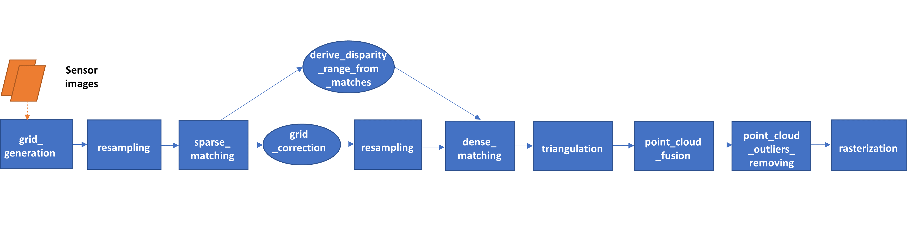

.. _overview:

========
Overview
========

CARS is a dedicated and open source 3D framework to produce Digital Surface Models from satellite imaging by photogrammetry.

This framework is intended for massive :term:`DSM` production with a robust, performant and modular design.

As shown in the figure above, the workflow is organized in sequential steps from input pairs (and metadata) to output data. Each step is performed tile-wise and distributed among workers.

The pipeline will perform the following steps:

1. Compute the stereo-rectification grids of the input pair's images.
2. Resample the images pairs in epipolar geometry.
3. Compute sift matches between the left and right images in epipolar geometry.
4. Derive an optimal disparity range from the matches and a bilinear correction model of the right image's stereo-rectification grid in order to minimize the epipolar error. Apply the estimated correction to the right grid.
5. Resample again the images pairs in epipolar geometry (corrected one for the right image) by using input :term:`DTM` (such as SRTM) in order to reduce the disparity intervals to explore.
6. Compute disparity for each image pair in epipolar geometry.
7. Triangule the sights and get for each point of the reference image a latitude, longitude, altitude point.
8. Merge point clouds coming from each stereo pairs.
9. Filter the 3D points cloud via two consecutive filters: the first removes the small groups of 3D points, the second filters the points which have the most scattered neighbors.
10. Rasterize: Project these altitudes on a regular grid as well as the associated color.

References
**********
For more details, here are the reference papers:

- Youssefi D., Michel, J., Sarrazin, E., Buffe, F., Cournet, M., Delvit, J., L’Helguen, C., Melet, O., Emilien, A., Bosman, J., 2020. **CARS: A photogrammetry pipeline using dask graphs to construct a global 3d model**. IGARSS - IEEE International Geoscience and Remote Sensing Symposium.(`https://ieeexplore.ieee.org/document/9324020 <https://ieeexplore.ieee.org/document/9324020>`_)
- Michel, J., Sarrazin, E., Youssefi, D., Cournet, M., Buffe, F., Delvit, J., Emilien, A., Bosman, J., Melet, O., L’Helguen, C., 2020. **A new satellite imagery stereo pipeline designed for scalability, robustness and performance.** ISPRS - International Archives of the Photogrammetry, Remote Sensing and Spatial Information Sciences.(`https://www.isprs-ann-photogramm-remote-sens-spatial-inf-sci.net/V-2-2020/171/2020/ <https://www.isprs-ann-photogramm-remote-sens-spatial-inf-sci.net/V-2-2020/171/2020/>`_)
