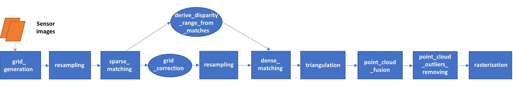

.. include:: ../common.rst

.. _overview:

========
Overview
========

As shown below, CARS pipeline is organized in sequential steps from input pairs (and metadata) to output data. Each step is performed tile-wise and distributed among workers.

The pipeline will perform the following steps |cars_isprs| |cars_igarss|:

- For each stereo pair:
    
    1. Create stereo-rectification grids for left and right views.
    2. Resample the both images into epipolar geometry.
    3. Compute sift matches between left and right views in epipolar geometry.
    4. Predict an optimal disparity range from the sift matches and create a bilinear correction model of the right image's stereo-rectification grid in order to minimize the epipolar error. Apply the estimated correction to the right grid.
    5. Resample again the stereo pair in epipolar geometry (using corrected grid for the right image) by using input :term:`DTM` (such as SRTM) in order to reduce the disparity intervals to explore.
    6. Compute disparity for each image pair in epipolar geometry.
    7. Triangule the matches and get for each pixel of the reference image a latitude, longitude and altitude coordinate.

- Then

    8. Merge points clouds coming from each stereo pairs.
    9. Filter the resulting 3D points cloud via two consecutive filters: the first removes the small groups of 3D points, the second filters the points which have the most scattered neighbors.
    10. Rasterize: Project these altitudes on a regular grid as well as the associated color.
