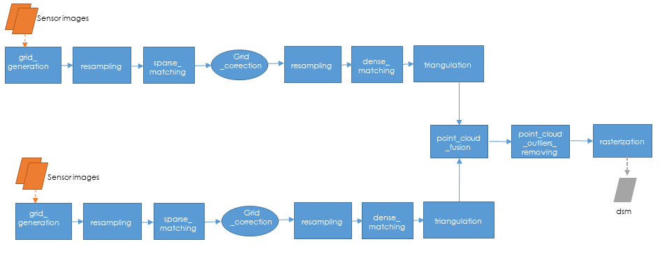

.. _sensor_to_full_resolution_dsm_pipeline:

===========================================
Sensor to full resolution dsm main pipeline
===========================================

Based on CARS 3D framework introduced in :ref:`overview`,
the *sensor_to_full_resolution_dsm* pipeline computes :term:`DSM` from stereo images.

Overview
=========

As shown in the figure above, the workflow is organized in sequential steps from input pairs (and metadata) to output data. Each step is performed tile-wise and distributed among workers.

The pipeline will perform the following steps:

1. Compute the stereo-rectification grids of the input pair's images.
2. Resample the images pairs in epipolar geometry.
3. Compute sift matches between the left and right images in epipolar geometry.
4. Derive an optimal disparity range from the matches and a bilinear correction model of the right image's stereo-rectification grid in order to minimize the epipolar error. Apply the estimated correction to the right grid.
5. Resample again the images pairs in epipolar geometry (corrected one for the right image) by using input :term:`DTM` (such as SRTM) in order to reduce the disparity intervals to explore.
6. Compute disparity for each image pair in epipolar geometry.
7. Triangule the sights and get for each point of the reference image a latitude, longitude, altitude point.
8. Merge point clouds coming from each stereo pairs.
9. Filter the 3D points cloud via two consecutive filters: the first removes the small groups of 3D points, the second filters the points which have the most scattered neighbors.
10. Rasterize: Project these altitudes on a regular grid as well as the associated color.

Configuration
=============

Let's see :ref:`overview` for general information.

Next sections describe specific information related to this pipeline:

Inputs
^^^^^^

+-------------------------------------------------------------------------------------------+-----------------------+----------------------+----------+
| Name                | Description                                                         | Type                  | Default value        | Required |
+=====================+=====================================================================+=======================+======================+==========+
| *sensor*            | Stereo sensor images                                                | See next section      | No                   | Yes      |
+---------------------+---------------------------------------------------------------------+-----------------------+----------------------+----------+
| *pairing*           | Association of image to create pairs                                | list of *sensor*      | No                   | Yes      |
+---------------------+---------------------------------------------------------------------+-----------------------+----------------------+----------+
| *epsg*              | EPSG code                                                           | int, should be > 0    | None                 | No       |
+---------------------+---------------------------------------------------------------------+-----------------------+----------------------+----------+
| *initial_elevation* | Field contains the path to the folder in which are located          | string                | None                 | No       |
|                     | the srtm tiles covering the production                              |                       |                      |          |
+---------------------+---------------------------------------------------------------------+-----------------------+----------------------+----------+
| *default_alt*       | Default height above ellipsoid when there is no DEM available       | int                   | 0                    | No       |
|                     | no coverage for some points or pixels with no_data in the DEM tiles |                       |                      |          |
+---------------------+---------------------------------------------------------------------+-----------------------+----------------------+----------+
| *roi*               | DSM roi file or bouding box                                         | string, list or tuple | None                 | No       |
+---------------------+---------------------------------------------------------------------+-----------------------+----------------------+----------+
| *check_inputs*      | Check inputs consistency (to be deprecated and changed)             | Boolean               | False                | No       |
+---------------------+---------------------------------------------------------------------+-----------------------+----------------------+----------+
| *geoid*             | geoid path                                                          | string                | Cars internal geoid  | No       |
+---------------------+---------------------------------------------------------------------+-----------------------+----------------------+----------+

.. _sensor:

Sensor
******

For each sensor images, give a particular name (what you want):

.. sourcecode:: text

    {
      "my_name_for_this_image":
        {
            "image" : "path_to_image.tif",
            "color" : "path_to_color.tif",
            "mask" : "path_to_mask.tif",
            "mask_classes" : {...}
            "nodata": 0
        }
    }

    
+-------------------+------------------------------------------------------------------------------------------+----------------+---------------+----------+
| Name              | Description                                                                              | Type           | Default value | Required |
+===================+==========================================================================================+================+===============+==========+
| *image*           | Path to the image                                                                        | string         |               | Yes      |
+-------------------+------------------------------------------------------------------------------------------+----------------+---------------+----------+
| *color*           | image stackable to image used to create an ortho-image corresponding to the produced dsm | string         |               | No       |
+-------------------+------------------------------------------------------------------------------------------+----------------+---------------+----------+
| *no_data*         | no data value of the image                                                               | int            | -9999         | No       |
+-------------------+------------------------------------------------------------------------------------------+----------------+---------------+----------+
| *geomodel*        | geomodel associated to the image                                                         | string         |               | Yes      |
+-------------------+------------------------------------------------------------------------------------------+----------------+---------------+----------+
| *geomodel_filters*| filters associated to the geomodel                                                       | List of string |               | No       |
+-------------------+------------------------------------------------------------------------------------------+----------------+---------------+----------+
| *mask*            | external mask of the image                                                               | string         | None          | No       |
+-------------------+------------------------------------------------------------------------------------------+----------------+---------------+----------+
|*mask_classes*     | mask's classes usage (see next section for more details)                                 | dict           |               | No       |
+-------------------+------------------------------------------------------------------------------------------+----------------+---------------+----------+

.. note::
    - *color*: This image can be composed of XS bands in which case a PAN+XS fusion will be performed.
    - If the *mask* is a multi-classes one and no *mask_classes*  configuration file is indicated, all non-zeros values of the mask will be considered as unvalid data.
    - The value 255 is reserved for CARS internal use, thus no class can be represented by this value in the masks.

CARS mask multi-classes structure
---------------------------------

Multi-classes masks have a unified CARS format enabling the use of several mask information into the API.
The classes can be used in different ways depending on the tag used in the dict defined below.

Dict is given in the *mask_classes* fields of sensor (see previous section).
This dict indicate the masks's classes usage and is structured as follows :

.. sourcecode:: text

    {
        "ignored_by_correlation": [1, 2],
        "set_to_ref_alt": [1, 3, 4],
        "ignored_by_sift_matching": [2]
    }

* The classes listed in *ignored_by_sift_matching* will be masked at the sparse matching step.
* The classes listed in *ignored_by_correlation* will be masked at the correlation step.
* The classes listed in *set_to_ref_alt* will be set to the reference altitude (srtm or scalar). To do so, these pixels's disparity will be set to 0.

.. _full_dsm_pipeline_applications:

Applications
^^^^^^^^^^^^

There is a particular case with the *Point Cloud outliers removing* application on this pipeline because it is called twice.
As described before, the ninth step consists of Filter the 3D points cloud via two consecutive filters.
So you can configure the application twice , once for the *small component filters*, the other for *statistical* filter.
Because it is not possible to define twice the *application_name* on your json configuration file, we have decided to configure
those two applications with :

 * *point_cloud_outliers_removing.1*
 * *point_cloud_outliers_removing.2*

Each one is associated to a particular *point_cloud_outliers_removing* method, let's refer to :ref:`point_cloud_outliers_removing`

Example
*******

.. sourcecode:: text

        "applications": {
            "point_cloud_outliers_removing.1": {
                "method": "small_components",
                "on_ground_margin": 10,
                "save_points_cloud": true
            },
            "point_cloud_outliers_removing.2": {
                "method": "statistical",
                "k": 10
            }
        },

Output
^^^^^^

+----------------+-------------------------------------------------------------+--------+----------------+----------+
| Name           | Description                                                 | Type   | Default value  | Required |
+================+=============================================================+========+================+==========+
| out_dir        | Output folder where results are stored                      | string | No             | Yes      |
+----------------+-------------------------------------------------------------+--------+----------------+----------+
| dsm_basename   | base name for dsm                                           | string | "dsm.tif"      | No       |
+----------------+-------------------------------------------------------------+--------+----------------+----------+
| color_basename | base name for  ortho-image                                  | string | "color.tif     | No       |
+----------------+-------------------------------------------------------------+--------+----------------+----------+
| info_basename  | base name for file containing information about computation | string | "content.json" | No       |
+----------------+-------------------------------------------------------------+--------+----------------+----------+

Example
*******

.. sourcecode:: text

        "output": {
              "out_dir": "myoutputfolder",
              "dsm_basename": "mydsm.tif"
        }

Output contents
===============

The output directory, defined on the configuration file (see previous section) contains at the end of the computation:

* the dsm
* color image (if *color image* has been given)
* information json file containing: used parameters, information and numerical results related to computation, step by step and pair by pair.
* subfolder for each defined pair which can contains intermediate data

.. _sensor_to_full_resolution_dsm_pipeline_example:

Simple configuration example
============================
A simple example with only required configuration:

.. sourcecode:: text

    {
      "inputs": {
          "sensors" : {
              "one": {
                  "image": "img1.tif",
                  "geomodel": "img1.geom"
              },
              "two": {
                  "image": "img2.tif",
                  "geomodel": "img2.geom"

              }
          },
          "pairing": ["one", "two"]
      }

.. _sensor_to_full_resolution_dsm_pipeline_full_example:

Full example
============

Here is a full detailed example with :ref:`orchestrator_config` and :ref:`applications` capabilities. See correspondent sections for details.

.. sourcecode:: text

    {
      "inputs": {
          "sensors" : {
              "one": {
                  "image": "img1.tif",
                  "geomodel": "img1.geom",
                  "no_data": 0
              },
              "two": {
                  "image": "img2.tif",
                  "geomodel": "img2.geom",
                  "no_data": 0

              },
              "three": {
                  "image": "img3.tif",
                  "geomodel": "img3.geom",
                  "no_data": 0
              }
          },
          "pairing": [["one", "two"],["one", "three"]],
          "initial_elevation": "srtm_dir",
        "orchestrator": {
            "mode":"local_dask",
            "nb_workers": 4
        },
        "applications":{
            "point_cloud_rasterization": {
                "method": "simple_gaussian",
                "dsm_radius": 3,
                "sigma": 0.3
            }
        },
        "output": {
          "out_dir": "outresults"
        }
      }

References
==========
For more details, here are the reference papers:

- Youssefi D., Michel, J., Sarrazin, E., Buffe, F., Cournet, M., Delvit, J., L’Helguen, C., Melet, O., Emilien, A., Bosman, J., 2020. **CARS: A photogrammetry pipeline using dask graphs to construct a global 3d model**. IGARSS - IEEE International Geoscience and Remote Sensing Symposium.(`https://ieeexplore.ieee.org/document/9324020 <https://ieeexplore.ieee.org/document/9324020>`_)
- Michel, J., Sarrazin, E., Youssefi, D., Cournet, M., Buffe, F., Delvit, J., Emilien, A., Bosman, J., Melet, O., L’Helguen, C., 2020. **A new satellite imagery stereo pipeline designed for scalability, robustness and performance.** ISPRS - International Archives of the Photogrammetry, Remote Sensing and Spatial Information Sciences.(`https://www.isprs-ann-photogramm-remote-sens-spatial-inf-sci.net/V-2-2020/171/2020/ <https://www.isprs-ann-photogramm-remote-sens-spatial-inf-sci.net/V-2-2020/171/2020/>`_)