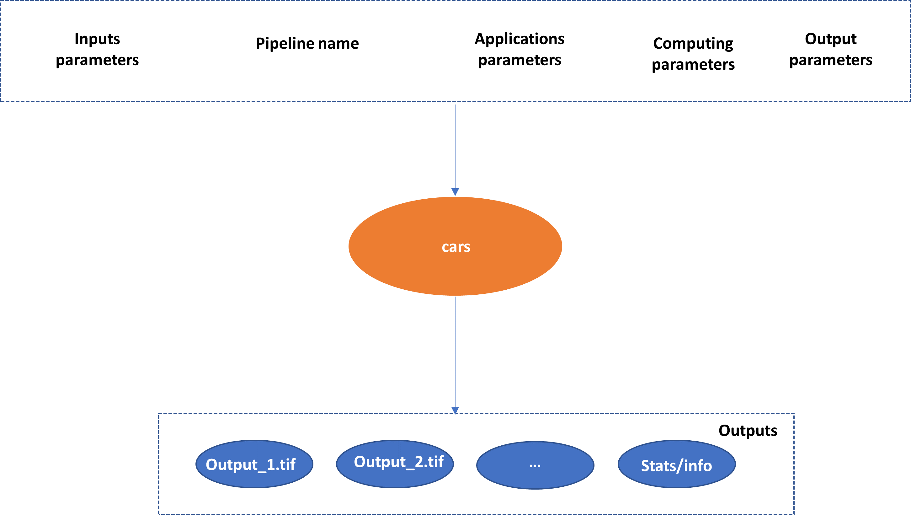
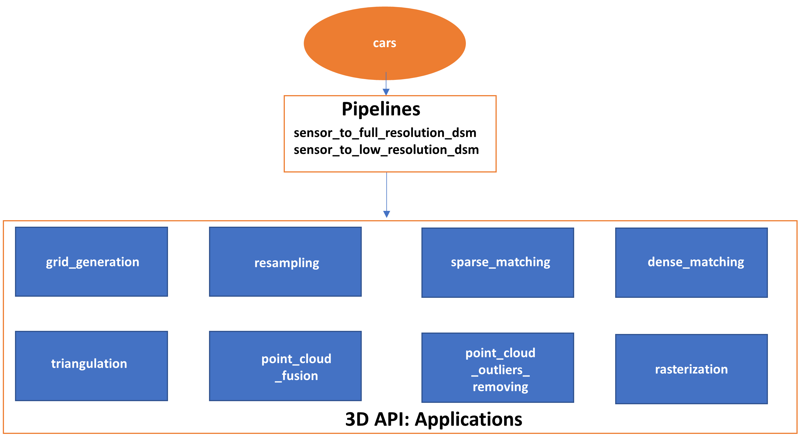

.. _overview:

========
Overview
========

A 3D framework
**************

CARS is a dedicated and open source 3D framework to produce Digital Surface Models from satellite imaging by photogrammetry.
This framework is intended for massive :term:`DSM` production with a robust, performant and modular design.

It is mainly composed of:

    A Python 3D API enabling to realize all the computation steps leading to a :term:`DSM` and allows access to intermediate data.

    Pipelines based on this API with the most important one, the end-to-end processing pipeline from sensor images to :term:`DSM`.

The chain can use dask (local or distributed cluster) or multiprocessing libraries to distribute the computations.
The distributed cluster require centralized files storage and uses PBS scheduler only for now.

More precisely, CARS is composed of well known steps in Multiview Stereo Pipeline divided in applications,
each being an independent 3d step. These applications can be used to create pipelines:

.. _configuration_overview:

Command line and configuration file
***********************************

``cars`` is the unique entry point for CARS command line interface (CLI) to run 3D pipelines.
It takes only one configuration file as command line argument.

.. code-block:: console

    cars configfile.json

This json configuration file is structured as

.. sourcecode:: text

    {
            "pipeline": ...,
            "inputs": {
                ...
            },

            "applications":{
              ...
            }

            "orchestrator": {
                    ...
            },

            "output": {
                  ...
            }
    }

The following sections describe the 5 sections of the CARS's configuration file

Pipeline
^^^^^^^^

This key is mandatory and defined the choice of CARS pipeline. At the moment, there are two of them:

* *sensor_to_full_resolution_dsm*, see :ref:`main_pipeline`
* *sensor_to_low_resolution_dsm*

Inputs
^^^^^^

Values associated to this key are defined by pipeline so let's refer to :ref:`main_pipeline`.

Applications
^^^^^^^^^^^^

This key is optional. It permits to redefine parameters for each application used by pipeline.
See :ref:`applications`.

.. _orchestrator_parameters:

Orchestrator
^^^^^^^^^^^^
This key is optional and permits to define orchestrator parameters that control the distributed computations:

+------------------+-----------------------------------------------------------+-----------------------------------------+---------------+----------+
| Name             | Description                                               | Type                                    | Default value | Required |
+==================+===========================================================+=========================================+===============+==========+
| *mode*           | Parallelization mode "local_dask", "pbs_dask" or "mp"     | string                                  |local_dask     | No       |
+------------------+-----------------------------------------------------------+-----------------------------------------+---------------+----------+
| *nb_workers*      | Number of workers                                        | int, should be > 0                      | 2             | No       |
+------------------+-----------------------------------------------------------+-----------------------------------------+---------------+----------+
| *walltime*       | Walltime for one worker                                   | string, Should be formatted as HH:MM:SS | 00:59:00      | No       |
+------------------+-----------------------------------------------------------+-----------------------------------------+---------------+----------+

Output
^^^^^^

Values associated to this key are defined by pipeline so let's refer to :ref:`main_pipeline`.

Loglevel parameter
^^^^^^^^^^^^^^^^^^

The ``loglevel`` option allows to parameter the loglevel. By default, the WARNING loglevel gives few information: only criticals, errors and warnings execution messages.

.. note::

	Use ``cars configfile.json --loglevel INFO`` to get many detailed information about each CARS steps.

